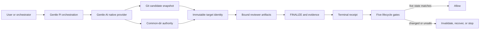
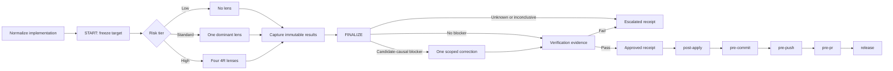
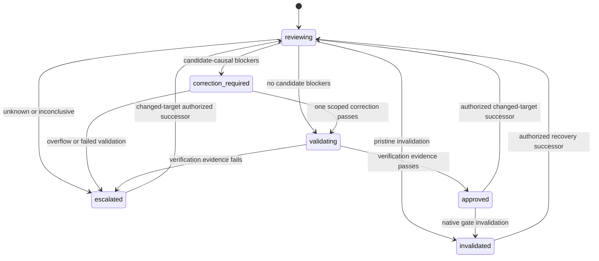
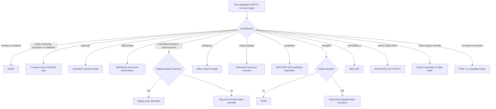
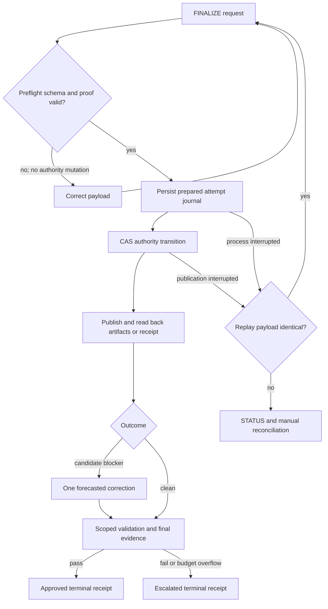
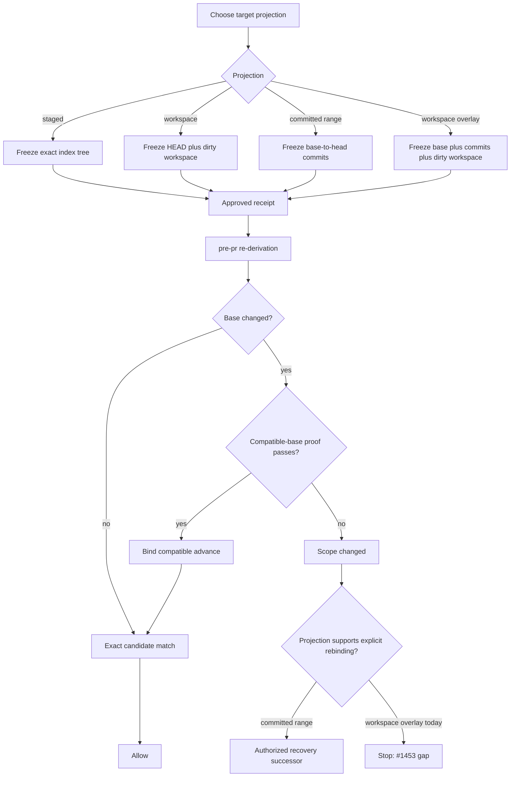
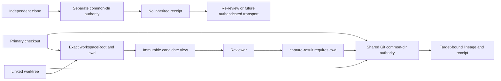
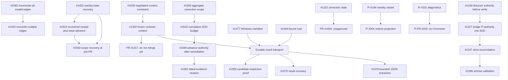
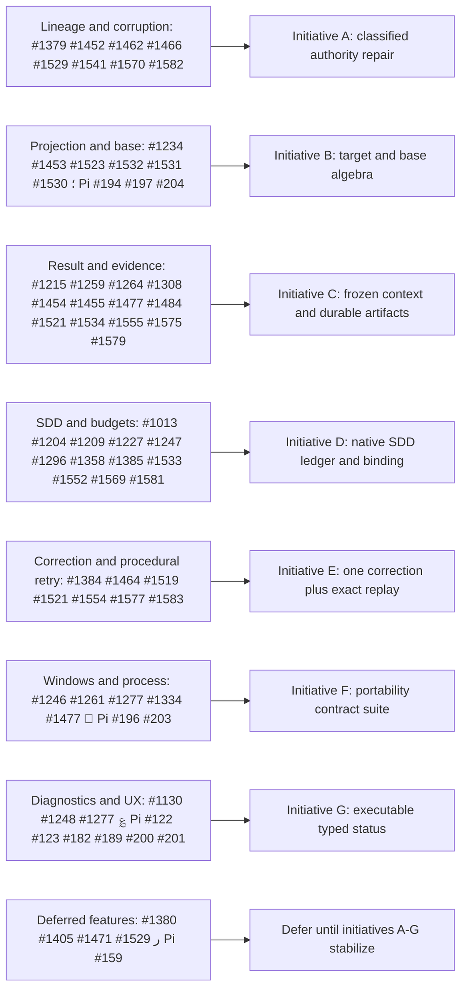

# Receipt-Driven Development System Audit

**Audit date:** 2026-07-21  
**Primary baseline:** `gentle-ai` `main` / `v2.1.11` at `51a5d9e20706b05718b1f2b7fcafda45bab21802`  
**Integration baseline:** `gentle-pi` `origin/main` / `v1.2.0` at `4d5214b410d352712be20917e81f9ce5974d039a`  
**Mode:** Read-only architecture, correctness, recovery, usability, and overengineering audit  
**Evidence cutoff:** Live public GitHub REST queries completed between `2026-07-20T23:52:31Z` and `2026-07-20T23:55:59Z`

Path references prefixed **AI** are relative to `/home/gentleman/work/gentle-ai`. Path references prefixed **PI** are relative to `/home/gentleman/work/gentle-pi` and were verified against `origin/main` unless stated otherwise.

## Executive Verdict

### Direct answer

RDD's **core trust model is coherent and materially safer than an ordinary best-effort review script**, but the complete user-facing system is not yet coherent or reliably operable. The core correctly freezes candidate identity, stores authority in the Git common directory, publishes artifacts without clobbering, uses compare-and-swap revisions and locks, creates immutable terminal receipts, and re-derives live Git evidence at each lifecycle gate. Those controls protect real provenance, race, and stale-approval risks.

The end-to-end product, however, has become **a distributed state machine whose correct recovery depends on knowledge that ordinary users and agents cannot reasonably possess**. That state is split across native compact authority, attempt journals, result and evidence artifacts, receipts, gate context, SDD progress, repository topology, remote Git state, and Gentle Pi's own routing and generated runtime mirrors. The provider now publishes a typed `native_next_transition`, but Gentle Pi discards it and continues to infer lifecycle actions from the older `action` field. Gentle Pi also bypasses the durable result-artifact handoff and cannot express the provider's combined workspace-overlay target. The fail-closed core prevents many unsafe transitions, but a system that only says “stop” when its consumer lacks enough data to recover is safe without being operable.

### Five-point verdict

- **Coherent:** Yes inside the compact authority and gate core; no across the provider–Gentle Pi orchestration boundary.
- **Safe:** Mostly fail-closed and provenance-oriented, but three confirmed integration defects weaken deterministic lifecycle routing, durable reviewer-result provenance, and complete candidate selection.
- **Operable:** Not for recovery. Happy-path automation is understandable; interrupted, scope-changed, base-advanced, corrupted, and independent-clone journeys expose implementation mechanics.
- **Overengineered:** Selectively. Immutable identity, CAS, locks, no-clobber publication, receipt binding, and gate re-derivation are essential. The 19-operation public surface, nine maintenance verbs, compatibility layers, split transition planners, and operation-specific repairs are accidental or user-leaking complexity.
- **Recommended posture:** Pause issue-by-issue recovery fixes. Stabilize the contract, then consolidate lifecycle planning behind one native executable transition model. Do not begin a full rewrite unless that consolidation cannot remove the duplicated state and routing.

### Three largest root causes

1. **Authority and context are split across too many owners.** Native authority, artifacts, receipt, Git common-dir, current worktree, remote base, SDD state, and Pi process memory each contain part of the next-action decision. No single public response carries the complete executable recovery instruction.
2. **One lifecycle algebra is implemented as operation-specific cases.** Projection type × gate × base movement × worktree topology × recovery cause has been patched at START, FINALIZE, status, recovery, pre-PR, SDD, and Pi separately. Issues reappear under a different operation or projection because the invariant is not centralized.
3. **Compatibility and fail-closed behavior leak inward-facing state.** Runtime validation, published schemas, Pi decoders, packaged mirrors, historical `action` routing, legacy repair verbs, and current native transitions can disagree. Unknown states correctly stop, but known-safe recovery is not consistently negotiated as an exact action.

### What must happen before more issue implementation

1. Fix the published START-schema/runtime mismatch and add mechanical contract conformance.
2. Make Gentle Pi consume and execute `native_next_transition`, adopt durable `capture-result`/`--result-artifact` transport, and represent workspace overlays.
3. Define one provider-owned projection/base/recovery transition function before implementing more base-advance or recovery variants.
4. Persist SDD attempt and correction consumption in native CAS authority rather than session narrative.
5. Group the recovery backlog by root cause; stop merging isolated fixes whose correctness depends on unresolved contract or base-rebinding decisions.

No `BLOCKER` was proven in current source. Three `CRITICAL` integration defects and multiple `WARNING`-level core, portability, and operability defects were confirmed.

## System at a Glance

### Simplest accurate mental model

RDD is a content-bound approval protocol around Git:

1. A **target selector** chooses staged content, a workspace snapshot, a committed range, or a base-relative overlay.
2. `review start` snapshots exact bytes, paths, modes, trees, projection context, and policy; derives a target identity; chooses zero, one, or four review lenses; and opens a bounded authority lineage.
3. Reviewer outputs are supposed to be captured as immutable, lineage/target/lens/order-bound artifacts.
4. `review finalize` validates those artifacts, freezes findings, permits at most one scoped correction transaction, validates evidence, and creates an approved, escalated, or invalidated terminal receipt.
5. `post-apply`, `pre-commit`, `pre-push`, `pre-pr`, and `release` re-derive live Git state and validate the **same** content-bound receipt. They do not create new review budgets.
6. If the live target or authority changes, recovery must either replay the exact interrupted operation, create an explicitly authorized successor, perform one narrowly classified repair, or stop.



### Trust boundary versus current implementation

| Boundary | Intended owner | Current condition |
|---|---|---|
| Git snapshot, target identity, risk, lens order, correction budget | Gentle AI binary | Strong and fail-closed. |
| Authority revision, journals, result/evidence publication, receipt | Gentle AI binary | Strong core; public recovery diagnostics are incomplete. |
| Exact next lifecycle transition | Gentle AI binary | Published in v2.1.11, but Gentle Pi does not consume it. |
| Workspace selection and process invocation | Gentle Pi | Strong cwd/argument-array handling, but incomplete overlay selectors. |
| Reviewer execution and candidate injection | Gentle Pi | Candidate view is immutable; result handoff remains legacy and non-durable. |
| SDD continuation | Gentle Pi plus native SDD status | Completion is persisted, but cumulative attempt consumption is not. |
| Clone/worktree user guidance | Gentle Pi | Linked worktrees work; independent-clone guidance is factually wrong. |

The security boundary is therefore stronger than the operational boundary. Provider rejection prevents many unsafe actions, but Pi and users still need internal knowledge to discover the accepted action.

## Happy Path

### RDD Happy Path



### Numbered journey

1. **Normalize before identity freeze.** Source-mutating formatters and generators run before START. After START, only check-only formatting, compilation, and tests may run. Any changed byte, path, or mode invalidates the reviewed identity.
2. **Discover the repository and target.** The native provider resolves the repository and Git common directory, snapshots the staged projection, current workspace, committed range, or workspace overlay, and calculates target/tree/path identity. The normal user-visible entry point is `gentle-ai review start`.
3. **Freeze authority.** START creates or resumes a lineage under common-dir authority and returns the target, tier, selected lenses, order, and bounded correction budget. Risk classification is deterministic: zero lenses for truly trivial content, one dominant-risk lens for standard changes, and the 4R set for security/hot paths or large active changes.
4. **Execute exactly the selected review.** Each reviewer should receive the immutable candidate diff/path context and the binding `{lineage,target,lens,order}`. The intended handoff is `capture-result`, producing a canonical immutable manifest.
5. **Finalize once.** FINALIZE reads ordered result manifests, classifies candidate-causal severe findings, and either proceeds to validation, requests one forecasted correction, or escalates. Schema/proof rejection before authority mutation is retryable with the corrected same operation.
6. **Validate correction and requirements.** If correction is permitted, only frozen finding IDs and genesis paths may change within the budget. A scoped validator and final evidence are captured. Passing evidence creates an approved terminal receipt.
7. **Reuse the receipt.** The same receipt validates post-apply, the exact staged index at pre-commit, the delivery range at pre-push, remote/base relationship at pre-PR, and immutable release evidence at release. A gate never silently opens another review budget.
8. **Stop on changed identity.** If target bytes, modes, paths, policy, base relation, provenance, or required evidence no longer matches, the gate denies and classifies the next action. Recovery must be explicit; approval does not float to changed content.

### Happy-path evidence map

| Step | State read | State written | Key identity/artifact | Failure and recovery | Evidence |
|---|---|---|---|---|---|
| Target discovery | Git worktree/index/refs, common-dir | None until START | target projection, base tree, path/mode set | Missing target → explicit START; ambiguous repository → stop | AI `internal/cli/review_facade.go:29-46,760-867` |
| START | Git snapshot, policy, prior authority | Reviewing authority | lineage, target identity, tree/path counts, tier/lenses/budget | Existing related authority → status/continue; changed target → explicit scope action | AI `internal/cli/review_start_contract.go:15-36,147-180`; `internal/reviewtransaction/risk.go:229-425` |
| Reviewer capture | START binding, reviewer JSON | Immutable artifact publication | result artifact manifest and digest | Invalid schema/order/binding → reject; retry same capture | AI `internal/cli/review_artifact.go:175-210` |
| FINALIZE | Authority revision, ordered results | journal, transitioned authority, receipt/evidence expectation | revision/CAS, merged finding IDs | Preflight reject → corrected same operation; committed transition with missing receipt → exact replay | AI `internal/reviewtransaction/compact.go`; PI contract `docs/review-integration.md:68,80-82` |
| Correction | Frozen blocker set, forecast | correction charge, validation state | correction lines, genesis paths, validator result | over budget or uncorroborated edit → escalated | AI `internal/reviewtransaction/compact.go:515-550,827-842` |
| Receipt | Validated authority and evidence | immutable terminal receipt | receipt hash, target binding, revision | failed evidence → escalated; publication interruption → exact replay | AI compact transaction tests (review test inventory) |
| Gates | receipt plus live Git/remote/evidence | allow or invalidation authority | exact stage/range/base/release evidence | mismatch → invalidated, recovery, or stop | AI gate implementations and `docs/review-authority-threat-model.md` |

### Current happy-path deviation in Gentle Pi

Gentle Pi correctly constructs an immutable candidate view (`PI lib/review-candidate-view.ts:855-908`) and invokes the provider with argument arrays and `shell:false` (`PI lib/native-review-cli.ts:407-417`). It then diverges from the intended v2.1.11 contract:

- reviewer JSON is staged in a temporary file and passed with legacy `--result` (`PI lib/native-review-cli.ts:1366-1413`), not captured durably with lineage/target/lens/order;
- status omits `--next-transition` (`PI lib/native-review-cli.ts:1458-1465`), so lifecycle routing remains consumer-owned;
- base-ref START is forced to committed-only and cannot freeze the full branch-plus-dirty-workspace candidate (`PI extensions/gentle-ai.ts:4721-4769`).

The provider will still reject many inconsistent inputs, but that is a safety backstop, not a coherent orchestration contract.

## Complete State Machine

### Authority State Machine

The compact authority has six semantic persisted states. Operational classifications such as missing, stale, ambiguous, scope-changed, corrupted, or interrupted are **not additional happy-path states**; they are observations over the authority graph, journal, receipt, and live Git state. Treating those classifications as if they were ordinary states is one source of user confusion.



### State table

| State | Meaning | Required invariant | Valid next state | Owner | User-visible action |
|---|---|---|---|---|---|
| `reviewing` | Target is frozen and selected lenses are pending or captured. | Target identity, revision, selected lens order, and budget are immutable for this lineage. | `validating`, `correction_required`, `escalated`, or pristine `invalidated` | Native provider | Run selected lenses, capture results, FINALIZE. |
| `correction_required` | Candidate-causal blockers were frozen and one bounded fix is authorized. | Only corroborated finding IDs and genesis paths; forecast and actual charge within budget. | `validating` or `escalated` | Native provider; executor supplies edit/evidence | Apply one scoped correction, capture validation/evidence, FINALIZE. |
| `validating` | Review/correction is frozen; final evidence is required. | Evidence is bound to target/revision and required verification contract. | `approved` or `escalated` | Native provider | Capture evidence and FINALIZE. |
| `approved` | Terminal content-bound receipt exists. | Receipt, authority revision, target, evidence, and policy are immutable and mutually bound. | `invalidated`; or a separate authorized successor lineage | Native provider/gates | VALIDATE the same receipt. |
| `escalated` | Terminal result cannot safely approve. | No silent retry or new budget for unchanged target. | Successor only for changed target with explicit authorization | Native provider/maintainer | Resolve externally or authorize a changed-target recovery. |
| `invalidated` | Former authority can no longer authorize the live boundary. | Original receipt remains auditable; no mutation into approval. | Explicit recovery successor | Native provider/maintainer | Recover with exact disposition and revision binding. |

### Operational classifications

| Classification | How it arises | Is it a compact state? | Deterministic public next action today? |
|---|---|---:|---|
| Missing | No related authority/receipt for selected target | No | Yes: START. |
| Stale/pristine | Authority exists but never progressed and can be safely abandoned | No | Native `abandon`, but user-facing distinction is specialized. |
| Interrupted/partial success | Prepared journal, committed CAS, or missing published receipt | No | Exact same-operation replay when request matches; otherwise manual status/reconciliation. |
| Ambiguous | More than one plausible lineage/authority match | No | Select explicit lineage; discovery remains cognitively heavy. |
| Scope-changed | Current target differs from reviewed target | No | Explicit successor recovery, but base/projection composition is incomplete. |
| Corrupted | Authority graph cannot be verified | No | Negotiated v1.1 response currently collapses to `stop`, even for some internally classifiable repairs. |
| Escalated | Persisted terminal state | Yes | Stop for unchanged target; changed-target successor only with authorization. |
| Invalidated | Persisted terminal state | Yes | Exact recovery disposition and revision-bound authorization. |

### Core invariants

1. **Identity does not float.** Approval binds bytes, paths, modes, tree/projection context, policy, and lineage—not a branch name or user's intention.
2. **Authority is append/transition oriented.** Terminal receipts are not edited into a new meaning; successors preserve provenance.
3. **Only native code mutates authority.** Agents and adapters provide role artifacts but do not construct canonical authority bytes or hashes.
4. **CAS and locks serialize transitions.** A stale revision or competing mutation fails rather than overwriting authority.
5. **Publication is no-clobber and read back.** A successful write is not accepted until the provider reopens and verifies the exact artifact.
6. **Gates re-derive live evidence.** Review approval does not exempt later delivery, base, remote, or release checks.
7. **Review budget is bounded by original target.** Gates and retries do not silently reset it.
8. **Unknown corruption fails closed.** This is correct; the defect is that known-safe repair classification is not exposed through the negotiated surface.

### Transition ownership

Native authority owns state transitions. Gentle Pi should own only:

- choosing the user-requested target selector;
- invoking the exact negotiated operation with the correct repository context;
- executing reviewers against the frozen candidate;
- returning captured artifact manifests;
- presenting the native failure and next transition.

Today Gentle Pi also interprets historical status actions, infers recovery routing, stages raw reviewer files, and maintains process-local rerun counters. That turns an adapter into a second transition planner.

## Recovery Model

### Recovery Decision Tree



### Executable recovery matrix

| Observed condition | Required evidence | Allowed action | Forbidden shortcut | Current operability |
|---|---|---|---|---|
| No authority | Exact target selector and repository | START | Reuse unrelated receipt | Clear. |
| Active lineage | Lineage, target, current revision, outstanding artifacts | Continue exact FINALIZE transition | Open another review budget | Core clear; Pi does not consume native next transition. |
| Approved receipt | Receipt plus live gate evidence | VALIDATE | Re-review unchanged content | Clear at provider; Pi wraps it. |
| Schema/proof rejection before mutation | Corrected input for same operation | Retry same operation | Recover/abandon an authority that never changed | Core behavior appears fixed; explicit regression proof is missing (#1384). |
| Prepared attempt journal | Byte-equivalent original request | Exact replay | Submit a different payload under same journal | Safe but opaque to users. |
| CAS committed, receipt publication incomplete | Same FINALIZE request and lineage | Exact replay/read-back | Construct receipt manually | Safe, specialized. |
| Stale pristine authority | Revision-bound abandonment authorization | `abandon` | Delete common-dir files | Correct but exposes internal maintenance. |
| Incomplete v2 directory | Proven incomplete/non-authoritative layout | `reclaim` | Treat incomplete bytes as receipt | Correct but specialized. |
| Invalidated terminal | Exact disposition, target/revision binding, maintainer authorization | `recover` successor | Re-enable prior receipt | Correct but high ceremony. |
| Scope changed | Before/after target evidence and explicit authorization | Successor recovery | Approve changed target under prior receipt | Correct principle; overlay/base composition incomplete. |
| Ambiguous lineages | Explicit lineage selected from discovered candidates | Continue that lineage | Guess newest lineage | Safe, weak discovery UX. |
| Escalated unchanged | Terminal receipt | Stop | Reset review budget | Correct. |
| Escalated changed | New target identity and authorization | New successor | Mutate terminal receipt | Correct but cognitively expensive. |
| One recognized invalid edge | Complete anomaly set and exact expected repair | `reconcile-authority` | Repair only first discovered edge | #1582 must make enumeration complete before #1452. |
| Known legacy anomaly | Narrow version/anomaly proof and authorization | Quarantine/repair command | Generic destructive repair | Essential compatibility containment, too many public verbs. |
| Unknown corruption | Failed graph verification | Stop | Guess a repair | Safe. Negotiated output should classify known-safe cases without exposing sensitive paths. |
| Independent clone | New common-dir with no local authority | Re-review, unless a future authenticated transport is designed | Claim `.git` authority arrived through normal Git replication | Current Pi message is wrong. |

### Retry and Incident Flow



### Recovery assessment

The recovery model is secure but not composable enough. Each individual operation has defensible preconditions, yet the user needs to distinguish replay, recover, reclaim, abandon, reconcile, quarantine, repair, invalidate, and dispose. Nine maintenance verbs exist because historical anomalies and lifecycle causes are represented by separate commands rather than one classified `repair/continue` facade.

The problem is not that those native checks should disappear. The problem is that the native provider already knows the evidence and preconditions, while users and Pi are asked to select the verb. A stable public contract should return an exact, opaque, executable next transition; the facade can retain separate internal implementations.

A session bootstrap performed during this audit returned `applicability: corrupted`, `reason_code: corrupted_or_unverifiable_authority`, and a native `stop` transition. That result was respected. No repair or lifecycle mutation was attempted. It demonstrates the current operational endpoint: the negotiated contract cannot tell a compliant orchestrator which known repair class, if any, applies.

## Gate-by-Gate Analysis

The same receipt is validated at every gate. The counts below are **semantic decision families observed by the audit**, not counts of source-language `if` statements.

| Gate | Purpose | Live evidence re-derived | Semantic branch families | Failure output/recovery | Assessment |
|---|---|---|---:|---|---|
| `post-apply` | Bind SDD implementation to an approved review before verification/archive | Exact current target, review applicability, receipt state | 4: missing, active, approved-match, mismatch/terminal denial | Missing starts review only as an explicit post-apply operation; active continues; approved validates; changed scope stops | Appropriate. It must never silently create another budget when receipt exists. |
| `pre-commit` | Prove the exact intended staged tree is the reviewed target | Complete index tree, paths, modes, intended-untracked transition | 5: missing receipt, non-approved, exact match, mixed/unprovable untracked transition, mismatch | Stage reviewed paths without byte/mode changes, then validate exact lineage; mismatch requires explicit new scope | Strong and necessarily strict. User friction comes from needing to understand staged versus workspace projection. |
| `pre-push` | Prove pushed commits are within reviewed delivery range and correction provenance | Remote refs, delivery range, genesis/fix containment, receipt | 6: remote unavailable, missing/non-approved, range mismatch, genesis escape, fix escape, allow | Re-establish remote evidence or authorize changed scope; never start a review at the gate | Strong provenance protection; error guidance must distinguish remote evidence from content change. |
| `pre-pr` | Bind candidate tree and remote/base relationship immediately before PR | Candidate tree/paths, remote boundary, receipt binding, base relation, optional compatible-base proof | 8: receipt, target, remote, base unchanged, compatible advance, incompatible advance, scope change, allow | Compatible advance may be proven; changed overlay recovery currently cannot renegotiate base cleanly | Highest complexity and largest recurrence cluster (#1453, #1523, #1563). Needs one projection/base algebra. |
| `release` | Bind immutable release target, remote head, CI, and publication evidence | HEAD/tag target, `origin/main`, CI for exact SHA, provenance plus five evidence artifacts, fresh risk | 8: target mismatch, remote mismatch, CI failure, missing evidence, invalid receipt, incompatible provenance, fresh risk, allow | Protected-main bypass is narrow; otherwise validate same receipt; major/post-incident review is explicit | Correctly conservative. Release provenance remains incomplete at distribution layer (#1585). |

### Gate ownership and repeated work

Users often perceive gate validation as a repeated review. It is not: no reviewer or correction budget should be created. Each gate re-derives a different delivery boundary around the same reviewed content. That distinction is valid security complexity, but current messages need to say **which boundary changed**—index, remote range, base, release evidence, or authority—instead of merely naming an internal state.

### Pre-PR and Base Advance Flow



The provider's compatible-base proof is an essential control: it ensures a base movement did not alter the reviewed patch/path semantics. The architectural defect is that recovery cannot use the same proof algebra for a workspace overlay with an explicitly advanced base, and Pi cannot create that overlay target in the first place.

## Repository and Worktree Model

### Identity rules

- **Repository authority is local to the Git common directory.** Linked worktrees share it; independent clones do not.
- **Workspace root/cwd matters.** Candidate restoration, START, capture, FINALIZE, and gate commands must refer to the same repository/worktree identity. `capture-result` currently needs `--cwd` even though native next-transition arguments do not carry repository context.
- **A branch name is not authority.** Target tree, path/mode manifest, projection, base relation, policy, lineage, and receipt revision provide identity.
- **Remote state is live evidence, not persisted intent.** Pre-push/pre-PR/release recheck it.
- **Normal Git replication does not transport `.git/gentle-ai/reviews`.** Pi's contrary message is a confirmed documentation/usability defect.

### Worktree and Repository Identity Flow



### Persona-specific topology outcomes

| Topology | What works | Hidden dependency | Recovery quality |
|---|---|---|---|
| Primary checkout | Full native lifecycle | Current index/workspace and common-dir must match frozen selector | Best supported. |
| Linked worktree | Shared authority and exact absolute `workspaceRoot` | Must reuse the same worktree context for FINALIZE/capture; common-dir shared across worktrees | Supported by PI tests `tests/review-controller-workspace-root.test.ts:161-211,290-310`, but cwd remains out-of-band. |
| Independent clone | Normal Git objects/refs | Review authority is absent because common-dir is different | Must re-review today. Current Pi guidance incorrectly claims normal replication carries authority. |
| Moved/nested cwd | Native repository discovery may still resolve root | Capture transition lacks a repository handle and depends on caller-retained cwd | Confirmed #1484 class of hidden coupling. |
| Base-advanced branch | Compatible proof can preserve receipt | Advertised base and exact remote state must be re-derived | Strong for supported projection; overlay recovery is incomplete. |

### Security tradeoff

Local common-dir authority prevents a receipt copied from an unrelated clone from being accepted without explicit transport validation. That is essential. The simpler current product answer is **re-review in a new clone and say so clearly**. Designing export/import would add signing, replay, repository-identity, expiry, and revocation obligations; it should not be added merely to avoid correcting a message.

## Gentle Pi Integration Boundary

### Ownership matrix

| Flow | Gentle Pi owns | Gentle AI binary owns | Current boundary quality |
|---|---|---|---|
| Binary selection | Package-local executable, archive/binary digest check | Published executable and contract | Strong; package verification checks pins and generated bytes. |
| Capability negotiation | Invocation, digest cache, JSON decode | Supported operations/features/schemas | Fail-closed, but Pi recognizes only 5 of 7 optional v1.1 features. |
| START | User target choice, workspace root, candidate view, reviewer dispatch | Snapshot, risk, lenses, budget, authority | Incomplete: Pi cannot request `base_ref_workspace_overlay`. |
| Reviewer execution | Sub-agent launch and immutable candidate injection | Selected lens/order contract | Candidate input strong; output transport is legacy. |
| Result capture | Process/file transport | Canonicalization, durable artifact binding, publication | Boundary violation: Pi uses raw temporary `--result`. |
| FINALIZE | Invoke exact operation and present outcome | Schema/proof validation, transitions, receipt | Provider strong; Pi keeps process-local retry logic. |
| STATUS/next action | Present exact native instruction | Classification and `native_next_transition` | Boundary violation: Pi drops typed transition and routes on historical `action`. |
| Gates | Derive user command/context and recheck availability | Receipt/authority/base validation | Generally strong; consumer still interprets too much. |
| Recovery UI | Confirmation and authorization presentation | Eligibility, revision/CAS, audit record | Too many native concepts leak to Pi/user. |
| Worktrees | Resolve exact root and candidate view | Shared common-dir authority | Linked worktrees supported; clone guidance wrong. |
| SDD | Phase orchestration and apply-progress | Receipt binding and review gate readiness | Cumulative attempt accounting not persisted across continuations. |

### Capability negotiation defect

The provider fixture advertises `native_next_transition` and `base_ref_workspace_overlay` (`AI contracts/review-integration/v1/fixtures/capabilities-v1.1.fixture.json:129-179`). Pi's recognized feature registry omits both (`PI lib/review-integration-v1.ts:107-130`), filters unknown optional features (`:534-568`), keeps `next_transition` only inside untyped `raw` (`:635-705`), and does not invoke status with `--next-transition` (`PI lib/native-review-cli.ts:1458-1465`). Its controller then routes from `status.action` (`PI extensions/gentle-ai.ts:4096-4164,4442-4480`).

This is not a minor compatibility omission. It preserves the exact duplicated transition-planner architecture v2.1.11 was meant to remove.

### Reviewer artifact boundary defect

Pi creates a correct immutable candidate view (`PI lib/review-candidate-view.ts:855-908`) and enforces its injection into the reviewer (`PI extensions/gentle-ai.ts:5617-5632`). Reviewer output is then converted directly (`:4920-4950`), staged as temporary JSON, and passed with raw `--result` (`PI lib/native-review-cli.ts:1366-1413`). The v2.1.11 contract requires durable `capture-result` and ordered `--result-artifact` manifests (`PI docs/review-integration.md:68,80-82`).

The result therefore loses restart-stable controller binding to lineage, target, lens, and order at the integration seam. Native schema/order checks reduce risk but do not provide the missing transport provenance.

### Source/runtime mirrors and compatibility

Gentle Pi carries four generated source/runtime pairs:

1. `gentle-ai-binary`;
2. `review-integration-v1`;
3. `native-review-cli`;
4. `git-commit-transaction`.

The generator and package verifier are strong (`PI scripts/build-git-commit-transaction-runner.mjs:8-60`; `scripts/verify-package-files.mjs:78-125,141-157`), and CI/publish invoke verification. The adapter nevertheless has a command table for eight exact Gentle AI versions, `2.1.4` through `2.1.11` (`PI lib/native-review-cli.ts:353-361`). Compatibility therefore imposes a broad behavioral surface even when byte mirrors are correct.

The right simplification is not to remove byte verification. It is to narrow supported behavioral contracts, consume provider-owned transitions, and generate or isolate the remaining compatibility adapter so that version support cannot silently preserve old routing semantics.

## Complexity Inventory

### Quantitative surface

| Measure | Count | Interpretation / evidence |
|---|---:|---|
| Production review Go files | 59 | AI review transaction and CLI implementation inventory. |
| Production review LOC | 22,432 | Large enough that recovery changes require subsystem reasoning, not local patch reasoning. |
| Review test files | 66 | More test files than production files; valuable coverage but evidence of a wide behavioral surface. |
| Review test LOC | 31,077 | Tests exceed production LOC. |
| Go test functions | 665 | Strong focused proof inventory, but no single end-to-end proof covers every integration path. |
| User-visible `gentle-ai review` operations | 19 | `capture-result`, `capture-evidence`, `preserve-result`, `capabilities`, `start`, `finalize`, `validate`, `status`, `invalidate`, `abandon`, `recover`, `reclaim`, `reconcile-authority`, `dispose-result`, three legacy quarantine/repair operations, `schema`, and `bind-sdd`. |
| Recovery/maintenance verbs | 9 | `invalidate`, `abandon`, `recover`, `reclaim`, `reconcile-authority`, `dispose-result`, `quarantine-legacy`, `quarantine-legacy-fix-scope`, `repair-legacy-alias`. |
| Compact persisted semantic states | 6 | `reviewing`, `correction_required`, `validating`, `approved`, `escalated`, `invalidated`. |
| Native lifecycle gates | 5 | post-apply, pre-commit, pre-push, pre-pr, release. |
| Target kinds | 5 | Native target identity variants observed by the core audit. |
| Main projections | 2 | Staged/current-workspace projection versus base-relative projection, with committed/overlay variants. |
| JSON schemas | 8 | Published review-integration schema inventory. |
| Contract fixtures | 10 | Negotiated contract fixtures. |
| Distinct schema/contract identifiers | 67 | Approximate referenced identifiers across review core and SDD status. |
| Pi source/runtime mirror pairs | 4 | Binary, review-integration decoder, native CLI adapter, Git commit transaction. |
| Pi exact supported binary versions | 8 | `2.1.4`–`2.1.11`. |
| Advertised optional protocol features | 7 | Pi recognizes 5; the 2 omitted features are operationally important. |
| Native maintainer-authorization command families | At least 7 | Recover, abandon, reconcile-authority, dispose-result, and three legacy quarantine/repair families. |
| Direct terminal receipt bindings | At least 8 | Seven content/evidence fields plus the canonical receipt payload hash. |
| Hash/digest/identity-like JSON fields | Approximately 78 | Heuristic source-surface count; not 78 independent cryptographic identities. |
| Receipt invalidator/denial categories | 11 | Content, projection/index, scope, authority, policy, evidence, base, delivery, provenance, gate race, and new risk evidence. |

### Persisted authority and artifact roles

The physical file count varies by risk tier and history. The terminal compact core is deliberately small—two files—but supporting proof is larger.

| Artifact/file role | Cardinality | Purpose |
|---|---:|---|
| `review-state.json` | Exactly 1 per active compact lineage | Mutable CAS authority: lineage, revision, target, state, risk, findings, correction, validation. |
| `review-receipt.json` | 0 before terminal; exactly 1 after terminal | Immutable approved/escalated receipt. |
| `finalize-attempt-journal.json` | At most 1 current journal per lineage | Write-ahead binding for request, artifacts, planned revisions, and replay. |
| `reviewer-results/NN-lens.json` | 0 / 1 / 4 by risk tier | Canonical immutable reviewer result. |
| `reviewer-results/NN-lens.json.sha256` | One per result | Result digest sidecar. |
| `final-evidence/verification.txt` | Usually 1 before approval | Validation evidence bound to validating revision. |
| `incidents/*.raw` | Optional/unbounded history | Raw incident preservation; not admissible review evidence. |
| `reclaim-record.json` | One per reclaim transaction | Two-phase quarantine/reclaim intent and completion. |
| `residue/` | Optional | Quarantined legacy or incomplete authority removed from active discovery. |

AI `internal/reviewtransaction/compact_store_test.go:1948-1970` proves the terminal compact core as two files. A medium-risk successful path normally adds at least two reviewer-result files plus evidence; high risk adds eight result files because each of four results has a digest sidecar.

### Identity inventory

The terminal receipt directly binds:

1. `base_tree`;
2. `initial_review_tree`;
3. `final_candidate_tree`;
4. `paths_digest`;
5. `fix_delta_hash`;
6. `policy_hash`;
7. `evidence_hash`;
8. the hash of the canonical receipt payload itself.

Additional lifecycle identities include target kind/projection, intended path and untracked proofs, reviewer result digest, lineage, generation, CAS revision, risk tier, selected lens/order, frozen finding IDs, gate-context store/chain/bundle/ledger bindings, and compatible-base old/new trees, patch/path digest, conflict-free merge tree, signed attestation, and trust root. Evidence: AI `internal/reviewtransaction/compact.go:132-148`, `snapshot.go:545-639,875-900`, `internal/cli/review_artifact.go:251-488`, and `internal/reviewtransaction/prepr.go:19-154`.

### Gate path counts

These are minimum supported **successful proof variants**, not all denial branches:

| Gate | Minimum successful variants | Variants |
|---|---:|---|
| post-apply | 1 | Exact live current target. |
| pre-commit | 1 | Exact staged snapshot, including complete reviewed path/mode transition. |
| pre-push | At least 3 | Current changes as one delivery commit; base/overlay range contained in genesis; empty-remote bootstrap. |
| pre-pr | At least 4 | Exact base; compatible base advance; current-changes one-commit reconciliation; multi-receipt chain composition. |
| release | 1 | Exact HEAD plus five independent release evidence artifacts. |

Every gate additionally has common denials for authority, identity, policy, evidence, and race failure. Pre-PR is the dominant complexity hotspot because it combines repository topology, remote state, compatible base proof, scope recovery, and optional receipt-chain composition.

### Essential versus accidental complexity

| Classification | Mechanism | Why it exists | Audit judgment |
|---|---|---|---|
| Essential | Immutable target snapshot, trees, path/mode digest | Prevent approval from floating to changed bytes or scope | Keep. |
| Essential | Git common-dir authority | Give linked worktrees one local authority root and reject unrelated repositories | Keep; clarify clone behavior. |
| Essential | CAS revisions, locks, write-ahead journal | Prevent concurrent overwrite and support exact interrupted replay | Keep. |
| Essential | Strict schema/canonicalization, no-clobber publication, read-back | Prevent ambiguous or substituted artifacts and TOCTOU publication failures | Keep. |
| Essential | Immutable terminal receipt and gate re-derivation | Preserve auditability and validate delivery boundaries without re-review | Keep. |
| Essential | Compatible-base proof | Permit harmless base motion without approving a changed patch | Keep and centralize. |
| Essential | Quarantine instead of destructive deletion | Preserve forensic evidence while removing invalid authority from discovery | Keep internally. |
| Incidental | 19 public operations and 9 maintenance verbs | Historical recovery causes received separate command surfaces | Hide behind one classified facade. |
| Duplicated | Status action routing in Pi plus native next transition | Backward compatibility preserved consumer-side planning | Remove for the pinned protocol; isolate old versions. |
| Duplicated | Runtime Go validation plus manually maintained JSON schemas/fixtures/TS decoders | Cross-language integration | Generate/check mechanically from one contract source. |
| User-leaking | Revision-bound multiline authorization and operation selection | Prevent unauthorized repair | Keep authorization proof; native output should generate the exact command and explain consequence. |
| Self-created | One-vs-three correction fields and process-local rerun maps | Historical correction/retry designs coexist | Choose one semantic model and migrate. |
| Self-created | Special recovery behavior per projection/gate | Shared target algebra was not centralized | Replace with one projection/base/recovery planner. |
| Speculative | Broad long-tail legacy compatibility retained in the primary path | Support old stores/binaries | Measure actual usage; quarantine old behavior in a compatibility module or deprecate it. |

## User Friction Analysis

### Ranked friction

| Rank | Persona and journey | Frequency | What they must know | Decisions/commands/artifacts | Can they recover without internals? | Impact |
|---:|---|---|---|---|---|---|
| 1 | Orchestrating AI agent after any non-happy-path status | Common during interrupted or changed-scope work | Historical `action`, native states, projection, lineage, cwd, journal/revision semantics, and correct maintenance verb | Status plus one of START/FINALIZE/VALIDATE/recover/reclaim/abandon/reconcile/quarantine; sometimes manual JSON | **No.** Pi discards native next transition and must infer | Correctness and progress risk; provider usually fails closed. |
| 2 | Maintainer repairing invalid/corrupt authority | Less frequent, very expensive | Difference among invalidated, incomplete, stale, ambiguous, legacy anomaly, graph defect, and corruption | At least seven authorization families, exact multiline/revision-bound text | **No** for negotiated corruption; internal command knowledge required | Merge/release blocking. |
| 3 | Contributor whose branch/base/workspace changed | Common | Projection chosen at START, staged versus workspace semantics, compatible base proof, full candidate scope | Potential restage, status, recovery, another START; overlay path missing in Pi | Only partially | Merge blocking, especially pre-PR. |
| 4 | Interrupted user during FINALIZE/evidence publication | Occasional | Whether preflight mutated authority, whether journal exists, whether payload is identical | Retry exact operation or status/reconcile | Usually not from the error alone | Safe but high anxiety and time cost. |
| 5 | Reviewer agent | Every nontrivial review | Frozen candidate, lens/order, binding, output schema | One review output, but current Pi raw file handoff lacks durable binding | Reviewer cannot verify transport provenance | Review-integrity risk. |
| 6 | SDD user resuming apply/remediation | Common in long changes | Prior attempts, changed-line charge, authority revision, apply progress | Continue invocation and possible gatekeeper reruns | No cumulative native ledger today | Budget can reset; policy becomes nominal. |
| 7 | Linked-worktree user | Moderate | Which worktree root initiated START and common-dir sharing | Preserve exact `workspaceRoot`/cwd throughout | With tests/docs, mostly | Operational friction; hidden cwd can misbind capture. |
| 8 | Independent-clone/CI operator | Moderate in teams | Authority is not Git-replicated | Re-review or unsupported transfer design | Current error message misleads | Release/CI blockage. |
| 9 | Windows user | Lower volume, high cost | Drive/UNC/MSYS/system-root/path publication details | Installer, capture, repair paths | Coverage is partial | Installation or recovery failure. |
| 10 | Release operator | Infrequent, high consequence | Exact SHA/tag/remote/CI/provenance/evidence contract | One release validation plus evidence preparation | Mostly; contract is strict but rational | Correctly blocking, provenance assets incomplete. |

### Terminology burden

The verbs are technically distinct but cognitively overlapping:

- `finalize` progresses active review authority;
- `validate` checks an existing receipt at a boundary;
- `recover` creates a successor after terminal or scope change;
- `reconcile-authority` repairs a recognized graph edge;
- `reclaim` quarantines an incomplete non-authoritative directory;
- `abandon` closes pristine stale authority;
- `invalidate` records a native gate failure;
- `quarantine-*` and `repair-*` address version-specific anomalies.

A maintainer should not have to memorize this taxonomy. The public model should be `status` → exact `continue`/`validate`/`repair` transition, with the specific internal verb preserved only in audit data.

### Actionability of failures

| Failure class | Does output identify changed boundary? | Does it give an executable action? | Audit result |
|---|---|---|---|
| Exact target mismatch | Usually identifies denial; structured path differences remain incomplete (#1248/PI #122) | Sometimes | Needs structured tree/path delta. |
| Known active state | Native contract can return exact transition | Pi does not consume it | Confirmed critical integration gap. |
| Corrupted authority | Negotiated reason is generic | Only `stop` | Safe, not actionable. |
| Missing pre-push base | Can be misclassified as review failure (#1551) | No targeted base resolution | UX/design gap. |
| Independent clone | Pi claims authority replicates | Wrong action model | Confirmed documentation defect. |
| Windows artifact/repair | Path-safe contract incomplete | Varies by operation | Open portability cluster. |
| SDD failed evidence revision | Internal revision mismatch persists despite passing verify (#1581) | No stable recovery | Open design gap. |

### Irreversibility

Native design wisely minimizes irreversible user actions: terminal receipts are preserved, quarantine retains residue, and unknown corruption stops. The dangerous mistakes are therefore mostly **operational dead ends**, not silent data loss: choosing the wrong projection, losing the initiating workspace context, changing target before a recoverable replay, or attempting an unsupported clone/overlay path. Exact maintainer authorization prevents accidental mutation but shifts cost into diagnosis.

## Confirmed Defects

### Summary

| ID | Severity | Category | Confirmed current defect |
|---|---|---|---|
| RDD-001 | CRITICAL | correctness / architecture | Gentle Pi drops `native_next_transition` and infers lifecycle routing. |
| RDD-002 | CRITICAL | correctness / resilience | Gentle Pi bypasses durable result capture and passes raw temporary reviewer results. |
| RDD-003 | CRITICAL | correctness / usability | Gentle Pi cannot express the provider's workspace-overlay target. |
| RDD-004 | WARNING | correctness | Published START schema omits two runtime-emitted reason codes. |
| RDD-005 | WARNING | resilience / architecture | SDD remediation/attempt consumption is not cumulative across continuations. |
| RDD-006 | WARNING | usability / observability | Negotiated corrupted status is a non-diagnostic stop even for internally known repair classes. |
| RDD-007 | WARNING | architecture / usability | `capture-result` requires out-of-band cwd not carried by native transition. |
| RDD-008 | WARNING | correctness / resilience | Workspace-overlay recovery cannot renegotiate an advanced base. |
| RDD-009 | WARNING | correctness / architecture | START does not expose a native frozen reviewer-context artifact required by orchestration. |
| RDD-010 | WARNING | documentation / architecture | Three-attempt documentation/fields coexist with one-shot compact correction behavior. |
| RDD-011 | WARNING | documentation / portability | Gentle Pi incorrectly says local review authority replicates through Git. |
| RDD-012 | WARNING | portability | Windows installer assumes `C:\\Windows`. |
| RDD-013 | SUGGESTION | observability | Escalated gate denial context is computed but not returned. |
| RDD-014 | SUGGESTION | observability | Risk-reason deduplication collapses multiple path witnesses. |

No issue's open state was treated as proof. Findings below were confirmed in current baselines through source/contract comparison. Unverified open reports remain in the issue matrix as design or reproduction work.

### RDD-001 — Gentle Pi does not execute the provider's native next transition

- **Severity / category:** CRITICAL — correctness, architecture.
- **Flow affected:** STATUS → lifecycle or recovery routing.
- **Affected personas:** Orchestrating agent, interrupted user, maintainer.
- **Evidence:** AI capability fixture advertises `native_next_transition` (`contracts/review-integration/v1/fixtures/capabilities-v1.1.fixture.json:129-179`). PI feature registry omits it (`lib/review-integration-v1.ts:107-130`), filters unknown supported features (`:534-568`), keeps the field only in `raw` (`:635-705`), omits `--next-transition` from STATUS (`lib/native-review-cli.ts:1458-1465`), and routes from `status.action` (`extensions/gentle-ai.ts:4096-4164,4442-4480`).
- **Status:** Confirmed on PI `origin/main` `4d5214b4`.
- **Related issues:** PI #170, #194, #200, #201; AI #1452, #1541, #1582.
- **User consequence:** Pi must know internal provider semantics and can choose a stale or incomplete operation. Native validation usually prevents unsafe mutation, but recovery becomes nondeterministic and stalls.
- **Smallest remediation:** For pinned v2.1.11, recognize and require `native_next_transition`, expose it as a typed value, and execute its exact operation and arguments. Keep historical `action` only in an isolated old-binary adapter if support is demonstrably required.
- **Tradeoff:** Narrowing fallback behavior may drop older provider compatibility; retaining it preserves duplicated planners.

### RDD-002 — Reviewer results cross the Pi boundary without durable binding

- **Severity / category:** CRITICAL — correctness, resilience.
- **Flow affected:** Reviewer execution → result handoff → FINALIZE → restart recovery.
- **Affected personas:** Reviewer agent, orchestrator, interrupted user, Windows user.
- **Evidence:** Immutable input view is strong (`PI lib/review-candidate-view.ts:855-908`; `extensions/gentle-ai.ts:5617-5632`), but output is converted directly (`extensions/gentle-ai.ts:4920-4950`), staged in a temporary file, and passed with legacy `--result` (`lib/native-review-cli.ts:1366-1413`). Contract requires `capture-result` and ordered `--result-artifact` (`docs/review-integration.md:68,80-82`). Runtime parity tests also use raw `--result` and may skip without the binary (`tests/native-review-parity-runtime.test.ts:20-31,156-165,205-215`).
- **Status:** Confirmed.
- **Related issues:** AI #1477, #1484, #1534, #1555, #1579; previously #1455/PR #1549 and open PR #1550.
- **User consequence:** Reviewer output lacks restart-stable lineage/target/lens/order provenance at the consumer boundary. A temp-path or process interruption can make admissibility and recovery ambiguous.
- **Smallest remediation:** Call native `capture-result` for each selected lens using exact binding and finalize only with ordered immutable manifests. Persist manifests in controller state.
- **Tradeoff:** Adds artifact lifecycle and Windows-path handling, but those are essential provenance costs already supported by the provider.

### RDD-003 — Gentle Pi cannot freeze a complete base-relative workspace overlay

- **Severity / category:** CRITICAL — correctness, usability.
- **Flow affected:** START for branch commits plus dirty workspace; later pre-PR/base advance.
- **Affected personas:** Contributor, linked-worktree user, base-advanced user.
- **Evidence:** Provider advertises `base_ref_workspace_overlay` and documents overlay target modes. PI START accepts only `mode`, `baseRef`, `committedOnly`, and `policyPath` (`extensions/gentle-ai.ts:4721-4738`), forces explicit base to committed-only (`:4735-4769`), adapter supports only `--base-ref ... --committed-only` (`lib/native-review-cli.ts:1338-1348`), and STATUS lacks `--workspace-overlay`/`--base-tree` (`:1458-1465`).
- **Status:** Confirmed.
- **Related issues:** AI #1453, #1523, #1563; PI #194, #204.
- **User consequence:** A user must review either the committed range or dirty workspace, not the complete intended PR candidate. Pre-PR can later reject scope that the user believed was reviewed.
- **Smallest remediation:** Add a typed provider-owned overlay selector and persist the base-tree/target identity for restart. Do not recreate overlay semantics in Pi.
- **Tradeoff:** Candidate view/restoration grows slightly; correctness improves by delegating existing complexity to the provider.

### RDD-004 — Published START schema rejects valid runtime output

- **Severity / category:** WARNING — correctness.
- **Flow affected:** Capability/schema negotiation and START decoding.
- **Affected personas:** Adapter implementer, orchestrating agent.
- **Evidence:** Runtime emits and validates `process_boundary` and `process_scan_limit` (`AI internal/reviewtransaction/risk.go:60-70,229-290`; `internal/cli/review_start_contract.go:147-180`); public schema enum omits both (`contracts/review-integration/v1/schemas/start.schema.json:82-93`); runtime behavior is tested (`internal/reviewtransaction/review_process_boundary_test.go:49-114`).
- **Status:** Confirmed on current main.
- **Related issues/PR history:** Process-boundary work around #1438/PR #1473.
- **User consequence:** A schema-generated or strict adapter can reject a valid native START response.
- **Smallest remediation:** Add both enum values and a test that enumerates every emitted runtime reason code through the published schema.
- **Tradeoff:** None material; this removes accidental drift.

### RDD-005 — SDD remediation and attempt budgets reset across continuations

- **Severity / category:** WARNING — resilience, architecture.
- **Flow affected:** Repeated SDD apply → remediation → continuation.
- **Affected personas:** SDD orchestrator, maintainer.
- **Evidence:** Apply progress stores completion/evidence but not runtime attempt count (`PI assets/agents/sdd-apply.md:25-38,124-139`); automatic gatekeeper permits a rerun per invocation (`assets/sdd-orchestrator-workflow.md:135-155`); native status budget is not the execution-attempt ledger (`PI lib/native-review-cli.ts:941-990`); core recomputes grant without durable remediation charges (`AI internal/sddstatus/review_gate.go:182-213`; `verification.go:233-335`; `skills/sdd-apply/SKILL.md:103-113,150-162,201-206,303-312`).
- **Status:** Confirmed design gap in both layers.
- **Related issues:** AI #1533, #1569, #1581, #1358, #1013.
- **User consequence:** A new process/continuation can repeatedly spend what is presented as one cumulative bounded budget.
- **Smallest remediation:** Store attempt ordinal and actual changed-line charge in a native CAS transition shared by SDD status/apply. Require explicit audited maintainer reset.
- **Tradeoff:** Transient failures consume budget; an explicit reset path is needed.

### RDD-006 — Corrupted status is safe but not diagnostically recoverable

- **Severity / category:** WARNING — usability, observability.
- **Flow affected:** Negotiated status after authority graph failure.
- **Affected personas:** Maintainer, orchestrator, interrupted user.
- **Evidence:** Negotiated target result lacks a cause/problem field (`AI internal/cli/target_status.go:69-87,301-305`); corruption maps to a generic repair/manual classification, while `internal/cli/review_next_transition.go:68-80` and `contracts/review-integration/v1/fixtures/status-corrupted.fixture.json` emit only a stop transition and prohibit managed repair.
- **Status:** Confirmed.
- **Related issues:** #1452, #1582, #1462, #1529, #1570.
- **User consequence:** A compliant adapter cannot distinguish incomplete state, recognized invalid edges, a known legacy anomaly, or unknown corruption, although separate native operations safely repair some classes.
- **Smallest remediation:** Publish a versioned, non-sensitive classification plus only the proven-safe exact transition. Keep unknown corruption fail-closed.
- **Tradeoff:** Classification can expose implementation detail; use stable reason codes and opaque bound arguments rather than filesystem paths.

### RDD-007 — Bound result capture has an unbound cwd dependency

- **Severity / category:** WARNING — architecture, usability.
- **Flow affected:** Native next transition → `capture-result` in linked worktrees or nested cwd.
- **Affected personas:** Orchestrator, linked-worktree user, Windows user.
- **Evidence:** Transition carries lineage, revision, target, lens, and order (`AI internal/cli/review_next_transition.go:164-185,227-232`), but `capture-result` also needs `--cwd` (`internal/cli/review_artifact.go:175-210`). Public negotiated output intentionally avoids repository/path fields (`internal/cli/review_incident.go:24-35`; `review_operation_contract.go:744-856`).
- **Status:** Confirmed.
- **Related issues:** #1484, #1530, #1534; PI worktree flows.
- **User consequence:** Adapter-retained process context becomes part of authority without being bound. A moved or wrong worktree can target the wrong local authority or fail mysteriously.
- **Smallest remediation:** Bind an opaque repository/authority handle to the negotiated session or explicitly include invocation context in the operation contract.
- **Tradeoff:** A repository handle needs lifetime and clone semantics; explicit cwd is simpler but leaks placement.

### RDD-008 — Overlay recovery cannot renegotiate an advanced base

- **Severity / category:** WARNING — correctness, resilience.
- **Flow affected:** Scope-changed workspace-overlay recovery followed by pre-PR.
- **Affected personas:** Base-advanced contributor and maintainer.
- **Evidence:** Recovery rejects `--base-ref` for workspace overlays and copies predecessor `BaseTree` into the successor (`AI internal/cli/review_facade.go:465-588`, especially `518-540`; `internal/reviewtransaction/compact_recovery_binding.go:16-110,146-219,251-272`).
- **Status:** Confirmed.
- **Related issues:** #1453, #1523, #1563, #1234; PI #194.
- **User consequence:** A reviewed overlay cannot be explicitly rebound to a new compatible base after changed-target recovery; pre-PR stops despite potentially unchanged patch semantics.
- **Smallest remediation:** Reuse the exact compatible-base patch/path/disjointness/merge-tree proof during recovery and bind the successor to the new base.
- **Tradeoff:** Recovery becomes more complex internally; centralization prevents another gate-specific variant.

### RDD-009 — Native START does not deliver frozen reviewer context

- **Severity / category:** WARNING — correctness, architecture.
- **Flow affected:** START → reviewer dispatch.
- **Affected personas:** Reviewer and orchestrating agents.
- **Evidence:** START returns identity, counts, lenses, and limited tree metadata, but not the exact immutable candidate diff or changed-path manifest required by managed orchestration (`AI internal/cli/review_facade.go:29-46,760-867`; `internal/cli/review_start_contract.go:15-36`). Pi reconstructs its own immutable candidate view.
- **Status:** Confirmed contract gap; candidate injection itself is strong in Pi.
- **Related issues/PR:** #1454, PR #1517, #1528, #1555, #1250.
- **User consequence:** Reviewer context can be reconstructed from Git rather than explicitly bound to START, creating a proof gap between target identity and inspected representation.
- **Smallest remediation:** Add a versioned, read-only frozen-context artifact whose digest is part of target identity. Keep large diff bytes outside START; negotiate a manifest/stream handle.
- **Tradeoff:** Adds one artifact type but removes consumer reconstruction and privacy pressure on START.

### RDD-010 — Correction/retry contract has contradictory attempt semantics

- **Severity / category:** WARNING — documentation, architecture.
- **Flow affected:** Candidate blocker → correction planning and repeated FINALIZE.
- **Affected personas:** Maintainer, SDD orchestrator.
- **Evidence:** Threat-model documentation states three correction attempts (`AI docs/review-authority-threat-model.md:41-42`), while compact authority rejects every attempt after the first (`internal/reviewtransaction/compact.go:24,515-550,827-842`). Historical counters and SDD logic still assume three (`internal/sddstatus/review_gate.go:182-213`).
- **Status:** Confirmed contract divergence.
- **Related issues:** #1464, #1583, #1533.
- **User consequence:** Agents can request a correction plan or retry that native authority can never accept; progress and budget messages disagree.
- **Smallest remediation:** Choose one-shot or three-attempt semantics, update schema/docs/state fields together, and add cross-layer conformance tests. The audit recommends one scoped correction for ordinary review.
- **Tradeoff:** One-shot is simpler and safer but less tolerant of transient tooling failures; those need a separate no-code procedural retry class.

### RDD-011 — Independent-clone recovery guidance is false

- **Severity / category:** WARNING — documentation, portability.
- **Flow affected:** Recovery or validation in a fresh clone/CI checkout.
- **Affected personas:** Clone user, CI operator, release operator.
- **Evidence:** Pi says `.git/gentle-ai/reviews` travels through normal Git replication (`PI extensions/gentle-ai.ts:4576-4589`), while authority is local to the Git common directory (`lib/review-repository.ts:246-267`) and foreign common dirs are rejected (`extensions/gentle-ai.ts:4517-4560`).
- **Status:** Confirmed.
- **Related issues:** PI recovery/topology cluster #170, #204; AI transport/provenance questions.
- **User consequence:** The prescribed recovery cannot work. A fresh clone lacks local receipt authority.
- **Smallest remediation:** State that the clone must re-review. Consider authenticated export/import only if a demonstrated team/CI requirement justifies its threat model.
- **Tradeoff:** Re-review costs time; transfer adds substantial provenance and replay complexity.

### RDD-012 — Windows installer assumes the system root

- **Severity / category:** WARNING — portability.
- **Flow affected:** Gentle Pi packaged runtime installation on non-default Windows layouts.
- **Affected persona:** Windows user.
- **Evidence:** Fixed extractor path in `PI scripts/gentle-ai-installer.mjs:116-125`; test intentionally ignores `SystemRoot` (`tests/gentle-ai-installer.test.ts:85-101`); architecture docs admit no native end-to-end Windows proof (`docs/native-authority-architecture.md:86-98`).
- **Status:** Confirmed limited-environment defect.
- **Related issues:** PI #203; AI #1246, #1477, #1534.
- **User consequence:** Installation can fail when Windows is not rooted at `C:\\Windows`.
- **Smallest remediation:** Resolve the trusted system directory through a platform API or validated canonical path, not untrusted raw environment input.
- **Tradeoff:** Platform-specific implementation and tests are required.

### RDD-013 — Escalated gates discard prepared denial context

- **Severity / category:** SUGGESTION — observability.
- **Flow affected:** Gate denial on escalated authority.
- **Affected personas:** Contributor, maintainer.
- **Evidence:** `AI internal/reviewtransaction/compact_gate.go:185-195` computes `denialContext` but returns `GateEscalated` without attaching it.
- **Status:** Confirmed source behavior; user impact is inferential until traced through every UI.
- **Related issues:** Diagnostic issues #1248, #1551; PI #122/#201.
- **User consequence:** Failure omits context already available, increasing unnecessary status/recovery investigation.
- **Smallest remediation:** Return structured denial context without paths that violate privacy contract.
- **Tradeoff:** Slightly expands public schema.

### RDD-014 — Risk reason deduplication loses path witnesses

- **Severity / category:** SUGGESTION — observability.
- **Flow affected:** START risk explanation and reviewer context.
- **Affected personas:** Reviewer, maintainer.
- **Evidence:** `AI internal/reviewtransaction/risk.go:398-425` deduplicates by code plus signal, collapsing multiple path witnesses.
- **Status:** Confirmed behavior; no approval bypass was proven.
- **Related issues:** #1555 and candidate-inspection evidence work.
- **User consequence:** A reviewer may see the correct risk classification but incomplete evidence about all triggering files.
- **Smallest remediation:** Preserve a bounded sorted witness list or count plus representative paths.
- **Tradeoff:** Larger START/context payload and possible path sensitivity.

### Historical defects not reported as current

- **#1384:** Current preflight ordering appears to reject invalid FINALIZE schema/proof before journal or authority mutation. The missing piece is an explicit “reject, correct, retry the same command” regression test. Recommendation: treat as already fixed pending proof, not as an active defect.
- **#1455 / PR #1549:** PR #1549 merged and administratively closed #1455, but its early payload-classification slice does not prove the full durable raw-evidence/recovery contract. Open PR #1550 attempts broader work and has changes requested. The original issue is closed; the architectural gap remains represented elsewhere.
- **Previous single-edge reconciliation fixes:** They do not prove #1452. In particular, a fix for two anomaly classes on one edge is not equivalent to enumerating multiple invalid graph edges. #1582 remains a real prerequisite.
- **#1477:** The audit confirmed a Windows validation gap, not a current native core defect. The integration's raw result path makes the design relevant, but open status alone is not proof.
- **#1476:** No additional current core bypass was proven. Keep as direct reproduction/provenance verification work.

## Overengineering Findings

### OE-001 — Public recovery verbs expose internal taxonomy

- **Classification:** User-leaking and incidental.
- **Exact evidence:** 19 public operations; nine maintenance verbs; at least seven exact maintainer-authorization command families (`AI internal/cli/review_facade.go:465-728` and legacy handlers).
- **Original protected risk:** Prevent unauthorized deletion, repair, or reuse of invalid authority and preserve an auditable cause-specific record.
- **Operational cost:** Users must diagnose internal graph and lifecycle state before selecting a verb and constructing revision-bound authorization. Pi becomes a second decision engine.
- **Simpler alternative:** One public `status` plus exact native `continue`, `validate`, or `repair` transition. Keep cause-specific handlers and audit event names internal.
- **Tradeoff:** The facade must preserve explicit confirmation and cannot turn unknown corruption into a generic best-effort repair.

### OE-002 — Projection/base/recovery logic is operation-specific

- **Classification:** Duplicated and self-created.
- **Exact evidence:** Overlay base restrictions in `review_facade.go:518-540`, compatible-base proof in `prepr.go:19-251`, recovery binding in `compact_recovery_binding.go:146-272`, Pi's separate target selector in `extensions/gentle-ai.ts:4721-4769`, and issue cluster #1453/#1523/#1563/#1234/PI #194.
- **Original protected risk:** Never transfer approval to a changed patch or expanded scope after base movement.
- **Operational cost:** Fixes apply to one gate/projection and recur under another. Pre-PR has at least four successful proof variants plus common denials.
- **Simpler alternative:** A provider-owned target algebra that takes old identity, new live identity, projection, and base evidence and returns `same`, `compatible-advance`, `provable-contraction`, `changed-scope`, or `unsafe` plus the exact transition.
- **Tradeoff:** A centralized module is conceptually dense and security-sensitive, but it is testable as a matrix and removes duplicated edge logic.

### OE-003 — Contract truth is replicated across languages and artifacts

- **Classification:** Duplicated.
- **Exact evidence:** Runtime reason codes differ from published START schema; 8 schemas, 10 fixtures, 67 identifiers; Pi carries four generated source/runtime pairs and a decoder; eight provider versions remain in a command table.
- **Original protected risk:** Strict cross-process validation and packaged runtime integrity.
- **Operational cost:** Byte parity can succeed while semantic capability adoption fails, as v2.1.11 demonstrates.
- **Simpler alternative:** Generate schemas, exhaustive enum tests, and typed decoders from one contract source; require capability conformance tests that invoke every advertised optional feature.
- **Tradeoff:** Generator tooling becomes critical infrastructure. Retain checked-in generated files and byte verification for auditability.

### OE-004 — Historical correction semantics remain in current authority

- **Classification:** Self-created.
- **Exact evidence:** Three-attempt threat-model language and SDD counters coexist with one-shot rejection (`compact.go:24,515-550,827-842`; `review_gate.go:182-213`).
- **Original protected risk:** Bound reviewer-driven editing and prevent endless fix/review loops.
- **Operational cost:** Agents request impossible plans, counters reset or mislead, and issues split between correction, procedural failure, and SDD attempts.
- **Simpler alternative:** One scoped code correction transaction; separately allow exact same-operation replay for no-mutation failures and an explicit procedural-failure recovery that cannot change candidate bytes.
- **Tradeoff:** Fewer automatic correction chances; clearer security boundary.

### OE-005 — Legacy repair compatibility is in the primary command surface

- **Classification:** Speculative/incidental unless usage evidence proves otherwise.
- **Exact evidence:** Three separate legacy quarantine/repair operations with 8/11-line authorization formats; open #1462/#1570; version support from 2.1.4 through 2.1.11.
- **Original protected risk:** Safely migrate or quarantine malformed historical stores without destructive manual deletion.
- **Operational cost:** Every orchestrator and maintainer must distinguish historical anomaly classes; schema and help surfaces grow indefinitely.
- **Simpler alternative:** A versioned offline migration/diagnostic module reached only through native classified repair, with telemetry-free local preview and an explicit support horizon.
- **Tradeoff:** Older stores may require a one-time upgrade step or lose automatic repair. Preserve raw residue and document the cutoff.

### OE-006 — Local authority is essential, but clone portability is implied rather than designed

- **Classification:** Essential mechanism with user-leaking consequences; not overengineering in the core.
- **Exact evidence:** Authority root under Git common-dir (`PI lib/review-repository.ts:246-267`), foreign common-dir rejection, false replication message.
- **Original protected risk:** Prevent receipts from being accepted in unrelated repositories or after unverified transfer.
- **Operational cost:** Teams and CI cannot move approval through normal Git, yet messages suggest they can.
- **Simpler alternative:** Explicitly choose “authority is checkout-local; re-review in a new clone” as the product contract.
- **Tradeoff:** Repeated review across clones. Authenticated transfer should be a later, evidence-driven feature—not an assumed property.

### OE-007 — Tests prove bytes more often than recoverability

- **Classification:** Incidental validation imbalance.
- **Exact evidence:** 31,077 review test LOC and 665 tests, yet missing end-to-end Pi native-transition, durable result-manifest, Windows capture-to-FINALIZE, clone messaging, overlay restart, and cumulative SDD continuation proofs.
- **Original protected risk:** Exhaustive local invariant enforcement.
- **Operational cost:** A subsystem can be locally correct while the cross-process user journey remains broken.
- **Simpler alternative:** Preserve focused tests but add a small executable contract suite covering persona journeys and every negotiated capability against the packaged binary.
- **Tradeoff:** End-to-end tests are slower and more platform-sensitive; keep them bounded to contract milestones.

## Issue and PR Map

### Seed and root-cause matrix

| Issue | Current state | Actual defect | Root-cause cluster | Dependency | Existing PR | Still reproducible on main? | User impact | Recommendation |
|---|---|---|---|---|---|---|---|---|
| [#1384](https://github.com/Gentleman-Programming/gentle-ai/issues/1384) | Open; approved | Same-operation FINALIZE retry after preflight rejection | Retry/idempotence | Explicit regression proof | None identified | **Behavior appears fixed**; no mutation-before-rejection found | Historical dead end after correctable input | **Already fixed**; convert remaining scope to a regression test. |
| [#1452](https://github.com/Gentleman-Programming/gentle-ai/issues/1452) | Open; approved | Reconcile multiple invalid recovery edges | Corruption enumeration/reconciliation | Explicitly blocked by #1582 | None | Current status/repair contract cannot safely enumerate all edges | Corrupt store remains blocked | **Ready after dependency.** |
| [#1453](https://github.com/Gentleman-Programming/gentle-ai/issues/1453) | Open; approved decision | Workspace-overlay recovery cannot accept an advanced base | Projection/base/recovery algebra | Foundation for #1523/#1563 and PI #194 | None | **Confirmed** in `review_facade.go` and recovery binding | Base-advanced overlay cannot reach pre-PR | **Do first** after contract stabilization. |
| [#1454](https://github.com/Gentleman-Programming/gentle-ai/issues/1454) | Open; approved | Reviewer needs native frozen candidate context | Candidate inspection/provenance | #1528 defines negotiated/privacy constraint | [PR #1517](https://github.com/Gentleman-Programming/gentle-ai/pull/1517) | **Confirmed contract gap** | Reviewer may inspect reconstructed rather than provider-bound view | **Needs redesign before implementation.** Do not merge PR #1517 yet. |
| [#1476](https://github.com/Gentleman-Programming/gentle-ai/issues/1476) | Open; approved | Alleged changed-target recovery provenance bypass | Recovery provenance | Related to #1259/#1308 | None | **Unknown; not reproduced** in this audit | Potential approval transfer if real | **Close as not reproducible** unless a current trace is produced; otherwise add regression proof. |
| [#1477](https://github.com/Gentleman-Programming/gentle-ai/issues/1477) | Open; approved | Windows-safe reviewer artifact manifest input | Durable result transport/Windows | Compose with #1484/#1534 | None | Core defect **not proven**; end-to-end proof absent | Windows adapter recovery risk | **Convert to documentation/UX work** plus portability contract test unless reproduction proves defect. |
| [#1484](https://github.com/Gentleman-Programming/gentle-ai/issues/1484) | Open; approved | Explicit review cwd missing from bound lens capture | Repository identity/result transport | Compose with PI adoption of capture-result | None | **Confirmed** | Wrong worktree/cwd can misroute capture | **Do first** as part of the native transition handle. |
| [#1523](https://github.com/Gentleman-Programming/gentle-ai/issues/1523) | Open; approved; “do not open PR yet” | Recovered receipts do not compose cleanly across compatible base advances | Projection/base/recovery algebra | #1453; requires attestation decision | None | **Confirmed design gap** | Valid recovered work can fail pre-PR | **Needs redesign before implementation.** |
| [#1528](https://github.com/Gentleman-Programming/gentle-ai/issues/1528) | Open; approved | Candidate context must stay out of unnegotiated START | Contract/privacy and frozen context | Precedes #1454/PR #1517 | None | Constraint is current and valid | Prevents unsafe contract growth | **Do first** as the contract decision before #1454. |
| [#1533](https://github.com/Gentleman-Programming/gentle-ai/issues/1533) | Open; approved | Cumulative SDD runtime attempt budget resets across continuations | SDD/native authority split | Consolidate #1358/#1569/#1581 | None | **Confirmed** | Bounded remediation can be spent repeatedly | **Needs redesign before implementation** as one CAS budget ledger. |
| [#1563](https://github.com/Gentleman-Programming/gentle-ai/issues/1563) | Open; approved | Scope-changed recovery not composable at pre-PR | Projection/base/recovery algebra | #1453 and #1523 | None | **Confirmed dependent gap** | Recovered target can become permanently unmergeable | **Ready after dependency.** |
| [#1582](https://github.com/Gentleman-Programming/gentle-ai/issues/1582) | Open; approved; first priority | Repair planning does not enumerate all invalid compact recovery edges in one pass | Corruption enumeration/reconciliation | Prerequisite for #1452 | None | Current reconciliation cannot safely assume first edge is the only edge | Repeated or unsafe partial repair | **Do first.** |
| [#1455](https://github.com/Gentleman-Programming/gentle-ai/issues/1455) | Closed by merged PR #1549 | Durable raw result/incident classification was broader than merged slice | Result admission/recovery | Open PR #1550 attempts broader contract | PR #1549 merged; PR #1550 open | Administrative closure is **not proof of full resolution** | Incident recovery remains fragmented | Treat PR #1549 as historical partial fix; **needs redesign before PR #1550**. |

### Additional open Gentle AI issue matrix

The following rows were re-queried through live public GitHub REST. “Unknown” means the issue remains open but the audit did not independently reproduce it on current main; the state is not used as proof.

| Issue | Current state | Actual defect / root-cause cluster | Dependency / existing PR | Reproducible on main? | User impact | Recommendation |
|---|---|---|---|---|---|---|
| [#1585](https://github.com/Gentleman-Programming/gentle-ai/issues/1585) — signed release provenance | Open; needs-review | Release supply-chain provenance | Overlaps older provenance #1250 and release work | Design gap confirmed: v2.1.11 has digests but no signed provenance asset | Consumers cannot authenticate publisher provenance | **Needs redesign before implementation**; prioritize after lifecycle stabilization. |
| [#1583](https://github.com/Gentleman-Programming/gentle-ai/issues/1583) — correction plan requested after forecast persistence | Open; untriaged | Correction-state UX; historical attempt semantics | Related to #1464/RDD-010 | Unknown; source contract divergence supports cluster | Agent requests an impossible/redundant plan | **Ready after dependency:** settle one-shot semantics first. |
| [#1581](https://github.com/Gentleman-Programming/gentle-ai/issues/1581) — passing verify blocked by failed-evidence revision mismatch | Open; untriaged | SDD evidence revision binding | #1533/#1569/#1358 | Unknown direct reproduction; split authority confirmed | Passing verification can remain blocked | **Needs redesign before implementation** with the SDD ledger cluster. |
| [#1579](https://github.com/Gentleman-Programming/gentle-ai/issues/1579) — reviewer prefixes prose before JSON | Open; untriaged | Reviewer-result extraction | Result admission cluster; PR #1550 context | Unknown | Valid reviewer output can be rejected/lost | **Ready after dependency:** durable capture first, then bounded extraction preserving raw bytes. |
| [#1577](https://github.com/Gentleman-Programming/gentle-ai/issues/1577) — escalated recovery authorization never accepted | Open; untriaged | Recovery authorization binding | Recovery facade cluster | Unknown | Maintainer cannot execute documented recovery | **Do first** only after a current reproduction; otherwise **close as not reproducible**. |
| [#1575](https://github.com/Gentleman-Programming/gentle-ai/issues/1575) — validating authority cannot recover admitted non-review results | Open; untriaged | Result admission/recovery state machine | #1454/#1555/result transport | Unknown | Authority dead end after admission | **Needs redesign before implementation** with result transport. |
| [#1570](https://github.com/Gentleman-Programming/gentle-ai/issues/1570) — legacy HEAD unavailable for alias repair | Open; untriaged | Legacy repair evidence | #1462 and legacy compatibility | Open contract gap is credible; not separately reproduced | Authorized repair cannot be constructed | **Ready after dependency**; expose immutable evidence through classified repair. |
| [#1569](https://github.com/Gentleman-Programming/gentle-ai/issues/1569) — compact authority not advanced after SDD remediation | Open; untriaged | SDD/native authority transition | #1533/#1358/#1581 | Cluster confirmed; exact issue trace unknown | Corrected implementation and authority diverge | **Duplicate** into a single SDD remediation transition design. |
| [#1555](https://github.com/Gentleman-Programming/gentle-ai/issues/1555) — clean results lack proof of candidate inspection | Open; untriaged | Reviewer evidence integrity | #1454/#1528; result capture | Contract gap confirmed; exploit/false-clean trace not reproduced | Review can be formally clean without inspection proof | **Ready after dependency** on frozen context and durable capture. |
| [#1554](https://github.com/Gentleman-Programming/gentle-ai/issues/1554) — unchanged-target recovery after procedural escalation | Open; untriaged | Procedural versus code escalation | Conflicts with soft-evidence/unchanged-target invariant | Design request, not proven defect | Tool failure can permanently escalate unchanged code | **Do not implement: complexity exceeds value** until one-shot/replay semantics are settled. |
| [#1552](https://github.com/Gentleman-Programming/gentle-ai/issues/1552) — CAS replacement of approved SDD binding | Open; untriaged | SDD binding CAS | #1524/#1209/#1227 | Unknown | Stale binding blocks valid continuation | **Needs redesign before implementation** as one revision-safe binding operation. |
| [#1551](https://github.com/Gentleman-Programming/gentle-ai/issues/1551) — missing pre-push base misclassified | Open; untriaged | Target-resolution diagnostics | Gate UX | Unknown; diagnostics gap consistent | User investigates review instead of missing Git base | **Convert to documentation/UX work** with structured error. |
| [#1541](https://github.com/Gentleman-Programming/gentle-ai/issues/1541) — START authority immediately unrelated to STATUS | Open; untriaged | Lineage identity/discovery | Overlaps #1466 | Unknown; high-value reproduction needed | Newly started review cannot continue | **Do first** if reproduced; otherwise **close as not reproducible**. |
| [#1534](https://github.com/Gentleman-Programming/gentle-ai/issues/1534) — Windows authority recovery/artifact handoff | Open; untriaged | Windows result/recovery contract | #1477/#1484/#1246 | Validation gap confirmed; exact defect unknown | Windows users cannot complete recovery | **Needs redesign before implementation** as one Windows-safe artifact contract. |
| [#1532](https://github.com/Gentleman-Programming/gentle-ai/issues/1532) — negotiated pure contraction rejected | Open; untriaged | Scope algebra | #1453/#1563 family | Unknown | Removing scope can force unnecessary full review | **Ready after dependency:** centralized scope algebra; only provable subset contraction. |
| [#1531](https://github.com/Gentleman-Programming/gentle-ai/issues/1531) — chained PR cost under content-bound receipts | Open; untriaged | Receipt/chained-PR ergonomics | #1530/#1250 | Product friction confirmed; exact remedy open | Review budget compliance becomes disproportionate | **Needs redesign before implementation**; model slice receipt reuse. |
| [#1530](https://github.com/Gentleman-Programming/gentle-ai/issues/1530) — multi-worktree session fragmentation | Open; untriaged | Repository identity/cwd | #1484/#1531 | Hidden cwd confirmed; whole issue not reproduced | Full restarts and lost review context | **Ready after dependency** on repository handle/transition binding. |
| [#1529](https://github.com/Gentleman-Programming/gentle-ai/issues/1529) — audited bulk cleanup | Open; untriaged | Authority-store hygiene | Corruption/legacy facade | Feature request | Stale lineages accumulate | **Do not implement: complexity exceeds value** until classified repair is consolidated. |
| [#1524](https://github.com/Gentleman-Programming/gentle-ai/issues/1524) — classify bind-sdd CAS conflict before publication | Open; untriaged | SDD binding conflict | #1552 | Unknown | Publication can fail after avoidable work | **Ready after dependency** on one binding CAS contract. |
| [#1521](https://github.com/Gentleman-Programming/gentle-ai/issues/1521) — recover persisted failed validator with unchanged candidate | Open; untriaged | Validator retry semantics | One-shot/procedural retry cluster | Unknown | Transient validator failure becomes terminal | **Needs redesign before implementation** with explicit no-code retry class. |
| [#1519](https://github.com/Gentleman-Programming/gentle-ai/issues/1519) — FINALIZE permanent no-op after recovery | Open; untriaged | FINALIZE/recovery transition | Historical #1470 | Unknown | Recovery succeeds but progress cannot resume | **Do first** if current regression reproduces; otherwise close. |
| [#1471](https://github.com/Gentleman-Programming/gentle-ai/issues/1471) — zero-diff tracker bootstrap | Open; needs-review | Empty-candidate lifecycle | Chained PR workflow | Design gap | Tracker branch cannot enter lifecycle safely | **Needs redesign before implementation**; avoid artificial receipt content. |
| [#1466](https://github.com/Gentleman-Programming/gentle-ai/issues/1466) — START stays ambiguous with unrelated lineages | Open; untriaged | Lineage discovery | Overlaps #1541 | Unknown | User cannot start unrelated work | **Duplicate** with #1541 after reproduction. |
| [#1464](https://github.com/Gentleman-Programming/gentle-ai/issues/1464) — zero-edit correction rejected | Open; untriaged | Correction terminal semantics | RDD-010/#1583 | Unknown | Converged candidate cannot finalize | **Ready after dependency:** settle one-shot correction state. |
| [#1462](https://github.com/Gentleman-Programming/gentle-ai/issues/1462) — quarantine seven invalid legacy-v1 records | Open; approved; high priority | Legacy corruption migration | #1582 enumeration principles | Known legacy records, not current v2 behavior | Old stores block discovery | **Ready after dependency** on complete preview/enumeration; keep as migration. |
| [#1443](https://github.com/Gentleman-Programming/gentle-ai/issues/1443) — v2.1.8 follow-ups | Open; bug | Catch-all historical debt | Multiple newer issues | Mixed/unknown | Backlog hides current ownership | **Superseded**; decompose links and close resolved rows. |
| [#1405](https://github.com/Gentleman-Programming/gentle-ai/issues/1405) — auditable follow-ups from escalated reviews | Open; untriaged | Follow-up artifact model | Terminal receipt semantics | Feature request | Valid follow-up cannot attach without reopening review | **Do not implement: complexity exceeds value** until core lifecycle is consolidated. |
| [#1385](https://github.com/Gentleman-Programming/gentle-ai/issues/1385) — supported Judgment Day lifecycle | Open; untriaged | Separate review mode lifecycle | #1204 | Design gap | Different retry/budget semantics confuse users | **Needs redesign before implementation** with unified budget accounting. |
| [#1380](https://github.com/Gentleman-Programming/gentle-ai/issues/1380) — adaptive evidence-driven review | Open; approved; high priority | Adaptive orchestration | Depends on stable core contracts | Feature request | Could reduce or increase review cost | **Do not implement: complexity exceeds value** before stabilization. |
| [#1379](https://github.com/Gentleman-Programming/gentle-ai/issues/1379) — cross-lineage stale sibling receipt trees | Open; untriaged | Lineage isolation/provenance | Recovery/store core | **Unknown; potentially severe; reproduce immediately** | Cross-lineage contamination if real | **Do first** as a bounded reproduction; implement only with proof. |
| [#1358](https://github.com/Gentleman-Programming/gentle-ai/issues/1358) — aggregate receipt scope after compact correction | Open; untriaged | SDD remediation scope | #1533/#1569 | Unknown exact trace; cluster confirmed | Corrected aggregate can lose scope | **Duplicate** into unified SDD remediation design. |
| [#1334](https://github.com/Gentleman-Programming/gentle-ai/issues/1334) — stale compact lock metadata reclaim | Open; untriaged | Lock recovery | Maintenance facade | Unknown | Stale lock blocks all operations | **Ready after dependency:** classified repair with ownership/CAS proof. |
| [#1328](https://github.com/Gentleman-Programming/gentle-ai/issues/1328) — projects without review history | Open; needs-review | Empty-history compatibility | Clean-repository journey | Unknown | First-time users can fail before START | **Close as not reproducible** unless clean-repo test fails; otherwise fix with test. |
| [#1308](https://github.com/Gentleman-Programming/gentle-ai/issues/1308) — candidate-bound evidence for distinct behavior | Open; untriaged | Evidence admission invariant | #1555/#1259 | Design requirement | Evidence may not prove changed behavior | **Needs redesign before implementation** as foundational evidence contract. |
| [#1296](https://github.com/Gentleman-Programming/gentle-ai/issues/1296) — Engram SDD archive validation | Open; untriaged | SDD store/authority integration | #1247/#1209 | Unknown | Archive cannot prove approved implementation | **Ready after dependency** on unified SDD authority discovery. |
| [#1277](https://github.com/Gentleman-Programming/gentle-ai/issues/1277) — subcommand help errors | Open; needs-review | CLI UX | Independent | Unknown; cheap reproduction | Users cannot discover lifecycle syntax | **Do first** only as a small verified UX fix. |
| [#1265](https://github.com/Gentleman-Programming/gentle-ai/issues/1265) — cross-worktree OpenSpec authority paths | Open; untriaged | Worktree/SDD identity | #1484/#1530 | Unknown | SDD status rejects valid linked worktree | **Ready after dependency** on repository identity handle. |
| [#1264](https://github.com/Gentleman-Programming/gentle-ai/issues/1264) — stale out-of-scope lens findings | Open; untriaged | Finding admission | #1308/#1555 | Unknown | Irrelevant finding can enter 4R freeze | **Ready after dependency** on unified admission validation. |
| [#1262](https://github.com/Gentleman-Programming/gentle-ai/issues/1262) — resume recovered successor by lineage | Open; untriaged | Recovery routing | native next transition | Exact public routing gap confirmed | Recovered work cannot continue deterministically | **Ready after dependency** on Pi/native transition adoption. |
| [#1261](https://github.com/Gentleman-Programming/gentle-ai/issues/1261) — Git path-format flag leaks into path | Open; untriaged | Git output parsing | Independent | Unknown; reported filesystem side effect is severe | Junk authority directory at repository root | **Do first** if reproduction succeeds; add no-mutation regression. |
| [#1259](https://github.com/Gentleman-Programming/gentle-ai/issues/1259) — predecessor evidence in successor | Open; untriaged | Recovery provenance | #1308/#1379 | Unknown | Successor may lose proof chain | **Needs redesign before implementation** with lineage isolation. |
| [#1250](https://github.com/Gentleman-Programming/gentle-ai/issues/1250) — exact staged/manifest candidates | Open; needs-design; high priority | Candidate identity | #1454/#1528/#1585 | Core has strong snapshot; broader ordinary-review design open | Review scope can be misunderstood | **Needs redesign before implementation**; avoid duplicating current compact identity. |
| [#1248](https://github.com/Gentleman-Programming/gentle-ai/issues/1248) — expected receipt tree/path differences | Open; needs-review | Scope diagnostics | RDD-013; PI #122 | Missing structured diagnostics confirmed | User cannot see which files differ | **Convert to documentation/UX work** with bounded structured delta. |
| [#1247](https://github.com/Gentleman-Programming/gentle-ai/issues/1247) — compact-v2/OpenSpec reconciliation | Open; needs-review | SDD/OpenSpec authority | #1296/#1227 | Unknown | Archive/status stores disagree | **Needs redesign before implementation** as one store-neutral binding. |
| [#1246](https://github.com/Gentleman-Programming/gentle-ai/issues/1246) — Windows publication without hard links | Open; untriaged | Windows artifact publication | #1534/#1477 | Core focused Windows tests exist; current defect unknown | START may fail on Windows filesystems | **Ready after dependency** only with native Windows reproduction. |
| [#1241](https://github.com/Gentleman-Programming/gentle-ai/issues/1241) — migrate legacy GGA hooks | Open; untriaged | Legacy integration migration | Lifecycle contract | Feature/migration | Old hooks bypass new validation | **Ready after dependency** on stable public facade. |
| [#1234](https://github.com/Gentleman-Programming/gentle-ai/issues/1234) — revalidate compatible-base artifacts at final authorization | Open; untriaged | Base advance/gate race | #1453/#1523 | Current pre-PR proof exists; exact gap unknown | Base could move between proof and authorization if real | **Duplicate** into centralized base/gate-race design. |
| [#1227](https://github.com/Gentleman-Programming/gentle-ai/issues/1227) — bridge Pi authority into native SDD | Open; approved | Pi/SDD authority boundary | #1209/#1247; PI integration | Split boundary confirmed | SDD cannot consume approved review cleanly | **Needs redesign before implementation** jointly across repos. |
| [#1222](https://github.com/Gentleman-Programming/gentle-ai/issues/1222) — pre-commit remains escalated after correction | Open; approved | Correction state machine | PR #1504 open | Unknown; PR is unapproved and policy checks fail | Corrected work remains blocked | **Needs redesign before implementation**; do not merge two-line partial fix. |
| [#1215](https://github.com/Gentleman-Programming/gentle-ai/issues/1215) — scoped validator delta binding | Open; untriaged | Evidence/correction identity | #1308 | Design gap consistent with invariant | Validator may prove wrong delta | **Ready after dependency** on evidence contract. |
| [#1209](https://github.com/Gentleman-Programming/gentle-ai/issues/1209) — discover compact authority before verify | Open; approved | SDD authority discovery | Foundation for #1227/#1296 | Split discovery confirmed | Verify cannot find valid approval | **Do first** within SDD consolidation. |
| [#1204](https://github.com/Gentleman-Programming/gentle-ai/issues/1204) — Judgment Day detached retry budget | Open; untriaged | Retry/budget accounting | #1385 | Unknown; same root as RDD-005 | Budget overflow through retries | **Duplicate** into unified budget ledger. |
| [#1130](https://github.com/Gentleman-Programming/gentle-ai/issues/1130) — validator lacks required tools | Open; needs-review; high priority | Validator capability contract | Evidence validation | Unknown current reproduction | Validator cannot satisfy required proof | **Do first** if reproduced; grant minimum bounded tools. |
| [#1013](https://github.com/Gentleman-Programming/gentle-ai/issues/1013) — fresh SDD apply after remediation | Open; needs-design | Post-review remediation | #1358/#1533/#1569 | Superseded by current architecture questions | Continuation behavior unclear | **Superseded** by unified SDD remediation design. |

### Gentle Pi issue matrix

| Issue | Current state | Actual defect / root-cause cluster | Dependency / existing PR | Reproducible on `origin/main`? | User impact | Recommendation |
|---|---|---|---|---|---|---|
| [PI #204](https://github.com/Gentleman-Programming/gentle-pi/issues/204) — restore approved workspace projection at fresh pre-commit | Open; untriaged | Projection restoration | Depends on/overlaps PI #194 | Unknown; Pi overlay support gap confirmed | Fresh process cannot validate approved workspace | **Ready after dependency.** |
| [PI #203](https://github.com/Gentleman-Programming/gentle-pi/issues/203) — NUL Git config on Windows MSYS | Open; untriaged | Windows Git parsing | Windows cluster | Unknown | Authority probes fail on MSYS | **Do first** after bounded reproduction. |
| [PI #201](https://github.com/Gentleman-Programming/gentle-pi/issues/201) — surface pre-PR binding failures | Open; PR #202 open | Diagnostics | PR #202 has no reviews/check-runs | Diagnostic gap likely; PR unproved | Failure is opaque | **Merge existing PR** only after CI/review and scope remains diagnostic. |
| [PI #200](https://github.com/Gentleman-Programming/gentle-pi/issues/200) — expose `validation_request` in negotiated FINALIZE | Open; untriaged | Decoder/contract adoption | Same root as RDD-001 | Decoder omission needs direct test | Agent cannot complete validation deterministically | **Ready after dependency** on typed contract adoption. |
| [PI #197](https://github.com/Gentleman-Programming/gentle-pi/issues/197) — whole-tree freshness check | Open; untriaged | Over-broad freshness identity | Candidate scope algebra | Unknown | Unrelated concurrent mutation invalidates valid review | **Needs redesign before implementation** using candidate-scoped freshness. |
| [PI #196](https://github.com/Gentleman-Programming/gentle-pi/issues/196) — candidate view ENOBUFS | Open; untriaged | Process buffering | Independent | Unknown | Large repository cannot be reviewed | **Do first** if reproduced; stream bounded output. |
| [PI #194](https://github.com/Gentleman-Programming/gentle-pi/issues/194) — protocol 1.1 overlays across restart | Open; untriaged | Overlay selector/restart persistence | Foundation for PI #204; AI #1453 | **Confirmed architectural gap** | Complete candidate cannot survive restart | **Do first** with RDD-003. |
| [PI #185](https://github.com/Gentleman-Programming/gentle-pi/issues/185) — forecast-restored worktree cleanup | Open; needs-review | Forecast/worktree cleanup | Negotiated and legacy modes | Unknown | Dirty/restored workspace left behind | **Ready after dependency** on one correction model. |
| [PI #182](https://github.com/Gentleman-Programming/gentle-pi/issues/182) — pristine lineage abandonment | Open; approved and needs-review | Abandonment UX | AI native abandonment | Label/design conflict | User cannot clear stale lineage confidently | **Needs redesign before implementation**; resolve authority ownership first. |
| [PI #170](https://github.com/Gentleman-Programming/gentle-pi/issues/170) — route invalidated authority recovery | Open; untriaged | Consumer transition routing | RDD-001 | **Root cause confirmed** | Pi cannot choose recovery deterministically | **Superseded** by native-next-transition adoption. |
| [PI #159](https://github.com/Gentleman-Programming/gentle-pi/issues/159) — unborn repositories | Open; untriaged | No-HEAD candidate model | Clean repository | Unknown | First commit cannot use review | **Needs redesign before implementation** with explicit empty-base identity. |
| [PI #189](https://github.com/Gentleman-Programming/gentle-pi/issues/189) — validation-only FINALIZE wrong candidate | Open; needs-review | Candidate selection | Typed validation request | Unknown | Evidence can bind wrong frozen candidate | **Do first** if reproduced; otherwise close. |
| [PI #123](https://github.com/Gentleman-Programming/gentle-pi/issues/123) — document compact-v2 FINALIZE schema | Open; untriaged | Tool schema discoverability | Contract generation | Documentation gap confirmed | Agent constructs fragile JSON | **Convert to documentation/UX work**; prefer generated schema. |
| [PI #122](https://github.com/Gentleman-Programming/gentle-pi/issues/122) — identify scope-changed files | Open; untriaged | Scope diagnostics | AI #1248 | Missing bounded path delta confirmed | User cannot understand denial | **Duplicate** cross-repo into one provider response. |
| [PI #113](https://github.com/Gentleman-Programming/gentle-pi/issues/113) — chained receipts cannot project to OpenSpec | Open; untriaged | Pi/SDD receipt projection | AI #1247/#1296 | Unknown direct trace; boundary split confirmed | Chained review cannot archive/project | **Needs redesign before implementation** jointly. |

### Pull request disposition

| PR | Live state at cutoff | Evidence | Disposition |
|---|---|---|---|
| [gentle-ai #1517](https://github.com/Gentleman-Programming/gentle-ai/pull/1517) | Open; mergeable but `unstable`; no approval; CodeRabbit commented | Failing type-label, unit, Go-format, three Linux E2E, and Windows runtime checks; unresolved reviewer-contract finding | **Do not merge.** Resolve #1528 contract first, repair CI, and re-review the resulting exact bytes. |
| [gentle-ai #1504](https://github.com/Gentleman-Programming/gentle-ai/pull/1504) | Open; unlabeled; no approving review | Linked approved #1222 remains open; historical code tests do not override current failing policy checks | **Do not merge.** A two-line state patch needs state-machine proof. |
| [gentle-ai #1550](https://github.com/Gentleman-Programming/gentle-ai/pull/1550) | Open; green checks reported, but `CHANGES_REQUESTED` | Broader durable incident/recovery attempt after partial PR #1549 | **Needs redesign before implementation/merge.** Align with durable capture and admission state machine. |
| [gentle-ai #1549](https://github.com/Gentleman-Programming/gentle-ai/pull/1549) | Merged; closed #1455 | Narrow two-file early payload classification/validation slice | Historical partial fix only; do not claim full architecture is fixed. |
| [gentle-pi #202](https://github.com/Gentleman-Programming/gentle-pi/pull/202) | Open; mergeable but unstable; zero reviews and zero check-runs at cutoff | Diagnostic work for PI #201, not the downstream topology failure | Require CI and review; keep independent from protocol routing changes. |

### Issue Dependency Graph





Every live relevant open issue enumerated above appears either as an explicit node or inside a root-cause cluster node. Grouping prevents an unreadable graph while preserving the dependency map.

### Historical fix waves and recurrence

| Release wave | Representative merged work | What it added | Recurrence signal |
|---|---|---|---|
| v2.1.3–v2.1.4 | #1245, #1256, #1258, #1260 | START idempotence, exact index/staged scope | Later retry and scope issues show invariants were still operation-local. |
| v2.1.6 | #1305, #1306, #1310 | Contract narrowing and publication | Schema/runtime drift remains possible. |
| v2.1.7 | #1369, #1370, #1373, #1375, #1378, #1381 | Artifacts, adapter, overlay, recovery, release durability | Current Pi still uses legacy result transport and lacks overlay capability. |
| v2.1.8 | #1391, #1395, #1400, #1412, #1413, #1429, #1432, #1434, #1436 | Discovery, capture/cwd, reclaim, base advance, chains, edge fixes | #1484 and multi-edge/base composition issues recur. |
| v2.1.9 | #1458, #1459, #1461, #1465, #1472, #1474 | Budget, recovery, invalidation, legacy, locking | #1465 did not solve #1452's multiple-edge problem; SDD budget still leaks. |
| v2.1.10 | #1505, #1513, #1520 | Alias and disposition recovery | #1570/#1575/#1577/#1579 reopen adjacent recovery paths. |
| v2.1.11 | #1538, #1549, #1558, #1559, #1564, #1571, #1573, #1576 | Discovery, partial result classification, native transitions, evidence, locks, quarantine | Pi did not adopt native transitions; broader result/recovery PR remains open. |
| Pi v1.1–v1.2 | #164/#165, #174/#181, #179, #192, #206/#208/#210 | Integration, adoption, workspace handling, slimming, version parity | Byte/version parity landed without semantic adoption of two v1.1 capabilities. |

From `v2.0.0..v2.1.11`, 259 commits were observed; 122 commit subjects matched review/receipt/authority/recovery/SDD terms, 78 were `fix(review|sdd|sdd-status)`, and 30 were related merge commits. Even in `v2.1.8..v2.1.11`, 41 of 85 commits matched the subsystem and 28 were fixes. This does not prove bad design by itself, but the recurrence across projections and operations corroborates the shared-root-cause diagnosis.

## Simplification Options

### Strategy 1 — Minimal stabilization

- **Scope:** Preserve all native states and operations. Fix schema drift; make Pi consume `native_next_transition`; add overlay selectors; adopt durable result manifests; correct clone guidance; persist SDD attempt charges; close or reclassify non-reproducible issues.
- **Benefits:** Lowest migration risk; immediately removes the three CRITICAL integration defects; retains all receipt and recovery compatibility.
- **Risks:** Nine maintenance verbs, duplicated recovery cases, and version matrix remain. New issues can still recur in adjacent projections.
- **Migration cost:** Moderate—two repositories, generated/runtime mirrors, contract tests, and Windows behavior.
- **Compatibility impact:** Can preserve v2.1.11 and isolate older fallback paths. Pi users may need a minimum provider version for deterministic transitions.
- **Issues closed or made unnecessary:** PI #170; portions of #1454/#1477/#1484/#1534/#1555; PI #123/#194/#200/#204; #1533 cluster partially.
- **Recommendation:** **Necessary first step, but insufficient as the final architecture.** Use it as a release-stabilization tranche with no unrelated recovery features.

### Strategy 2 — Consolidation

- **Scope:** Add one provider-owned lifecycle planner over target/projection/base/authority state; expose only `status`, `start`, `continue/finalize`, `validate`, and classified `repair` publicly. Internally retain cause-specific transitions and exact authorization. Generate contract schemas/decoders, centralize compatible-base/scope algebra, persist a native SDD ledger, and make Pi a thin executor.
- **Benefits:** Removes duplicated transition planning, prevents operation-specific recurrence, reduces user decisions, makes errors executable, and keeps all proven integrity controls.
- **Risks:** The planner becomes a high-value security module. Migration must prove equivalence across existing states and legacy records.
- **Migration cost:** High but bounded. Requires compatibility fixtures, authority migration/adapter layer, cross-repo contract suite, and documentation changes.
- **Compatibility impact:** Public maintenance verbs can remain as deprecated aliases for one or two releases; older Pi/provider combinations need explicit support boundaries.
- **Issues closed or made unnecessary:** #1452/#1466/#1541/#1582 repair routing; #1453/#1523/#1532/#1563 base/scope family; #1262/#1484/#1530 and PI #170 transition/context family; much of #1529/#1570 legacy UX; duplicated diagnostic issues; #1533/#1569/#1581 budget family when native ledger is included.
- **Recommendation:** **Preferred strategy.** Begin after the minimal contract fixes, using a written transition matrix and migration proof before implementation.

### Strategy 3 — Architectural reset

- **Scope:** Define a smallest viable receipt protocol: one immutable candidate manifest, one review-result bundle, one terminal receipt, one validation operation, and re-review for every changed target or clone. Remove compatible-base composition, successor recovery, most legacy repair, and cross-receipt chaining from the primary model. Provide a read-only migration/archive tool for old authority.
- **Benefits:** Smallest mental model and public surface; substantially fewer recovery states and compatibility branches.
- **Risks:** Loses legitimate efficiency for compatible base advances, chained PRs, and interrupted operations; can strand current authority; risks replacing understood security invariants with an under-specified rewrite.
- **Migration cost:** Very high. Requires authority conversion or expiration policy, cross-repo coordinated release, and user retraining.
- **Compatibility impact:** Breaking. Old receipts likely become validation-only historical records; active lineages require completion or restart.
- **Issues closed or made unnecessary:** Most base-composition, scope-recovery, bulk cleanup, follow-up, and legacy repair issues—but by removing functionality rather than solving it.
- **Recommendation:** **Do not choose now.** Reconsider only if consolidation cannot reduce the public model without recurring integrity defects, or if usage evidence shows advanced recovery features are rarely used.

### Strategy comparison

| Criterion | Minimal stabilization | Consolidation | Architectural reset |
|---|---:|---:|---:|
| Immediate risk reduction | High | Medium initially, high finally | Low initially |
| Cognitive-load reduction | Medium | High | Very high |
| Integrity preservation | High | High if proven | Uncertain during migration |
| Compatibility | High | Medium/high with aliases | Low |
| Recurrence prevention | Low/medium | High | High, by feature removal |
| Recommended | First tranche | **Target architecture** | Contingency only |

## Recommended Order of Work

1. **Contract integrity now.** Fix RDD-004 START schema drift and add runtime-enum ↔ schema ↔ Pi decoder conformance. This is small, independent, and prevents valid native output from being rejected.
2. **Prove high-severity open reports before broad work.** Reproduce #1379, #1541/#1466, #1519, #1577, #1261, #1130, and PI #189/#196/#203 against current main. Close or convert any report that cannot be reproduced; do not let severity labels substitute for evidence.
3. **Repair completeness first:** implement #1582's complete invalid-edge enumeration, then #1452. Do not partially repair the first detected edge.
4. **Freeze the public reviewer contract:** decide #1528, then implement #1454 with a native frozen-context artifact. Do not merge PR #1517 in its current unstable, unapproved state.
5. **Make Pi a thin v2.1.11 consumer:** adopt `native_next_transition`, `base_ref_workspace_overlay`, durable `capture-result`/`--result-artifact`, typed validation requests, and an explicit repository context handle. This resolves RDD-001–003 and constrains #1484/PI #170/#194/#200/#204.
6. **Centralize projection/base/recovery algebra:** implement #1453 first; decide #1523's attestation semantics; then implement #1563, #1532, and any remaining #1234 behavior through the same matrix. Do not write separate pre-PR and recovery variants.
7. **Unify evidence/result admission:** handle #1555, #1575, #1579, #1215, #1259, and #1264 with one candidate-bound artifact/admission contract. Rework PR #1550 rather than merging a parallel state machine.
8. **Create one native SDD ledger:** consolidate #1533, #1358, #1569, #1581, #1552/#1524, #1209/#1227/#1247/#1296, and obsolete #1013/#1204 fragments. Persist attempt ordinal, line charges, binding revision, and evidence revision under CAS.
9. **Separate exact replay from code correction:** choose one ordinary scoped correction; allow byte-identical operation replay for preflight/partial-success incidents; design a no-code procedural retry only if evidence justifies #1554/#1521. Align #1384/#1464/#1583/docs.
10. **Collapse maintenance UX:** preserve internal operations but publish a classified native repair transition and bounded structured diagnostics. Then address #1462/#1570/#1334 and retire catch-all #1443.
11. **Run a portability tranche:** Windows installer/system-root, hard-link-independent publication, MSYS NUL parsing, manifest path semantics, and one native capture→FINALIZE E2E test. Include PI #203 and AI #1246/#1477/#1534.
12. **Only then consider product features:** signed provenance #1585 is valuable for releases; adaptive review #1380, escalated follow-ups #1405, bulk cleanup #1529, zero-diff bootstrap #1471, and authenticated clone transport should wait for lifecycle consolidation and usage evidence.

### Issues that should not be implemented yet

- **#1523 and #1563:** wait for #1453 and the shared base/recovery algebra.
- **#1454 / PR #1517:** wait for #1528 and a frozen artifact contract; current PR checks/review are not acceptable.
- **#1554 and #1521:** do not add recovery exceptions until exact replay versus code correction is formally separated.
- **#1380, #1405, #1529, #1471:** new surface area before stabilization would increase the state space.
- **PR #1504:** do not merge a local state change without full correction-state proof.
- **PR #1550:** do not merge while changes are requested and its model competes with durable capture/admission consolidation.
- **Authenticated cross-clone receipt transport:** do not build until maintainers reject the simpler “re-review per clone” contract based on real operational cost.

## Validation Gaps

1. **Contract exhaustiveness:** No single test proves every runtime-emitted enum/reason code is accepted by the published JSON schemas and Pi decoder.
2. **Pi native transition execution:** No end-to-end test proves Pi requests, decodes, persists, and executes each `native_next_transition` without interpreting historical `action`.
3. **Durable reviewer handoff:** No Pi test covers START binding → reviewer → native `capture-result` → ordered manifest → FINALIZE across process restart.
4. **Workspace overlay restart:** No complete PI journey proves base-relative commits plus dirty workspace survive restart and later pre-PR validation.
5. **Advanced-base recovery:** No matrix proves staged, committed-range, and overlay recovery under compatible and incompatible base movement through the same algebra.
6. **Multiple invalid edges:** #1582 remains prerequisite evidence that every invalid edge is enumerated before repair.
7. **Same-operation preflight retry:** #1384 behavior appears fixed but lacks an explicit reject/correct/retry regression asserting no journal/authority mutation after rejection.
8. **Partial-success replay:** Focused native tests exist, but there is no cross-process Pi test for journal prepared, CAS committed, receipt missing, identical replay, and differing-payload rejection.
9. **Cumulative SDD budget:** No restart/continuation test proves the second process observes and charges the first process's attempt and actual changed lines.
10. **Windows end-to-end:** Focused extended-path and lock tests exist, but no native Windows capture-manifest → FINALIZE → receipt proof was found. Installer and MSYS paths are separately open.
11. **Independent clone:** No supported user journey proves authority transfer; current product should test and document the expected re-review behavior.
12. **Structured denial context:** Tests do not prove users receive bounded path/tree differences, base-resolution errors, and already-computed escalation context across AI and Pi.
13. **Cross-lineage isolation:** Open #1379 requires an immediate current-main reproduction or closure; its severity cannot remain assumption-driven.
14. **Release provenance:** v2.1.11 exposes SHA-256 digests but no signed provenance asset; `v1.2.0` has no uploaded release assets. Receipt correctness does not prove publisher identity.
15. **Mermaid and documentation contracts:** Documentation is not currently executable proof; generated diagrams/examples should be parsed in docs CI.

## Final Recommendation

Maintainers should **pause individual recovery fixes and consolidate**, but should not replace RDD wholesale.

The immutable candidate, CAS authority, locks, no-clobber publication, terminal receipt, gate re-derivation, compatible-base proof, and quarantine model are defensible and should remain. The failure is architectural placement: lifecycle choice and recovery context are split between the native provider, Pi, Git topology, and SDD narrative. Preserve the core and move all next-action planning into one provider-owned, typed, executable transition contract.

The target public model should be:

1. `status` — returns one classified condition and an exact bound next transition;
2. `start` — freezes one complete candidate projection;
3. `continue` — captures ordered artifacts and progresses the active authority;
4. `validate` — rechecks the same receipt at a named gate;
5. `repair` — only for a natively classified, bounded, explicitly authorized repair; unknown corruption stops.

Cause-specific operations may remain internally for auditability. Pi should become a deterministic executor, not a parallel state machine. SDD attempt/correction accounting must be native and cumulative. Base/scope compatibility must be one algebra reused by START, recovery, and pre-PR. Legacy behavior should receive a support horizon rather than permanent expansion of the primary surface.

If one consolidation cycle cannot eliminate duplicated routing and recurring projection-specific defects, then write an architectural-reset RFC with usage data and an authority migration plan. A rewrite today would discard proven integrity controls while the actual boundary failures are already identifiable and correctable.

## Evidence Appendix

### Repository and release baselines

| Repository | Audited ref | SHA | Published release | Live verification |
|---|---|---|---|---|
| `Gentleman-Programming/gentle-ai` | `main` and annotated `v2.1.11` | `51a5d9e20706b05718b1f2b7fcafda45bab21802` | `v2.1.11`, published `2026-07-20T22:15:59Z` | Local HEAD/main/origin/main/tag agree; public REST main and release agree. |
| `Gentleman-Programming/gentle-pi` | `origin/main` and annotated `v1.2.0` | `4d5214b410d352712be20917e81f9ce5974d039a` | `v1.2.0`, published `2026-07-20T23:12:59Z` | Local origin/main/tag and public REST agree. Local checkout was three commits behind and was not changed. |

Annotated tag objects:

- gentle-ai `v2.1.11`: `62c9e96421cfdf00c61e485f9ed73cf72939879e`, peeling to the audited main SHA.
- gentle-pi `v1.2.0`: `113906a34c1b527ba2d65806b7638bff32b8e916`, peeling to the audited origin/main SHA.

### CodeGraph baselines

- gentle-ai index present and current: 573 files, 12,652 nodes, 45,379 edges.
- gentle-pi index present and current for local checkout `cf9718abe2d47c41cc5db59ed3807c4b974d65e8`: 112 files, 3,055 nodes, 14,514 edges. The three-commit `origin/main` overlay was inspected with exact `git show origin/main:<path>` and `git diff`, not by changing checkout.

### Key source references

| Area | References |
|---|---|
| Risk and START contract | AI `internal/reviewtransaction/risk.go:60-70,229-425`; `internal/cli/review_start_contract.go:15-36,147-180`; `contracts/review-integration/v1/schemas/start.schema.json:82-93` |
| Compact receipt/state/correction | AI `internal/reviewtransaction/compact.go:24,132-148,515-550,827-842` |
| Result artifact capture | AI `internal/cli/review_artifact.go:175-210,251-488` |
| Status and next transition | AI `internal/cli/target_status.go:69-87,301-305`; `internal/cli/review_next_transition.go:68-80,164-185,227-232` |
| Recovery/base composition | AI `internal/cli/review_facade.go:465-728`; `internal/reviewtransaction/compact_recovery_binding.go:16-110,146-272`; `prepr.go:19-251` |
| Gate invalidation | AI `internal/reviewtransaction/compact_gate.go:145-438`; `compact_chain.go:74-250` |
| SDD budget/evidence | AI `internal/sddstatus/review_gate.go:182-213`; `verification.go:233-335`; `skills/sdd-apply/SKILL.md:103-113,150-162,201-206,303-312` |
| Pi capability decoder | PI `lib/review-integration-v1.ts:107-130,534-568,635-705` |
| Pi native CLI adapter | PI `lib/native-review-cli.ts:353-361,407-417,1338-1413,1458-1465` |
| Pi controller routing/START/result | PI `extensions/gentle-ai.ts:4096-4164,4442-4480,4721-4798,4920-4950,5617-5632` |
| Pi candidate view/worktrees | PI `lib/review-candidate-view.ts:855-908`; `tests/review-controller-workspace-root.test.ts:161-211,290-310` |
| Pi packaging/mirrors | PI `scripts/build-git-commit-transaction-runner.mjs:8-60`; `scripts/verify-package-files.mjs:78-125,141-157` |
| Pi Windows installer | PI `scripts/gentle-ai-installer.mjs:116-125`; `tests/gentle-ai-installer.test.ts:85-101` |

### Read-only commands and evidence method

Representative commands used:

```text
git rev-parse --show-toplevel
git status --short --branch
git rev-parse HEAD main origin/main 'v2.1.11^{}' 'v1.2.0^{}'
git log --oneline --decorate
git diff --name-status --numstat --shortstat
git show origin/main:<path>
codegraph status
codegraph files
codegraph query
codegraph explore
rg / sed / find / wc for targeted source inventories
gentle-ai review status --cwd /home/gentleman/work/gentle-ai --contract gentle-ai.review-integration/v1 --next-transition
```

The lifecycle status command was the mandatory single bootstrap and returned `corrupted_or_unverifiable_authority` with a `stop` transition. No follow-up lifecycle command was executed.

The requested GitHub CLI path was attempted, but the managed permission profile forbade reading `/home/gentleman/.config/gh/hosts.yml`, so authenticated `gh` access was unavailable. Current public repository evidence was instead obtained read-only through GitHub REST after resolving `api.github.com` with DNS-over-HTTPS and using `curl --resolve`. The REST rate window was exhausted after the bounded audit. No cached issue state was substituted for the live snapshot.

### Current GitHub references

- [gentle-ai issues](https://github.com/Gentleman-Programming/gentle-ai/issues)
- [gentle-ai pull requests](https://github.com/Gentleman-Programming/gentle-ai/pulls)
- [gentle-ai v2.1.11](https://github.com/Gentleman-Programming/gentle-ai/releases/tag/v2.1.11)
- [gentle-pi issues](https://github.com/Gentleman-Programming/gentle-pi/issues)
- [gentle-pi pull requests](https://github.com/Gentleman-Programming/gentle-pi/pulls)
- [gentle-pi v1.2.0](https://github.com/Gentleman-Programming/gentle-pi/releases/tag/v1.2.0)

Every issue and PR in the matrices links directly to its live GitHub artifact.

### Audit limitations

- No tests or builds were run because the governing prompt prohibited artifact-generating execution and repository mutation. Existing tests were inspected as evidence.
- The local gentle-pi checkout was behind `origin/main`; all current integration claims were made against the exact local `origin/main` object and live public SHA, without fetch, checkout, or pull.
- Open issues not independently reproduced are explicitly marked unknown/design/reproduction work.
- Counts labeled “approximately” or “at least” are surface inventories, not claims of independent cryptographic primitives or cyclomatic complexity.
- The audit did not attempt to repair the corrupted/unverifiable local lifecycle status because that would mutate authority and violate scope.

### Mutation confirmation

This investigation created exactly one file: `/home/gentleman/work/rdd-system-audit.md`. It made no source edit, branch, commit, tag, release, issue, comment, label, review, workflow action, receipt mutation, authority mutation, ledger mutation, recovery transition, or new review budget. Final repository status and reference checks are recorded by the delivery validation performed after writing this report.

### Delivery summary

**Report path:** `/home/gentleman/work/rdd-system-audit.md`

**Five-bullet executive verdict:**

- The compact native trust core is coherent and worth preserving.
- The complete RDD product is not operable enough because recovery is a distributed state machine across provider, Pi, Git topology, and SDD state.
- Three current CRITICAL integration defects are native-transition omission, legacy reviewer-result transport, and missing workspace-overlay support in Pi.
- Overengineering is concentrated in recovery/compatibility/public orchestration, not in immutable identity, CAS, receipts, or gate re-derivation.
- Maintainers should stabilize contracts, then consolidate behind one provider-owned transition and target algebra rather than continue isolated fixes or begin an immediate rewrite.

**Three highest-priority maintainer decisions:**

1. Decide that v2.1.11's native next transition is authoritative and Pi historical-action routing is deprecated.
2. Approve one provider-owned projection/base/recovery algebra before #1453/#1523/#1563 work continues.
3. Choose one ordinary correction semantic and one native cumulative SDD ledger, separating exact procedural replay from code-changing remediation.

**Mutation confirmation:** No code, GitHub, receipt, workflow, review-budget, recovery, or authority state was mutated.
