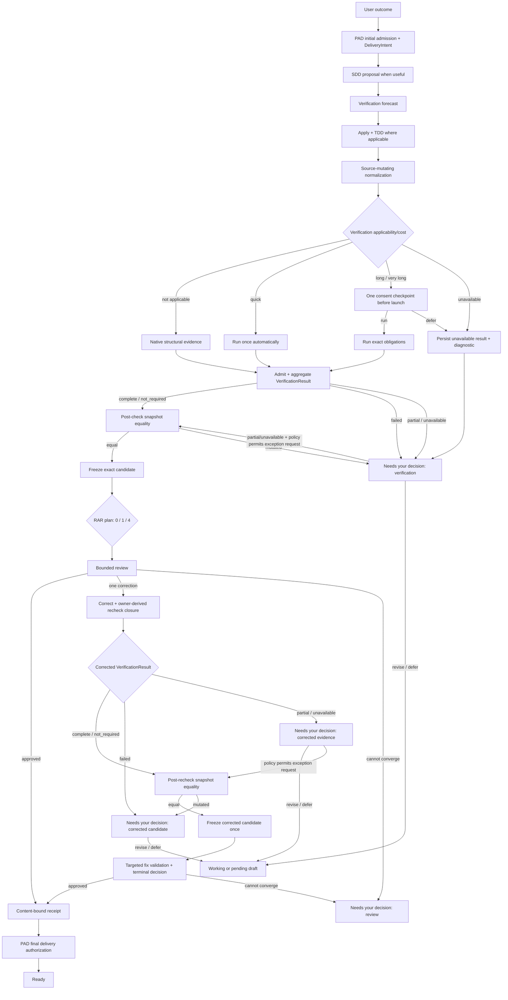

# Organic Recovery Architecture and Implementation Plan

- **Decision date:** 2026-07-23
- **Status:** Proposed for maintainer approval
- **Architecture baseline:** `main` at `0d95c399c79edb341e3d874032eba4654b2b3f17`
- **Parent architecture:** [Systemic Remediation Architecture](./2026-07-23-systemic-remediation-architecture.md)
- **Scope:** proportional verification, the SDD/RDD/PAD handoff, an outcome-first user experience, and typed delivery routes
- **Delivery posture:** one `size:exception` Gentle AI pull request composed of reversible work-unit commits; release Gentle AI before adapting Gentle Pi

> **Decision:** Restore Gentle AI's organic “ask for the outcome” experience without removing its trust kernel. Keep byte integrity, immutable candidate identity, typed evidence, bounded review, receipts, and gate revalidation invisible behind one provider-owned flow. Make semantic verification proportional to applicability, risk, and cost; surface only decisions that materially affect the user's intent, exposure, or delivery.

This is a recovery slice within the nine-context systemic architecture, not a replacement architecture and not a second workflow engine. It changes the `EPD`, `RAR`, `SDD`, and `PAD` handoffs while consuming existing `HCR`, `MMI`, and `ACI` ports. The product invariant is end-to-end: a person asks for an outcome, the system performs the necessary work and proof, and the person sees either **Ready** or one actionable decision. The slice must preserve the one-way dependency rules and authority ownership from the parent architecture.

## 1. Executive decision

Gentle AI should return to a simple public mental model:

1. The user asks for an outcome.
2. PAD records an initial admission decision and typed delivery intent.
3. SDD helps shape a proposal when the work benefits from one.
4. Apply implements the work, using TDD for executable behavior when applicable.
5. Gentle AI performs only the verification and review justified by the exact change.
6. PAD authorizes the selected delivery route against the final receipt and live destination.
7. The user sees either a ready result or one bounded decision.

The public product exposes only four states:

| Public state | Meaning |
|---|---|
| **Working** | The implementation can still change. |
| **Checking** | The system is performing the applicable functional proof and bounded adversarial review. |
| **Ready** | The exact candidate has sufficient evidence for its selected delivery route. |
| **Needs your decision** | Safe automatic convergence is impossible; the user receives the cause, impact, and a small set of concrete choices. |

Hashes, lineages, revisions, locks, actor tickets, attempt ordinals, recovery classes, receipts, and lifecycle operations remain available to maintainers and support tooling, but they are not the normal user's workflow.

### Non-negotiable constraints

- No second SDD review state machine, authority kernel, or evidence ledger.
- No model-authored `not_applicable`, identity, hash, authorization, or PASS.
- No loop-until-clean review or verification.
- No silent downgrade from missing or expensive proof to approval.
- No requirement that every delivery use both an issue and a pull request.
- No route may weaken immutable candidate identity, managed mutation integrity, receipt binding, remote revalidation, or repository protection.
- No optional fields may be added to the existing `sdd-status` v1 response because Gentle Pi decodes that shape exactly.
- A kill switch may disable the new capability or reduce it to read-only diagnostics; it may not restore consumer-side inference or prose authority.

## 2. Problem and evidence

### 2.1 Product failure

The four-R review model improved investigation and found risks that the previous organic workflow missed. It also turned internal safety machinery into a user-visible ceremony:

- simple document or visual-asset work can launch the same verification phase as executable behavior;
- functional verification, adversarial review, correction, and gate checks can appear as repeated reviews of the same fact;
- expensive, environment-dependent, or impossible checks are discovered only after the system starts them;
- missing tools and timeouts can lead to retries or opaque blocking states;
- the user has to understand review internals to recover;
- issue-first and pull-request-first governance is treated as if it were universal security policy;
- SDD, RDD, gates, CLI adapters, and Gentle Pi can each infer a next action.

The result is safe stopping without an operable path forward. Users who were satisfied with “build this for me” encounter review vocabulary, repeated prompts, and non-convergent flows after the implementation is already correct.

### 2.2 Systemic evidence

The parent audit proved that ticket-by-ticket remediation is the wrong strategy:

- the live-normalized collision graph contains **90 PRs and 499 overlap edges**;
- **74 PRs form one collision component** spanning eight canonical contexts;
- **16 PRs require decomposition** because they cross too many contexts or act as oversized collision hubs.

This recovery therefore cannot be another sequence of isolated workflow patches. It must establish one owner for each decision and one explicit handoff between SDD, RAR, EPD, and PAD.

### 2.3 Existing implementation seams

Gentle AI already contains reusable foundations:

| Existing seam | Reuse decision |
|---|---|
| `internal/reviewtransaction/risk.go` | Reuse native path/content risk assessment, operational Markdown detection, and static MDX inspection. Extend it through an owner-issued applicability contract rather than file-extension heuristics. |
| `NativeLowRiskVerificationEvidence` in `internal/reviewtransaction/compact.go` | Retain only as post-freeze RAR evidence for a genuine low-risk, zero-lens review. It cannot prove pre-review applicability because it requires an existing frozen compact state. |
| `RuntimeStore` and SDD CAS records | Reuse as the durable work/attempt ledger. Do not create a second verification database. |
| `CandidateIdentity`, review authority, and immutable receipts | Preserve unchanged as the trust kernel. |
| `applyPreVerifyReviewRouting` in `internal/sddstatus/status.go` | Replace the current review-before-final-verification ordering with functional verification before the review candidate is frozen. |
| `gentle-ai.sdd-status` v1 | Introduce an explicit strict v1 projection that matches the current Gentle Pi decoder and cannot leak `runtimeStatus`, `remediationState.correctionBudget`, new root keys, or v2-only next-action tokens. |

Pre-review `not_applicable` requires a new RAR-owned applicability decision bound to the post-normalization snapshot and supported by EPD-admitted evidence. It must not reuse the RAR-only low-risk evidence preimage.

## 3. Product contract

### 3.1 Outcome-first interaction

The normal user does not invoke SDD, RDD, or PAD commands. Natural language remains the primary interface:

> Create this poster using the supplied copy and dimensions.

Internally, Gentle AI can classify the work, perform a structural readback, run a renderer or parser when one is applicable, select the bounded review plan, and authorize delivery. The final response remains about the outcome.

The system asks a question only when the answer changes at least one of:

- requested scope;
- destructive or irreversible impact;
- permission or security exposure;
- verification cost or external side effects;
- acceptance of explicit residual risk;
- delivery route.

It does not ask the user to choose hashes, lenses, recovery verbs, attempt budgets, or authority states.

### 3.2 One visible checking phase

Functional verification and adversarial review may remain distinct internal operations, but they map to one public **Checking** state. The user should not see a separate ceremony for:

- structural readback;
- formatter or parser checks;
- selected review lenses;
- refutation;
- one scoped correction;
- targeted rechecks;
- receipt publication;
- repeated delivery gates.

Repeated gates validate the same content-bound receipt. They never open another review or verification budget.

### 3.3 Guaranteed convergence

For one immutable candidate generation:

- the review plan selects zero, one, or four lenses according to native policy;
- each selected lens runs only its bounded sweep;
- one merged adversarial decision is produced;
- at most one candidate correction is authorized;
- the owner-derived dependency closure, mandatory global obligations, and risk/policy classification are recomputed after correction;
- only when that closure is complete and unambiguous may unaffected evidence be reused;
- the corrected candidate receives a new exact binding;
- if the bounded process cannot approve, the public state becomes **Needs your decision**.

Operational replay of an interrupted durable operation does not consume the correction budget. Changed content is a new candidate generation, not another invisible attempt on the old one.

## 4. Authority and ownership

| Context | Owns in this slice | Must not own |
|---|---|---|
| `HCR` | Execute already-authorized argv with exact cwd and allowlisted environment, deadlines, bounded and secret-safe streams, cancellation, descendant cleanup, and terminal process evidence | Verification policy, model-selected commands, SDD advancement, or delivery authorization |
| `MMI` | Atomic/rollback-safe writes, path and mode safety, and post-write structural readback | Semantic correctness, review selection, or delivery policy |
| `ACI` | Advertise canonical capabilities and render the canonical recovery modules for each supported adapter | Runtime detection, verification outcomes, or lifecycle transitions |
| `EPD` | Action tickets, evidence envelopes, evidence admission, diagnostic identity, and ordered policy versions | Applicability, durable attempts, SDD advancement, process execution, or delivery authorization |
| `RAR` | Candidate identity, native verification applicability, risk-selected review plan, bounded correction, terminal content receipt, and gate validation | Implementation planning, attempt budgets, test-selection prose, or route-specific issue policy |
| `SDD` | Proposal/spec/design/tasks/apply lifecycle, declared verification obligations, durable attempts/budgets, forecast/disposition/result lifecycle, TDD evidence, and references to external evidence/receipts | Copied review states, applicability policy, lenses, recovery algebra, process execution, or delivery authority |
| `PAD` | `DeliveryIntent`, route-specific governance applicability, final admission, and delivery authorization | Candidate hashing, reviewer execution, or mutation mechanics |
| CLI/Pi/adapters | Present the four public states and execute exact owner-issued transitions | Reconstruct policy, identity, flags, recovery, or PASS |

The handoff rule is reference-only:

- SDD references `VerificationResultRef` and `ReviewReceiptRef`.
- RAR consumes owner-issued evidence; it does not recreate SDD tasks.
- PAD references the exact content receipt and route evidence; it does not perform another review.

## 5. Canonical flow



### 5.1 SDD relationship

SDD remains valuable because it helps a person turn an outcome into a coherent proposal. It does not become a classical “write tests first for everything” system.

- **Proposal:** clarify outcome, constraints, and acceptance when ambiguity justifies it. Compute the verification forecast once scope stabilizes.
- **Spec/design/tasks:** use only when they reduce implementation ambiguity; trivial work can collapse these phases.
- **Apply:** use TDD for executable behavior and focused checks for each work unit. Static human content does not need artificial tests.
- **Normalize:** run every source-mutating formatter or generator before candidate freeze.
- **Functional verification:** prove the applicable behavior once against the final normalized candidate.
- **Review handoff:** freeze the exact candidate only after applicable functional verification.
- **Archive:** store references to evidence and the receipt rather than copying their internal state.

If a correction changes executable behavior, SDD reruns only the obligations affected by the corrected paths and requirements. Any evidence whose binding no longer matches is rejected.

### 5.2 RDD/RAR relationship

RDD becomes a thin content-approval plane implemented by the single RAR kernel:

1. Receive the normalized, functionally assessed candidate.
2. Derive native risk and select zero, one, or four lenses.
3. Perform one bounded review and one merged adversarial decision.
4. Permit at most one scoped correction.
5. Bind the terminal result to the exact candidate and evidence.
6. Reuse that receipt at later gates.

RDD does not plan implementation, run an open-ended TDD loop, choose delivery governance, or expose recovery mechanics to normal users.

### 5.3 PAD relationship and delivery routes

PAD operates twice:

1. **Initial admission:** before SDD or implementation, issue an owner-authenticated admission decision and a provisional `DeliveryIntent`.
2. **Final authorization:** after RAR emits a terminal content receipt, re-evaluate the exact destination, live repository policy, route evidence, and any authorized exception.

The caller or model may request a route, but only repository and maintainer policy can issue `not_applicable`, exception, direct-main, or emergency authority.

`DeliveryIntent` is explicit and typed:

| Route | Intended behavior |
|---|---|
| `pr_with_issue` | Default community route. Validate approved issue linkage, current PR policy, exact head, live required checks, and final authorization. |
| `pr_without_issue` | Explicit route for a bounded contribution where issue admission is intentionally not applicable. PR and safety checks still apply. |
| `direct_main` | Maintainer-only route. Revalidate remote/base freshness and repository protection immediately before the update. Never force or bypass branch protection. |
| `emergency` | Expiring, reasoned, auditable break-glass route bound to one candidate, destination, policy revision, and known residual risk. High-risk policy may require an independent second maintainer. It does not convert incomplete evidence into PASS. |

Issue and PR checks are governance obligations whose applicability depends on the route. They are not universal security evidence. Conversely, changing the route never disables candidate identity, mutation integrity, remote revalidation, or receipt binding.

A normal route does not deliver an applicable candidate with `failed`, `partial`, or `unavailable` evidence. Failed proof returns to work or remains blocked. For `partial` or `unavailable`, the work may remain as a draft, or an explicit `DeliveryExceptionAuthorization` issued by PAD may accept documented residual risk when repository policy permits it. That authorization is candidate-bound, destination-bound, one-shot, expiring, and separate from the RAR review receipt. After the human decision, the public flow may reach **Ready with accepted risk**, but the underlying verification evidence remains visibly incomplete rather than green.

**Ready with accepted risk** is a reason/detail attached to the public **Ready** state, not a fifth progress state.

The exception path still proves evidence-subject equality and obtains a RAR content receipt. That receipt records the incomplete `VerificationResultRef` and means only that bounded content review converged; it is not delivery approval and does not relabel verification. PAD may issue normal authorization only for `complete` or `not_required`. For `partial` or `unavailable`, it may issue the separate exception authorization only after the public decision and only when repository policy permits the route.

## 6. Proportional verification

### 6.1 Independent axes and availability

Verification policy must not reduce every decision to a single risk level:

| Axis | Question | Examples |
|---|---|---|
| **Applicability** | Does this candidate have a semantic/runtime obligation that can meaningfully be checked? | A passive poster has structural constraints but no runtime behavior. `AGENTS.md` changes agent behavior and is applicable. |
| **Risk** | How much adversarial review is justified? | A small auth rule may be high-risk; a large prose document may primarily need readability review. |
| **Cost** | What will the check consume or require if executed? | Local parser versus Docker, network, credentials, paid APIs, devices, or an unknown-duration environment. |
| **Availability** | Can the exact required plan run in the observed environment now? | An applicable long check can also be unavailable because its trusted runner is missing. |

`RiskLow` alone is not proof that verification is inapplicable. File extension alone is not proof that content is passive.

The contract keeps these coordinates separate:

```text
applicability: applicable | not_applicable | unknown
risk: low | medium | high
cost: quick | long | very_long | unknown
availability: available | partial | unavailable
```

Product routing is derived from their combination. No single enum may collapse applicability, cost, and availability.

### 6.2 Verification artifacts

The negotiated provider contract exposes four typed artifacts without moving their underlying authority:

| Artifact | Owner | Purpose |
|---|---|---|
| `VerificationApplicability` | `RAR` | Decides `applicable`, `not_applicable`, or `unknown` for the exact subject using native policy and EPD-admitted evidence. |
| `VerificationForecast` | `SDD` | Declares the applicability reference, exact obligations, expected cost class, prerequisites, policy/provenance, and what cannot currently be proven. It contains no PASS. |
| `VerificationDisposition` | `SDD` | Records the automatic policy or user decision to run, defer, reduce scope, or select a trusted deferred runner. It binds the forecast and its validity conditions. |
| `VerificationResult` | `SDD` | Records the actual candidate-bound result of every obligation and references immutable EPD evidence. RAR consumes this artifact, never the forecast. |

The first forecast is produced when the planned scope is stable. It may reference a RAR policy projection over that planned scope, but that projection cannot authorize `not_required` or launch a process. After normalization, RAR issues the exact subject-bound applicability decision. Only that decision controls execution or `not_required`, and SDD records it in the final forecast/result binding. A material scope, plan, policy, capability, applicability, or candidate change invalidates any authorization whose assumptions no longer hold.

### 6.3 Provider-owned execution evidence

Structural verify-result syntax is not proof that a command ran.

- Exact argv, cwd, environment, deadline, and output limits come from a provider- or user-owned plan.
- A model cannot authorize or alter commands, candidate identity, exit codes, timestamps, or output hashes.
- HCR executes the issued action ticket and owns bounded, secret-safe/redacted stdout/stderr capture, cancellation, descendant termination, cleanup, and terminal cause.
- EPD admits an immutable evidence envelope bound to candidate, verification context, revision, slot, cwd, argv, execution outcome, and captured-byte digests.
- Timeout, cancellation, truncation, spawn failure, stale binding, cross-candidate replay, or incomplete cleanup cannot satisfy delivery.
- A coherent nonzero execution may support `failed`; it can never be rewritten into PASS.

This is the bounded provider-evidence slice needed by proportional verification. It does not introduce arbitrary or model-selected shell execution.

### 6.4 Derived product behavior

| Coordinates | Product behavior |
|---|---|
| `not_applicable` with native evidence | Launch no semantic verification actor and consume no SDD runtime attempt. Preserve MMI readback, the RAR applicability decision, and its EPD evidence references. |
| `applicable + quick + available` | Run automatically exactly once without asking. Quick means predicted p95 at most 120 seconds with no paid, network, privileged, credential, device, or external effect. |
| `applicable + long + available` | Forecast the reason and expected range, then ask once before launching a process or consuming an attempt. Long means above 120 seconds, unknown/high variance, or dependent on an external capability or effect. |
| `applicable + very_long + available` | Recommend a trusted CI/deferred runner. Very long means above 15 minutes or unsuitable for an interactive session. |
| `applicable + partial/unavailable` | Persist a typed diagnostic and move to **Needs your decision**. Do not fabricate a skip or retry loop. |
| `unknown` in any safety-relevant coordinate | Fail closed to a typed decision or capability blocker. |

The time values above are versioned runtime policy thresholds, not delivery estimates.

### 6.5 Check and aggregate results

Individual obligations use explicit outcomes:

```text
passed
failed
not_applicable
skipped_by_user
skipped_by_policy
unavailable
cancelled
```

Applicable obligations aggregate monotonically to:

```text
not_required
complete
failed
partial
unavailable
```

Rules:

- `not_required` is valid only when every semantic obligation is owner-proven `not_applicable`.
- `skipped_*`, `unavailable`, `cancelled`, or missing required evidence never aggregate to `complete`.
- A timeout is a typed incomplete result, not a generic process failure and not a PASS.
- Exit code zero, empty output, a literal “PASS,” or syntactically valid model output is insufficient without the owner-required evidence binding.
- High-risk evidence requirements cannot be downgraded by a lower-capability actor or adapter.
- An all-`not_applicable` semantic plan is represented by native `not_required` plus structural evidence; it is not a model-authored verification PASS.

### 6.6 Passive versus active content

The native classifier starts from path, mode, content, repository ownership, and loader/registry references:

| Candidate | Default |
|---|---|
| Ordinary human-facing `README`, `.md`, `.rst`, or `.adoc` with no operational ownership | Passive semantic verification; structural readback only |
| Ordinary poster or raster/vector image outside managed/runtime assets | Passive semantic verification; validate requested structural constraints such as format or dimensions when specified |
| `AGENTS.md`, `SKILL.md`, prompts, agent rules, policy text, runtime instructions | Active; treat as executable behavior/configuration |
| `.github/workflows`, configuration, templates consumed by runtime, registry-loaded docs | Active |
| MDX with imports, expressions, components, exports, or active renderer behavior | Active |
| Mixed, unknown, executable, mode-changing, symlink, submodule, or ambiguous content | Active/fail closed |

The classifier must be native, versioned, deterministic, and covered by fixtures. A model may supply observations, but it cannot declare its own work exempt.

#### Poster example

For “create a poster from this copy”:

- confirm that the target file exists and its bytes can be read back;
- confirm format and requested dimensions when those are objective requirements;
- optionally render a preview if a native renderer is available and quick;
- do not invent a runtime verification phase;
- do not claim objective aesthetic correctness;
- let the user accept visual quality unless a specific visual review was requested.

### 6.7 Long-check consent

When long verification was not already accepted in the proposal, the UI presents one compact decision before process launch:

> Full checking is expected to take about 8–12 minutes and requires Docker.
>
> Run it once when implementation finishes?
>
> 1. Run it when ready
> 2. Keep the work as a pending draft
> 3. Reduce the scope

The exact wording is adapter-specific, but the envelope must include:

- why the check is applicable;
- expected cost/range and prerequisites;
- any external effect;
- what delivery remains possible if it is deferred;
- a recommended option.

The proposal-level choice is a reusable disposition, not launch authority. Immediately before execution, the SDD-owned `RuntimeStore.Begin` must atomically commit:

- the canonical verification-plan revision and preimage reference;
- the exact post-normalization candidate identity;
- cost and availability observations;
- the authorization actor and decision identifier;
- the allowed action ticket and attempt ordinal.

No process launches and no attempt is consumed unless that atomic begin succeeds. The user is not asked again while the committed assumptions remain valid. A mismatch invalidates the disposition and returns one updated decision instead of silently launching or looping.

## 7. Contract invariants

### 7.1 Identity and provenance

- Every result binds the exact `CandidateIdentity`, policy version, obligation set, command/action ticket, working directory, toolchain/capability identity, and evidence digest.
- RAR issues applicability decisions; their supporting evidence is admitted by EPD and referenced through `EvidenceRef`.
- RAR accepts only admitted `VerificationResult` artifacts; free-form reviewer prose is never lifecycle authority.
- PAD accepts only the terminal receipt for the exact candidate and the evidence applicable to the selected route.
- A route change may reuse review evidence only when native RAR validation proves the full target relation remains `exact` or an allowed `compatible_base_advance`, including repository identity, selector/projection, base tree, candidate tree, object types, paths digest, policy, and destination relation. PAD must still re-evaluate route governance and the live remote head.

### 7.2 Mutation ordering

1. Apply the work.
2. Run source-mutating normalizers.
3. Capture the verification subject snapshot.
4. Perform applicable final checks in a sandbox or through explicitly non-mutating operations.
5. Re-snapshot after verification and prove exact equality with the evidence subject.
6. Freeze review identity only from that equal post-check snapshot.
7. After freeze, run only non-mutating checks.

Any byte, path, or mode mutation during final verification discards that evidence and returns to bounded normalization/replanning; it cannot be accepted by formatter tolerance. Any mutation after freeze invalidates the receipt.

### 7.3 Attempt and retry behavior

- Quick verification starts exactly once through a successful atomic `Begin`.
- Long verification consumes no attempt before the exact consent-bound `Begin`.
- Exact durable replay after an interrupted publication is read-only with respect to budgets.
- Missing tools, timeout, cancellation, and declined consent do not trigger automatic relaunch.
- One correction is the only candidate-changing automatic recovery.
- Exhausted convergence always becomes **Needs your decision**.

### 7.4 Correction impact closure

- Each verification obligation owns a canonical input/requirement/path digest and declares mandatory global checks.
- After correction, native owners recompute the dependency closure, verification applicability, RAR risk, and policy.
- Models and adapters may add observations but cannot shrink the closure.
- Unknown, mixed, ambiguous, security-sensitive, or high-risk impact reruns every required obligation.
- The corrected result must be `complete` or `not_required`, or carry a policy-permitted `partial`/`unavailable` exception request, and must pass post-recheck snapshot equality before the corrected candidate is frozen. Failure or mutation becomes **Needs your decision**.
- RAR performs targeted fix validation and terminalization after the correction. It does not launch a second initial 0/1/4 sweep.

### 7.5 Diagnostics

Owner-issued diagnostics are typed and actionable:

- what could not be proven;
- why;
- whether implementation work can continue;
- which delivery routes remain available;
- the exact decision needed;
- the evidence and candidate to which the diagnosis applies.

User-facing adapters translate internals without dropping choices or inventing remediation.

## 8. Compatibility and rollout

### 8.1 Provider first

Gentle AI owns policy and must publish the new contracts first. Gentle Pi adapts only after the provider release exists.

Compatibility is explicit rather than inferred:

| Invocation | Provider response |
|---|---|
| `gentle-ai sdd-status ... --json` | A strict `StatusV1Projection` containing only the fields and tokens accepted by the current Gentle Pi decoder. |
| `gentle-ai sdd-status ... --json --contract gentle-ai.sdd-status/v2` | A separately typed `StatusV2` with the public state, verification summary/references, delivery intent, and at most one provider-issued `AuthorizedTransition`. |
| `gentle-ai sdd-transition apply --contract gentle-ai.sdd-transition/v1 --authorization-ref <ref> --expected-revision <revision> --json` | The only v2 mutation surface. It applies the stored owner-issued transition through CAS and returns the resulting durable revision and next transition, if any. |
| An explicitly empty or unknown `--contract` value on either surface | A typed unsupported-contract diagnostic and a read-only exit before any transition or mutation. |

The default v1 projection must exclude `runtimeStatus`, `remediationState.correctionBudget`, new root keys, and v2-only next-action tokens even when the internal aggregate contains them. Gentle Pi's current decoder rejects unknown root fields, so adding “optional” fields is not compatible.

`StatusV2` does not publish a menu from which a client reconstructs policy. The native controller returns zero or one exact `AuthorizedTransition`, bound to `gentle-ai.sdd-transition/v1`, its opaque authorization reference, expected revision, candidate, action ticket, and applicable authorization. A client may present it and submit only the returned reference and revision to `sdd-transition apply`; it may not choose other flags, rebuild recovery algebra, or synthesize an alternative transition. Missing, expired, replayed-with-different-inputs, or mismatched authorization fails CAS without mutation.

The current `sdd-continue` contract remains unchanged for v1 consumers. The new behavior stays behind the advertised v2 capability until a consumer explicitly requests the recognized contract. There is no ambient upgrade based on provider version, field presence, prose, or adapter detection.

### 8.2 Historical authority

- Existing runs remain on the authority and contract version that created them.
- No migration rewrites historical receipts or fabricates new evidence.
- New readers may render old records, but cannot silently upgrade their authorization.
- Unsupported capability yields read-only status or a typed stop, not adapter inference.

### 8.3 Gentle Pi follow-up

The Gentle Pi change is intentionally outside this provider PR. Its subsequent implementation should:

- negotiate the new capability;
- consume the provider-issued next transition;
- invoke the exact `gentle-ai.sdd-transition/v1` apply surface with the returned authorization reference and revision;
- present only the four public states;
- execute forecast consent without constructing policy;
- preserve v1 behavior against older providers;
- add provider-version matrix fixtures.

## 9. One-PR implementation plan

The recovery lands in one `size:exception` pull request because the user-visible invariant, compatibility switch, and rollback boundary are one vertical unit. This is a deliberate, maintainer-approved packaging exception to the parent architecture's default one-context, review-sized slices; it is not an exception to context ownership, dependency order, safety evidence, or acceptance criteria.

The pull request is not one undifferentiated change:

- Wave 0 inventory and every required owner foundation are checked before behavior is activated.
- Existing `MMI` and `ACI` foundations are prerequisites. Changed owner units follow `HCR` facts/execution, `RAR` authority, `EPD` evidence/policy, `SDD` lifecycle, and `PAD` delivery. Final `ACI` work only projects contracts already proven by those owners; SDD may not depend on that generated projection.
- The v2 capability remains unadvertised and unable to start new work throughout intermediate commits.
- A missing foundation is implemented only inside its owning work unit and port. It is never improvised inside SDD, CLI, Pi, prompts, or generated assets.
- Each work unit must build and prove its owner acceptance before the next dependent unit is considered reviewable.
- The pull request may merge only when the complete provider contract is coherent and the exact final candidate passes independent review.

Changed LOC below means **additions plus deletions**, not net growth. It includes Go, schemas, fixtures, skills, documentation, tests, generated mirrors, and goldens.

| Work-unit commit | Outcome | Estimated changed LOC |
|---|---|---:|
| 1. Status compatibility floor | Add the strict v1 projection, separate v2 schemas, and contract selection without advertising new behavior. | 300–500 |
| 2. HCR bounded execution | Add the authorized execution inputs and terminal process evidence required by the slice. | 600–800 |
| 3. RAR authority and native policy | Add subject-bound verification applicability; extend candidate/risk classification, zero/one/four lens routing, correction impact rules, full target-relation validation, and receipt reuse. | 1,300–1,900 |
| 4. EPD evidence and diagnostics | Add action tickets, provider evidence envelopes, admission, typed diagnostics, and ordered verification-policy inputs without owning lifecycle state. | 1,400–2,000 |
| 5. SDD lifecycle and ledger routing | Add forecast/disposition/result records, durable attempts and atomic consent-bound `Begin`, TDD/apply evidence, normalization and equality proof, verification before review freeze, status, and truthful blockers. | 1,800–2,600 |
| 6. PAD delivery intents | Add PR-with-issue, PR-without-issue, direct-main, and emergency admission with route-specific policy. | 1,300–1,900 |
| 7. ACI projection and outcome-first UX | Map internal states to four product states; update canonical capability descriptors, skills, commands, help, diagnostics, and docs. | 1,300–2,000 |
| 8. Tests, fixtures, and architecture fitness | Add only cross-cutting classification matrices, property tests, route journeys, failure injection, v1 compatibility, and rollback coverage not already colocated with behavior. | 2,000–3,000 |
| 9. Generated mirrors and goldens | Regenerate provider assets and adapter mirrors from the exact canonical sources. | 2,000–3,800 |
| **Total** | Full provider recovery slice. | **12,000–18,500** |

The planning center is approximately **15,000 changed lines**. LOC is a review-load forecast, not an authorization to widen scope. Generated changes must be reviewed through their canonical source and parity checks rather than line by line.

### Work-unit rules

- Tests ship in the same commit as the behavior they protect; the dedicated test unit covers cross-cutting journeys and fitness functions.
- Generated mirrors ship with the canonical source revision that produced them or in the immediately following mechanically provable generation commit.
- No work unit introduces a second transition planner or duplicates an owner enum.
- Every commit states its rollback and compatibility effect.
- The PR description provides a reviewer path by work unit and identifies generated files.

## 10. Acceptance criteria

### 10.1 Product behavior

- [ ] A normal user can ask for an outcome without learning SDD, RDD, PAD, hashes, lenses, or recovery commands.
- [ ] The only public progress states are **Working**, **Checking**, **Ready**, and **Needs your decision**.
- [ ] A passive ordinary document or image launches no semantic-verification subagent and consumes no verification attempt.
- [ ] MMI still proves the intended file mutation and structural readback for passive work.
- [ ] An applicable quick check runs exactly once without prompting.
- [ ] A long or very-long check presents one forecast before any process, ordinal, credential, network effect, or paid action begins.
- [ ] An already accepted forecast is not prompted again unless its binding assumptions change.
- [ ] Exhausted automatic convergence ends in one actionable decision, never an infinite loop.

### 10.2 Classification and evidence

- [ ] `AGENTS.md`, `SKILL.md`, prompts, policies, workflows, runtime config, active MDX, and registry-loaded content never receive the passive shortcut.
- [ ] Mixed, unknown, mode-changing, symlink, submodule, executable, or ambiguous candidates fail closed.
- [ ] A free-text or model-authored `not_applicable` claim is rejected.
- [ ] Exit zero with empty output, a literal PASS, stale command/cwd/toolchain data, or stale candidate identity is rejected as proof.
- [ ] Missing tool, timeout, cancellation, or declined execution remains incomplete and never aggregates to `complete`.
- [ ] Aggregate result rules are monotonic under property tests: adding weaker/missing evidence cannot improve the outcome.
- [ ] High-risk obligations cannot be downgraded by an adapter or low-capability actor.
- [ ] Any changed byte, path, mode, scope, policy, or required capability invalidates the applicable plan/evidence/receipt binding.

### 10.3 SDD/RDD convergence

- [ ] Apply/TDD and source-mutating normalization precede final functional verification.
- [ ] Applicable final functional verification precedes review identity freeze.
- [ ] The post-verification snapshot exactly equals the evidence subject; a mutation discards the evidence and triggers bounded replanning.
- [ ] Native policy selects exactly zero, one, or four review lenses.
- [ ] At most one scoped candidate correction is permitted.
- [ ] Native owners recompute correction dependency closure and mandatory global obligations; unknown, mixed, ambiguous, security-sensitive, or high-risk impact reruns every required obligation.
- [ ] Only demonstrably unaffected evidence may be reused; stale affected evidence is rejected and clients/models cannot shrink the closure.
- [ ] Corrected verification branches explicitly: complete/not-required plus equality reaches targeted terminalization; failed/mutated stops; policy-permitted partial/unavailable follows the separate exception decision and never restarts the initial lens plan.
- [ ] A corrected candidate receives an exact new identity and terminal decision.
- [ ] Later post-apply, commit, push, PR, main, and release gates reuse the same valid receipt and do not relaunch review.

### 10.4 Delivery

- [ ] `pr_with_issue` remains the default route and validates current approved linkage.
- [ ] `pr_without_issue` marks issue admission not applicable without weakening PR or safety gates.
- [ ] `direct_main` is maintainer-authorized, validates exact remote freshness, respects protection, and never force-pushes.
- [ ] `emergency` is explicit, expiring, reasoned, candidate-bound, and auditable.
- [ ] Emergency residual risk remains recorded as `partial` or `unavailable` under a distinct PAD exception, never as PASS or a normal review receipt.
- [ ] Changing only the delivery route can reuse unchanged content evidence while reevaluating route-specific governance.

### 10.5 Compatibility and operations

- [ ] The default `sdd-status` v1 JSON remains byte-shape compatible for current Gentle Pi fixtures.
- [ ] `StatusV1Projection` strips `runtimeStatus`, `remediationState.correctionBudget`, new root keys, and v2-only tokens regardless of internal state.
- [ ] An explicit `gentle-ai.sdd-status/v2` request returns the separate typed schema and zero or one exact provider-issued `AuthorizedTransition`.
- [ ] `gentle-ai.sdd-transition/v1` is the sole v2 mutation surface and rejects missing, expired, mismatched, or stale authorizations without mutation.
- [ ] An empty explicit or unknown contract fails read-only before mutation; absence of the flag continues to select v1.
- [ ] Capable and incapable consumers are covered by a provider-version/contract matrix, and `sdd-continue` remains unchanged for v1 consumers.
- [ ] Historical v1 verification records and receipts remain readable and retain their original authority.
- [ ] Disabling the new capability produces safe read-only/unsupported diagnostics and never restores prose or consumer inference.
- [ ] The full provider test suite, asset parity suite, schema fixtures, and generated-asset checks pass.
- [ ] Independent adversarial review runs against the exact final candidate, followed by no more than the one permitted correction cycle.

## 11. Rollback

### 11.1 Runtime rollback

- Disable advertising the new capability and reject new v2 starts.
- Keep current v1 status and historical authority readable.
- Keep v2 compatibility readers plus owner-issued recovery and terminalization available for already-started v2 work.
- Reject every other new proportional-verification or delivery-intent transition with a typed unsupported/read-only result.
- Do not fall back to a retired prompt parser, consumer-side transition planner, or unsigned arbitrary command.
- Disable `direct_main` and `emergency` routes independently if their admission policy is implicated.

### 11.2 Source rollback

- Before capability activation, or while no v2 record exists, revert the one provider PR or the last safe dormant work-unit boundary.
- After any v2 record exists, never deploy a binary that cannot read it. Use a compatibility-preserving rollback release or fix forward while new starts remain disabled.
- Preserve additive versioned schemas, readers, recovery/terminalization paths, and historical fixtures for every persisted authority version.
- Regenerate mirrors from the reverted canonical source and prove parity.
- Re-run current v1 compatibility fixtures before publishing a rollback release.

### 11.3 Data rollback

- Never rewrite or delete old receipts to make rollback appear clean.
- Existing runs continue under their originating authority version.
- New-version runs remain inspectable and can execute only owner-issued recovery or terminalization when their general capability is disabled.
- Interrupted durable publications use exact replay; they do not synthesize a replacement authorization.

## 12. Out of scope

- Implementing all nine systemic architecture contexts in this recovery PR.
- Resuming or merging the 74 colliding community PRs one by one.
- Migrating the 16 multi-context PRs; their extraction follows the parent architecture.
- The Gentle Pi consumer implementation and release.
- A second review/evidence ledger for SDD.
- General arbitrary-shell verification supplied by a model.
- Treating aesthetics or subjective writing quality as objectively verified without explicit criteria.
- A generic “skip verification and mark ready” option.
- Bypassing protected branches, force-pushing main, or disabling immutable identity and mutation safety.
- Replacing current model/catalog, installer, reconciliation, or capability-manifest architecture beyond seams required by this vertical slice.

## 13. Immediate next action

1. Approve the tracker issue linked to this plan.
2. Create one branch from current `main` after this plan and its tracker issue are published.
3. Open one `size:exception` PR organized by the nine work-unit commits above.
4. Review canonical sources before generated mirrors.
5. Publish Gentle AI after exact-candidate review, CI, and final maintainer authorization.
6. Start the separate Gentle Pi capability-consumer change only after the provider release is available.

## 14. References

- [Systemic Remediation Architecture](./2026-07-23-systemic-remediation-architecture.md)
- [Receipt-Driven Development System Audit](./2026-07-21-rdd-system-audit.md)
- [Architecture baseline commit `0d95c399c79edb341e3d874032eba4654b2b3f17`](https://github.com/Gentleman-Programming/gentle-ai/commit/0d95c399c79edb341e3d874032eba4654b2b3f17)
