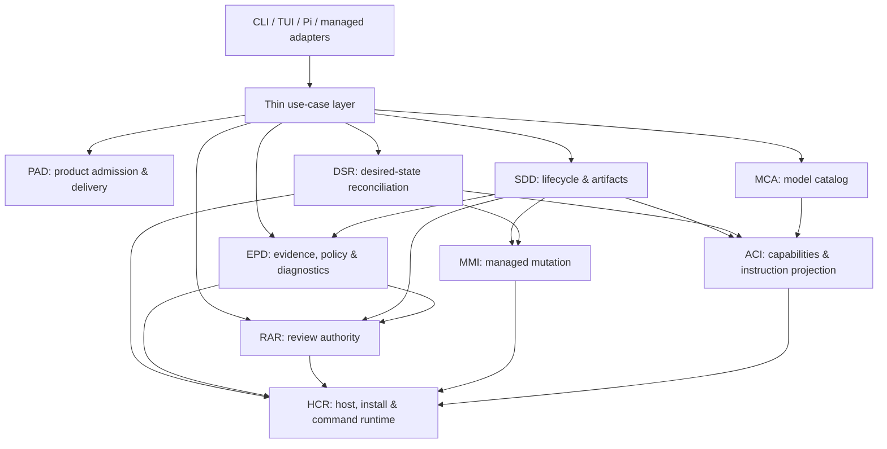
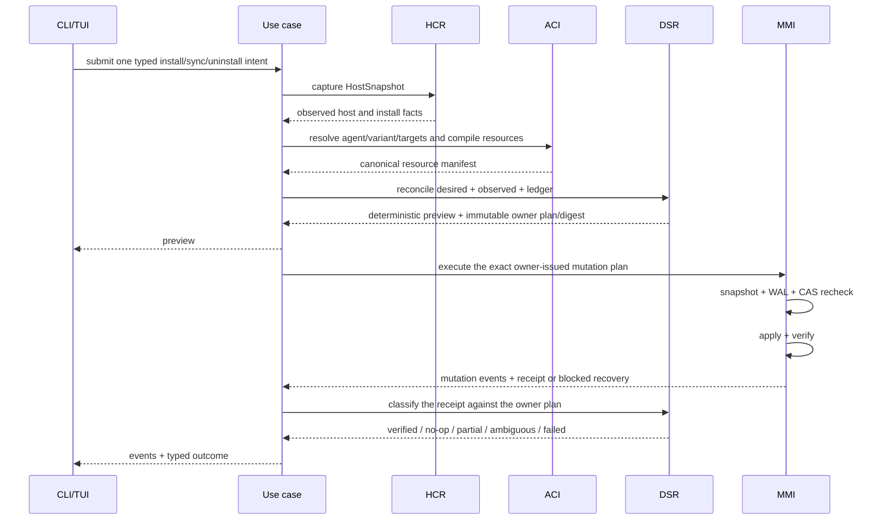
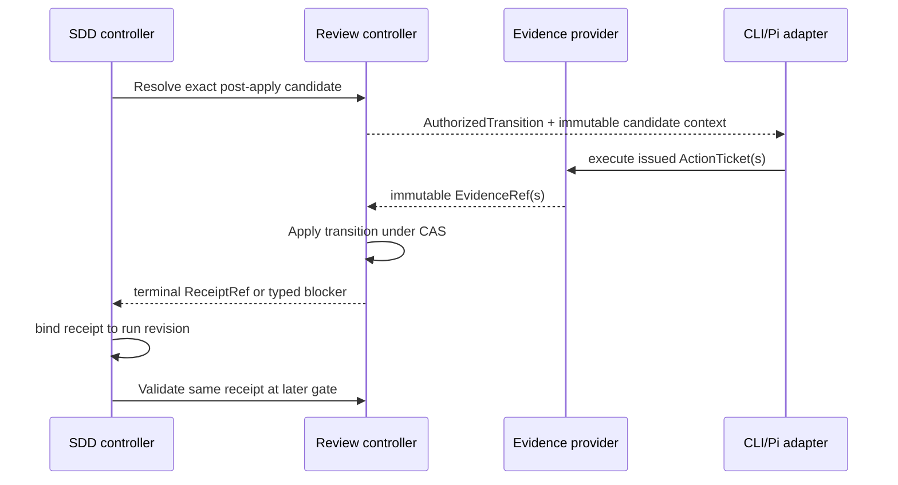
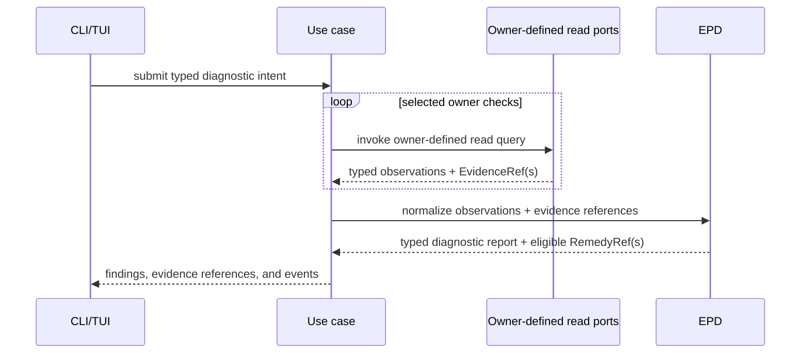

# Systemic Remediation Architecture for Gentle AI

**Decision date:** 2026-07-23

**Status:** Proposed for maintainer approval

**Architecture baseline:** `main` at `8b8dac0e4c2f55af76a78a46554064c5b4001308`

**Evidence baseline:** 241-issue and 92-PR snapshots captured on 2026-07-23, reconciled against later live state

**Scope:** install, sync, uninstall, update, managed resources, agents, models, generated instructions, policy, review, SDD, diagnostics, CLI, TUI, and delivery governance

> **Decision:** Stop ticket-by-ticket remediation. Build the shared architectural seams first, migrate existing behavior and community contributions through those seams, and resume isolated feature delivery only when the owning seam is stable.

This is a consolidation, not a rewrite. Gentle AI should preserve the proven review trust kernel and replace duplicated planning, capability inference, direct mutation, prose authority, and adapter-specific policy with nine bounded contexts. Each fact gets one owner; each lifecycle gets one authority; every side effect is re-observed before success.

## 1. Executive decision

Maintainers should approve the following direction before accepting more broad review, recovery, agent, plugin, configuration, update, or SDD implementations:

1. **Adopt the nine canonical contexts in this document.** They replace the 48 provisional cluster names from the four backlog analyses; no parallel taxonomy should be created.
2. **Land foundations in dependency waves.** Host/process facts come first; then `MMI`/`ACI`/`RAR`; then `EPD`/`MCA`; then `DSR`; then `SDD`; removal and standalone delivery come last.
3. **Treat the backlog as acceptance evidence.** The 241 issues are not 241 independent design decisions, and the 92 snapshot PRs are not a merge queue.
4. **Preserve community work deliberately.** Reuse verified code, tests, fixtures, and assets; publish the extraction map and contributor credit before closing source PRs.
5. **Fail closed without unsafe fallback.** A kill switch disables mutation or degrades to read-only diagnostics; it never silently restores a retired writer, unsigned installer, consumer-side planner, or prose parser.

The decision explicitly rejects four tempting replacements:

- no god manifest that owns agents, targets, installs, models, assets, and policy;
- no universal transaction engine pretending files, package managers, networks, and model actors are one atomic system;
- no one-size-fits-all adapter that erases provider and platform semantics;
- no second sprawling Receipt-Driven Development state machine for SDD.

## 2. Verified evidence and methodology

### 2.1 Snapshot facts, live facts, and authorization

| Evidence class | Verified result | Architectural consequence |
|---|---|---|
| Issue snapshot | **241/241** items mapped exactly once; no missing, unexpected, duplicate, title, or URL mismatch | Coverage is complete enough to design systemic boundaries. |
| PR snapshot | **92/92** items mapped exactly once; no missing, unexpected, duplicate, title, URL, or snapshot-head mismatch | Every snapshot PR has a disposition and canonical context. |
| Live drift | All 241 issues remained open; snapshot PRs became **90 open / 2 closed** when #1023 and #1769 closed | Snapshot dispositions are evidence, not live merge authorization. |
| Changed content | #1624 alone changed head, from `b378de3…` to `5ba1ace…`, and grew from 253 to 383 changed lines | Its prior content-bound assessment is stale and must be rerun. |
| Collision graph | Live-normalized graph: **90 PRs / 499 edges**; component sizes `[74, 3, 1 × 13]` | Integration of the 74-PR component must be serialized. |
| Cross-context pressure | The 74-PR component spans 8 contexts and contains **345 cross-context edges** | Apparent feature independence is not file-level independence. |
| Direct context span | 40 PRs directly touch more than one context; **16 require decomposition** | Context seams and review-sized slices precede integration. |

The completeness validator returned `NEEDS_RECONCILIATION`, but that verdict applies to **live PR dispositions and linkage semantics**, not item coverage. Coverage passed exactly: 241/241 issues and 92/92 snapshot PRs. The required reconciliation is:

- six PRs described in the snapshot as metadata-only merge candidates are live `UNSTABLE`;
- #1624 changed bytes and acquired two new Major findings;
- #946, #1287, and #1357 overload “linked issues” with closing versus related/intended references;
- the collision graph required removal of now-closed #1769.

### 2.2 Why green CI is not authorization

CI proves only the checks that ran against a particular head. It does not prove current merge state, approved issue linkage, human review completion, candidate identity, policy invariants outside the suite, or absence of adversarial failures.

The evidence contains direct counterexamples:

- #956 is clean and CI-green at `e95d10f091019ec2d4cc6dd58a485cb9abe054e0`, yet independent exact-byte reviews reproduced an outer-wildcard permission-ordering escalation and an unbounded aggregate solver cost.
- #1756 is clean and green, yet rollback can delete a same-byte recreated file, follow an in-root ancestor symlink, or widen a mode-only user restriction.
- #1764 is clean and green, yet nested/interleaved marker topology can delete user bytes or another managed section.
- #1063, #1064, #1079, #1080, #1105, and #1219 have visible green checks but live `mergeStateStatus=UNSTABLE`, not `CLEAN`.

Therefore “green,” “mergeable,” or a stale review is never authority. The required rule is: **same immutable head, current required gates, clean live merge state, current issue/linkage policy, and final human authorization**.

### 2.3 Method

This design was synthesized from:

- the complete [2026-07-21 Receipt-Driven Development audit](./2026-07-21-rdd-system-audit.md);
- four complete backlog reports and their machine-readable ledgers;
- the completeness validator, used as authority for taxonomy, totals, live drift, linkage caveats, and decomposition;
- the 2026-07-23 issue, PR, enriched-PR, linkage, and collision snapshots;
- the audit-to-architecture mapping and independent target design;
- focused exact-head reviews for #956, #1642, and #1297 where their evidence changes architectural decisions.

No issue state was treated as proof of a defect. No CI state was treated as approval. Counts are snapshot-bound; live actions must revalidate the exact head and current repository policy.

### 2.4 Evidence identity

| Evidence artifact | SHA-256 |
|---|---|
| `gentle-ai-open-issues-2026-07-23.json` | `c5f3a4547e819feaede2f9558b5d7bed8869b8687984c704bbfa986da8f8f1ac` |
| `gentle-ai-open-prs-2026-07-23.json` | `5780413ef205bf7ae6dff47f097f2b36b7d72eb786d3a6b6806c904ad0da2a5b` |
| `gentle-ai-open-prs-enriched-2026-07-23.json` | `6777a16fbb2fd22ccf5714993277aa80921925114b90be942299605f330b19d1` |
| `gentle-ai-backlog-linkage-2026-07-23.json` | `ab347cfebc4d0154aac264419b9759cefa924d524fba82fadd80101c815b5e55` |
| `gentle-ai-open-pr-conflict-graph.json` | `f2b154e5d75a04de8fee3aa4b6da6200791079b6ecfa6e41a688a91232d0e16b` |
| `gentle-ai-backlog-cluster-1.json` | `5b6e6c33402ef594b4737826d0b570dad30e7cc067c09855bff937a986c90733` |
| `gentle-ai-backlog-cluster-2.json` | `994a439e5a8bd6e0d08e332975a7118078b3a1ba785a52309ff7182260422fdd` |
| `gentle-ai-backlog-cluster-3.json` | `6fffe0a2efd2fae6b660600bb247c704ad648c40194b8c2047345615ad81f3b8` |
| `gentle-ai-backlog-cluster-4.json` | `9efb1c414507b0eef0e834beb55f4775addc4bd0b4f331fd0c4f3fe16cc2bf57` |
| `gentle-ai-backlog-completeness-validation.json` | `c1a85296155ebc3cfd5449f32929036c119e60b71ed80b07bf55ca178be11151` |

## 3. What the prior RDD audit proved

The [prior audit](./2026-07-21-rdd-system-audit.md) proved that Gentle AI's review core is not the problem to rewrite. It also proved that the orchestration around that core had become distributed and operation-specific.

### 3.1 Trust kernel to preserve

| Preserve | Why it is essential |
|---|---|
| Immutable candidate identity | Approval must bind bytes, paths, object types, modes, projection, policy, and relevant base evidence. |
| Git-common-dir authority | Linked worktrees share one local authority root; unrelated clones do not inherit trust. |
| CAS revisions and locks | Stale or concurrent mutations fail instead of overwriting authority. |
| Write-ahead intent and replay | Interrupted operations can be classified and replayed only when the request is identical. |
| No-clobber publication and read-back | A write is not accepted until reopened and verified. |
| Immutable terminal receipts | Approved or escalated history is auditable and not rewritten into a new meaning. |
| Live gate re-derivation | Post-apply, pre-commit, pre-push, pre-PR, and release validate current delivery evidence without opening another review budget. |
| Compatible-base proof | Harmless base motion can be proven without letting approval float to changed scope. |

### 3.2 Recurring mechanisms

| Recurring mechanism | Backlog recurrence | Architectural response |
|---|---|---|
| Split transition authority | CLI, Pi/adapters, review status, gates, and SDD each infer the next action | One native review controller returns the only executable transition. |
| Operation-local target algebra | Staged, committed, overlay, recovery, and pre-PR logic diverge | One candidate identity and target-relation algebra. |
| Ephemeral evidence | Temp files, caller cwd, actor identity, and slots are out of band | Ticket-bound, content-addressed evidence with provider-owned provenance. |
| Replicated contract truth | Runtime, schema, fixtures, decoders, help, and assets drift | Generate projections and execute conformance vectors through the real parser. |
| Ambiguous side-effect outcome | Rename, fsync, state CAS, and rollback disagree | Journaled operation outcomes plus post-effect observation. |
| Inferred ownership/support | Bytes, PATH, directories, OS strings, or labels imply authority | Versioned capability, provenance, and managed-resource records. |
| Prose as state | Markdown and prompt text determine SDD or policy behavior | Typed lifecycle, evidence, policy, and asset contracts. |

### 3.3 Machinery to remove

The audit's overengineering lesson is precise: preserve integrity, remove duplicated orchestration. The target removes client routing from historical `action`, raw temporary reviewer transport, public cause-specific recovery taxonomy, operation-specific target logic, process-local SDD budgets, direct managed writes, prose/regex authority, and contract lists maintained independently across languages. It does **not** remove immutable identity, CAS, journaling, receipts, or gate revalidation.

## 4. Canonical target architecture

### 4.1 Nine contexts, one taxonomy

| Code | Canonical context | Issues | PRs | Depends on |
|---|---|---:|---:|---|
| `HCR` | `host-install-command-runtime` | 43 | 15 | — |
| `PAD` | `product-admission-and-delivery` | 13 | 4 | — |
| `MMI` | `managed-mutation-integrity` | 25 | 15 | `HCR` |
| `ACI` | `agent-capability-and-instruction-projection` | 40 | 26 | `HCR` |
| `RAR` | `review-authority-and-receipts` | 39 | 4 | `HCR` |
| `MCA` | `model-catalog-and-assignment` | 7 | 2 | `ACI` |
| `EPD` | `evidence-policy-and-diagnostics` | 21 | 6 | `RAR`, `HCR` |
| `DSR` | `desired-state-resource-reconciliation` | 28 | 13 | `MMI`, `ACI`, `HCR` |
| `SDD` | `sdd-lifecycle-and-artifacts` | 25 | 7 | `RAR`, `EPD`, `MMI`, `ACI` |

These totals are mutually exclusive and sum to 241 issues and 92 PRs. Appendix B is the complete item ledger.

### 4.2 One-way dependency rule



Dependency rules:

1. Domain packages never import CLI or TUI.
2. The use-case layer coordinates owners; it does not become a second source of truth.
3. `HCR` reports facts and executes authorized steps; it does not choose review, resource, model, or product policy.
4. `MMI` owns byte/path safety; it does not understand agent IDs, package managers, provider policy, or SDD state.
5. Generated output is downstream of typed sources and upstream of reconciliation; renderers never write.
6. `SDD` may reference a review receipt; it may not copy review identity, gates, correction rules, or recovery logic.
7. Unknown capability, ownership, provenance, target relation, or cleanup state is unavailable until proven otherwise.
8. Compatibility lives in version-pinned adapters with removal dates, never as branches inside the current kernel.

### 4.3 `HCR` — host, install, and command runtime

**Responsibility.** Observe host capabilities once per operation; resolve canonical repository/path/process facts; execute already-authorized argument-array steps with bounded streams, deadlines, environment, descendants, and cleanup; own install/update method provenance and post-action observation.

**Source of truth.** An immutable evidence-bearing `HostSnapshot`, versioned install-method registry, exact acquisition identity, and an `InstallReceipt` recording intended and observed owner, destination, artifact, and version.

**Prohibited.** Agent-ID policy, file ownership decisions, review transitions, SDD state, UI wording, shell command strings, or using PATH/package presence as authorization.

```go
type HostSnapshot struct {
    SchemaVersion string
    OS, Arch      string
    Facts         map[FactID]Observation
    CapturedAt    time.Time
    Digest        Digest
}

type ExecStep struct {
    Program AbsoluteProgram
    Args    []string
    Cwd     PathIdentity
    Env     EnvDelta
    Timeout time.Duration
    Limits  StreamLimits
}

type InstallMethod interface {
    Plan(Request, HostSnapshot, ObservedInstall) (ActionPlan, error)
    Observe(context.Context, SubjectID) (ObservedInstall, []EvidenceRef, error)
}
```

**Fail-closed invariants.**

- Failed probes return `unknown` with evidence, never a false “unsupported.”
- An exit code is evidence, not success; destination, owner, version, and artifact are re-observed.
- Multiple plausible active installs return `ambiguous`.
- Process-tree cleanup and output truncation are terminal evidence, not hidden warnings.
- Shell availability never reauthorizes an installer that distribution policy forbids.

**Migration boundary.** Introduce read-only host/process/provenance adapters first; port one permitted command or install method per PR. Keep current methods selectable only until their replacement passes differential and platform tests.

**Coverage.** 43 issues / 15 PRs. This context owns the platform, TTY, bounded process, canonical path, installer/update, package-manager, signing, and toolchain recurrence clusters.

### 4.4 `MMI` — managed mutation integrity

**Responsibility.** Execute all managed filesystem/configuration changes through `plan → snapshot → apply → verify → commit-or-rollback`, with path containment, object identity, mode, symlink/junction, ownership, CAS, and crash recovery.

**Source of truth.** Three distinct planes: desired operation specification, observed filesystem snapshot, and durable ownership/transaction ledger. None may substitute for another.

**Prohibited.** Deciding what resources should exist, selecting agents or installers, interpreting JSON/TOML/Markdown semantics, package-manager compensation, or inferring ownership from byte equality.

```go
type MutationOp struct {
    ID             OperationID
    Kind           OpKind
    Target         PathIdentity
    ExpectedBefore StatePredicate
    DesiredAfter   StatePredicate
    Content        ContentRef
    Mode           FileMode
}

type Transaction interface {
    Prepare(context.Context, MutationPlan) (TxnRef, error)
    Apply(context.Context, TxnRef) (TxnResult, error)
    Recover(context.Context, TxnRef) (RecoveryResult, error)
}
```

**Fail-closed invariants.**

- Bind the authorized root and nearest existing ancestor before planning.
- Reject path escape, unexpected link traversal, ambiguous case identity, unsupported ACL semantics, or unreadable ownership before effects.
- Persist intent before each effect and recheck bytes, object identity, type, mode, resolved path, and ledger revision immediately before mutation.
- Roll back only while the live target still matches the recorded after-state; a concurrent user edit blocks rollback.
- Same operation ID plus same plan digest resumes; the same ID with different bytes or scope is rejected.

**Migration boundary.** Keep the existing atomic writer as a low-level primitive, but move policy out of it. Cut over one resource family at a time with a per-family mutation kill switch and read-only legacy-ledger support.

**Coverage.** 25 issues / 15 PRs. This context owns backup/restore, symlink/ACL/mode safety, multi-target atomicity, managed-marker ownership, migration, and rollback recurrence.

### 4.5 `ACI` — agent capability and instruction projection

**Responsibility.** Own canonical agent IDs, aliases, variants, versioned capability claims, target kinds/resolution, runtime tool vocabulary, and canonical semantic instruction/asset modules rendered for provider-specific formats.

**Source of truth.** Two composed but separate immutable registries: an agent-capability registry and an instruction/asset module graph. The composition root validates both; there is no combined god manifest.

**Prohibited.** Install commands, file writes, model inventory, policy evaluation, lifecycle transitions, or assuming a directory means a supported runtime.

```go
type AgentDescriptor struct {
    SchemaVersion string
    ID            AgentID
    Aliases       []Alias
    Variants      []Variant
    Claims        []CapabilityClaim
    TargetKinds   []TargetKind
}

type Module struct {
    ID        ModuleID
    Version   Version
    Authority Authority
    Scope     Scope
    Requires  []ModuleID
    After     []ModuleID
    Source    ContentRef
    Variables VariableSchema
}

type Projector interface {
    ResolveTarget(AgentDescriptor, VariantID, Scope, TargetKind, HostSnapshot) (Target, error)
    Compile(Graph, CompileContext, CompileBudget) (Manifest, []RenderedResource, error)
}
```

**Fail-closed invariants.**

- Aliases normalize before lookup; collisions and ambiguous variants fail bootstrap.
- Capability is `supported`, `unsupported`, or `unknown`; unknown is never advertised.
- Module dependencies are acyclic and deterministic; one logical block appears at most once per runtime scope.
- Provider-specific renderers may change syntax, never semantics or artifact-language policy.
- Renderers return bytes, mode, target kind, compiler version, and digest; they never write.

**Migration boundary.** Project current adapters into descriptors without behavior change, dual-render one module family, compare semantic output, then switch one adapter/resource family at a time.

**Coverage.** 40 issues / 26 PRs. This context owns agent/rebrand/variant support, target projection, generated persona/skill/SDD assets, language contracts, prompt deduplication, and capability-driven UI recurrence.

### 4.6 `MCA` — model catalog and assignment

**Responsibility.** Discover provider/model observations, normalize canonical IDs and aliases, retain source provenance and freshness, express tri-state capabilities, and resolve namespaced per-agent/profile assignments.

**Source of truth.** Immutable `CatalogSnapshot` values produced by bounded source adapters and a deterministic precedence policy.

**Prohibited.** Agent target paths, installation, file mutation, silently substituting a model, or treating a stale private cache as authoritative.

```go
type CatalogSnapshot struct {
    Provider   ProviderID
    Models     []Model
    Source     SourceProvenance
    Freshness  Freshness
    CapturedAt time.Time
    Digest     Digest
}

type ModelResolver interface {
    Merge([]CatalogSnapshot) (CatalogView, error)
    Resolve(ModelRef, CatalogView, ModelRequirement) (Selection, error)
}
```

**Fail-closed invariants.** Exact canonical IDs outrank aliases; ambiguous aliases fail; stale or incomplete sources remain visible; `unknown` capability is not converted to false; assignment scope cannot leak between base and profiles.

**Migration boundary.** Land one source adapter or assignment-isolation slice at a time behind deterministic source/provenance fixtures.

**Coverage.** 7 issues / 2 PRs. This context owns custom-provider discovery, capability provenance, per-phase assignment design, and profile-selection isolation.

### 4.7 `RAR` — review authority and receipts

**Responsibility.** Own canonical candidate identity, target-relation algebra, the one native review transition graph, authority revisions, correction budget, recovery classification, receipts, and all gate validation.

**Source of truth.** The existing Git-common-dir review store, CAS authority, journals, immutable result/evidence references, and terminal receipt.

**Prohibited.** Running model actors, constructing evidence provenance, parsing client prose, allowing CLI/Pi to infer flags, or rebuilding a second review system.

```go
type CandidateIdentity struct {
    Repository  RepositoryID
    Selector    TargetSelector
    Projection  ProjectionKind
    BaseTree    Digest
    HeadTree    Digest
    Paths       Digest
    ObjectTypes Digest
    Modes       Digest
    Policy      Digest
}

type Controller interface {
    Resolve(context.Context, RepositoryHandle, TargetSelector) (Status, AuthorizedTransition, error)
    Apply(context.Context, BoundTransition, []EvidenceRef) (OperationResult, error)
    Validate(context.Context, Gate, RepositoryHandle) (GateResult, error)
}

type OperationResult struct {
    Outcome        OutcomeCode
    Reason         ReasonCode
    DurableRevision uint64
    Receipt        *ReceiptRef
    Next           *AuthorizedTransition
}
```

**Fail-closed invariants.**

- One start per immutable candidate identity; identity or scope change requires explicit new authority.
- Every emitted transition round-trips through the production parser.
- Exact same-operation replay is distinct from code correction and does not reset budget.
- Ordinary review permits one bounded correction transaction.
- Every later gate validates the same receipt and never starts another review budget.
- Unknown corruption stops; known repair is an opaque revision-bound transition, not a user-selected verb.

**Migration boundary.** Extract current target/next-transition logic from CLI into the existing controller in shadow mode. New lineages use the new controller; historical records remain immutable and finish through version-pinned compatibility adapters or read-only migration.

**Coverage.** 39 issues / 4 PRs. This context owns applicability, target/base/scope relations, transition/schema parity, recovery, cumulative delivery, receipts, and gate recurrence.

### 4.8 `EPD` — evidence, policy, and diagnostics

**Responsibility.** Own bounded actor tickets, provider-captured evidence, content-addressed admission, ordered security-policy semantics, typed diagnostics, and allowlisted remedy IDs.

**Source of truth.** Immutable `ActionTicket` and `EvidenceEnvelope` records, a versioned ordered-policy IR, and owner-issued diagnostic findings/remedies.

**Prohibited.** Advancing review or SDD state, accepting model-authored identity/hashes/authorization, executing arbitrary diagnostic commands, or reordering policy for cosmetic canonicalization.

```go
type ActionTicket struct {
    ID                   TicketID
    Actor                ActorID
    Slot                 SlotID
    Subject              SubjectRef
    Budget               Budget
    RequiredCapabilities []CapabilityID
    ExpectedRevision     uint64
    Deadline             time.Time
}

type EvidenceEnvelope struct {
    Ticket         TicketID
    RawDigest      Digest
    SemanticResult ResultRef
    Execution      ExecutionRef
    TerminalCause  CauseCode
    Redactions     []Redaction
}

type PolicyRule struct {
    Sequence uint32
    Selector Selector
    Decision Decision
    Origin   Origin
    Locked   bool
}
```

**Fail-closed invariants.**

- Capability preflight and durable ticket publication happen before actor budget is consumed.
- Slot consumption is exactly once; replay rediscovery is deterministic.
- Models contribute semantic observations, never candidate hashes, slot identity, authorization, or budget.
- Rule order is semantic; lower authority cannot relax a locked restriction.
- Diagnostics are read-only by default; remedies resolve to previewable owner use cases and succeed only when recheck converges.

**Migration boundary.** Introduce read-only capture and diagnostics first. Move #956's useful policy corpus into a dedicated package only after the proven wildcard and aggregate-budget blockers are corrected. Enable remedies after their owning mutation/install use cases are safe.

**Coverage.** 21 issues / 6 PRs. This context owns reviewer/refuter/validator evidence, actor budgets, permission precedence, doctor findings, and safe-repair recurrence.

### 4.9 `DSR` — desired-state resource reconciliation

**Responsibility.** Register resource semantics and ownership, discover actual state, compute deterministic budgeted diffs, and coordinate install/sync/uninstall/refresh through `MMI`.

**Source of truth.** A versioned resource registry, explicit desired state, observed typed state, and the prior committed ownership ledger.

**Prohibited.** Direct writes, agent identity, host detection, process execution, model discovery, or adopting/deleting unknown content.

```go
type ResourceKey struct {
    Owner, Resource, Agent, Variant, Scope string
}

type ResourceSpec struct {
    TargetKind     TargetKind
    MergeStrategy  StrategyID
    RemovalPolicy  RemovalPolicy
    AdoptionPolicy AdoptionPolicy
    SymlinkPolicy  SymlinkPolicy
    Postcondition  PostconditionID
}

type Reconciler interface {
    Observe(context.Context, ResolvedResource) (ObservedResource, []EvidenceRef, error)
    Plan(DesiredSet, ObservedSet, LedgerSnapshot, Limits) (ReconcilePlan, error)
}
```

**Fail-closed invariants.**

- The same inputs produce the same plan and digest.
- Invalid or ambiguous desired state causes zero mutation.
- Unknown ownership is preserved and diagnosed, never silently adopted or deleted.
- A second identical apply is a no-op.
- Install, sync, verify, migrate, and uninstall share resource identity and postconditions.

**Migration boundary.** Start with dry-run inventory for one family, compare against current behavior, then make that family the sole active writer through `MMI`. Repeat by resource family.

**Coverage.** 28 issues / 13 PRs. This context owns plugin/skill/theme/persona/registry desired state, source precedence, cache identity, safe retirement, and convergence recurrence.

### 4.10 `SDD` — lifecycle and artifacts

**Responsibility.** Own a typed dependency graph, explicit artifact-store identity, durable attempts and budgets, phase result/evidence references, archive transitions, continuation, and review-receipt binding.

**Source of truth.** A lightweight native CAS run ledger plus immutable artifact hashes/backend references. Markdown and Engram text are projections or content stores, not lifecycle authority.

**Prohibited.** Reimplementing review identity, gates, compatible-base logic, evidence transport, filesystem transactions, or using regex/prose to advance state.

```go
type WorkNode struct {
    ID           NodeID
    Kind         PhaseKind
    Dependencies []NodeID
    AllowedRoots []RootRef
    Evidence     EvidenceRequirement
    Budget       AttemptBudget
}

type Attempt struct {
    ID, Node    string
    Number      uint32
    Status      AttemptStatus
    InputHashes []Digest
    OutputRefs  []ArtifactRef
    Evidence    []EvidenceRef
}

type Run struct {
    ID            RunID
    GraphDigest   Digest
    Revision      uint64
    Generation    uint32
    Nodes         []NodeState
    Attempts      []Attempt
    ReviewBinding *ReceiptRef
}
```

**Fail-closed invariants.**

- Store identity is explicit; ambient file/environment discovery cannot cross projects.
- Attempt reservation commits before actor launch; cumulative budgets survive restart.
- Same-operation replay is not a correction.
- Schema-valid results, allowed roots, hashes, and evidence are checked before node completion.
- A graph/scope change creates a new generation; historical attempts remain immutable.
- Existing runs never mix legacy and typed authority mid-run.

**Migration boundary.** Shadow typed routing beside existing reports, migrate only at a phase boundary, keep legacy Markdown import-only, and disable typed advancement to read-only rather than falling back to prose.

**Coverage.** 25 issues / 7 PRs. This context owns phase/status ambiguity, Strict TDD task kinds, attempt/reset rules, OpenSpec/Engram/hybrid identity, archive safety, and review handoff.

### 4.11 `PAD` — product admission and delivery

**Responsibility.** Own issue-first admission, product/design gates, documentation and UX tracks, CI/workflow policy, external-product boundaries, and review-sized delivery planning.

**Source of truth.** Approved issue/problem statements, explicit design decisions, current repository contribution policy, and a public delivery/extraction map.

**Prohibited.** Runtime capability detection, lifecycle authority, direct mutation, inferring implementation approval from PR existence, or absorbing unrelated standalone work into architecture epics.

```go
type AdmissionDecision struct {
    Item        ItemRef
    Disposition Disposition
    Context     ContextID
    Evidence    []EvidenceRef
    Preconditions []DecisionRef
}

type DeliverySlice struct {
    Context      ContextID
    Invariant    InvariantID
    SourcePRs    []PRRef
    Acceptance   []CheckID
    SizeBudget   LineBudget
}
```

**Fail-closed invariants.** Unapproved or under-specified work does not enter implementation; one slice owns one dominant context/invariant; exceptions are explicit; source contributions remain linked and credited.

**Migration boundary.** Create the nine context trackers immediately, but resume isolated feature tracks only after their required seam is available.

**Coverage.** 13 issues / 4 PRs. This context owns admission, docs/UX/CI, external service questions, and bounded standalone delivery.

## 5. Execution and data flows

### 5.1 Install, sync, and uninstall



The adapter submits one typed intent and receives only preview, events, and outcome. The thin use case coordinates the `HCR`, `ACI`, `DSR`, and `MMI` owner ports; it may forward an owner-issued plan unchanged, but it may not modify that plan, infer authority, or reconstruct ownership or authorization.

- **Install** may include an external HCR action followed by resource reconciliation.
- **Sync** never rediscovers ownership from bytes alone; it compares desired, observed, and ledger state.
- **Uninstall** removes only proven owned resources and restores a predecessor only when policy and live CAS permit it.

### 5.2 Update

1. `HCR` observes the running executable, package owner, destination, version, and artifact provenance.
2. A versioned method authorizes exact argv, environment, privilege, destination, timeout, backup policy, and expected outcome.
3. `HCR` executes bounded steps and re-observes the installation.
4. Managed configuration changes, if any, use `DSR → MMI`.
5. External package actions are a saga boundary: uncompensated effects produce `partial`, never fictional rollback.

This directly addresses #1297/#999/#1298: an updater must resolve the **effective destination** it will mutate and prove that it is the installation currently running.

### 5.3 Generated assets and instructions

```text
agent capability + canonical modules + policy references
    -> validate graph, variables, order, and budgets
    -> provider-specific deterministic render
    -> rendered resource manifest (bytes/mode/target/digest)
    -> desired-state diff
    -> managed mutation
    -> observed semantic and byte postconditions
```

No provider asset, schema, help table, or decoder is an independent authoring surface. Provider differences remain explicit renderers; they are not flattened into a universal format.

### 5.4 SDD and review transitions



The same transition/result API serves CLI, Pi, and future adapters. Adapters may execute or decline an issued transition; they may not construct flags, hashes, lineage, authorization, recovery class, or retry budget.

### 5.5 Diagnostics and repair



Every owner exposes read ports, and the thin use-case layer invokes them. It passes typed observations and evidence references to `EPD`, which normalizes and presents findings with stable check IDs, bounded evidence, severity, eligibility, and optional remedy ID. `EPD` imports no owner implementations, calls no owner repositories, and maintains no shadow copy of owner state; this route therefore leaves the validated context dependencies unchanged. A remedy resolves to an allowlisted use case, produces a previewable plan, executes through the owning domain, and succeeds only when the owner check re-runs as converged. There are no prose-to-command or arbitrary-shell repair paths.

## 6. Review and SDD: consolidate authority without another RDD

### 6.1 One native review authority kernel

Keep the current review store and integrity machinery. Consolidate only the duplicated edges:

- one `CandidateIdentity` for start, recovery, gate validation, and SDD binding;
- one `AuthorizedTransition` contract with exact operation, arguments, input schema, actor/evidence slots, revision, possible outcomes, and authorization requirements;
- one `OperationResult` contract with stable outcome/reason codes, durable revision, refs, and next transition;
- one target-relation algebra: `exact`, `compatible_base_advance`, `provable_contraction`, `changed_scope`, `unrelated`, `ambiguous`, or `unsafe`;
- one crash-safe CAS/journal path with `not_started`, `prepared`, `committed`, `rolled_back`, `conflict`, or `blocked`.

Models remain semantic observers. Providers bind actor, slot, candidate, raw digest, normalized result, execution provenance, and redaction. The authority kernel consumes immutable references; it does not trust model-authored identity.

### 6.2 Typed SDD, deliberately smaller

SDD needs a lightweight work graph and attempt ledger, not review-style target algebra:

- work nodes declare dependencies, mutation roots, evidence obligations, and budgets;
- attempts are reserved under CAS before actor launch;
- artifact stores hold content, while the run ledger holds lifecycle authority and hashes;
- review after apply is represented by one `ReceiptRef`;
- archive is a native managed mutation;
- prose is render-only.

Do not add review lineages, lenses, compatible-base proof, receipts, or recovery verbs to SDD. Reuse the review and evidence APIs instead.

### 6.3 Primary-path exclusions

The primary path must contain no:

- routing from historical prose or `action`;
- duplicate planner in CLI, Pi, TUI, SDD, or plugin code;
- raw temporary result transport;
- public legacy repair taxonomy;
- regex-derived phase authority;
- client-constructed recovery binding;
- silent budget reset;
- legacy-record mutation in place.

Compatibility adapters may inspect and migrate old records for a declared support window. They do not participate in new authority.

## 7. Managed mutation and external sagas

### 7.1 Managed mutation protocol

```text
new
  -> planned
  -> snapshotted
  -> prepared
  -> applying
  -> verifying
  -> committed

planned/prepared -> aborted
applying/verifying -> recovering -> rolled_back | conflict | blocked
```

Each plan binds:

- authorized root, resolved target, nearest existing ancestor, object type, link target, mode, ACL capability, and stable object identity;
- expected bytes/semantic state, desired bytes/semantic state, resource owner, plan digest, limits version, and ledger revision;
- private staging location, atomic replacement primitive, durability steps, postcondition, and rollback predicate.

An ambiguous post-rename error is resolved by observation: desired state means applied; original state means retryable; any third state means blocked. Rollback never overwrites a concurrent edit.

### 7.2 Document strategies

Whole-file, marker-block, JSON/JSONC, TOML, directory, and migration semantics remain versioned `DSR` strategies. They compile to MMI operations. This avoids both extremes: callers cannot hand-roll parsing/writes, and `MMI` does not become a generic merge DSL or understand every document format.

### 7.3 External command saga boundary

Package managers, network installers, and remote APIs cannot join the filesystem transaction. The use-case layer records each domain receipt and reports the honest composite outcome:

- `verified`: every intended postcondition observed;
- `no-op`: already converged;
- `partial`: an irreversible effect occurred but a later postcondition failed;
- `ambiguous`: more than one observed outcome is plausible;
- `failed`: intended postcondition not reached;
- `cancelled`: only when observation proves no irreversible step escaped.

Compensation runs only when the method declares it safe and verifies its preconditions.

## 8. Delete, deprecate, and prevent god objects

### 8.1 Required removals

| Surface | Disposition |
|---|---|
| Client routing from historical review `action` | Remove; current clients execute native transitions only. |
| Raw temporary reviewer `--result` transport | Remove after ticket-bound durable capture migration. |
| Public cause-specific recovery verbs | Deprecate behind classified `repair`; retain internal audit events and bounded legacy adapters. |
| Direct component config writes and local backup loops | Remove; all managed roots use `DSR → MMI`. |
| Byte-only rollback ownership | Prohibit immediately in new code. |
| AgentID/GOOS/distro/PATH/directory branching outside owner modules | Remove progressively with architecture checks. |
| Manually maintained schemas, enum lists, help copies, and provider feature tables | Replace as authoring surfaces with generated projections and conformance checks. |
| SDD Markdown/regex authority and prompt-mandated `mv`/`cp` | Remove; retain legacy import/render only. |
| Process-local SDD rerun maps and ambient store detection | Remove after typed ledger cutover. |
| Duplicate prompt/protocol injection and provider semantic copies | Remove after compiler parity. |
| Claim that local review authority travels through normal Git replication | Delete; independent clones re-review unless a separate authenticated transport is approved. |
| Unsupported or unsigned distribution fallbacks | Remove; shell availability cannot override release policy. |

Historical receipts, journals, and incident residue remain immutable forensic evidence. “Remove” applies to active routing and mutation, not history.

### 8.2 Anti-god-object guardrails

1. **Separate registries by concern.** Agent capabilities, resources, install methods, models, asset modules, and diagnostics validate together but never merge into one manifest.
2. **Keep execution ignorant of policy.** `HCR` executes an authorized step; `MMI` executes authorized byte/path operations.
3. **Keep semantic strategies in their owner.** JSON/TOML/marker rules belong to `DSR`, not a universal transaction engine.
4. **Keep provider differences explicit.** Renderers and platform adapters satisfy shared contracts without pretending semantics are identical.
5. **Keep use cases thin.** Coordination may not duplicate state or decide another domain's transition.
6. **Keep SDD smaller than review.** A work ledger is not a generalized authority framework.
7. **Enforce imports.** CI rejects domain-to-UI, direct-writer, raw-process, and prose-authority dependencies.

## 9. Phased implementation program

This is the sole operational schedule: **Wave 0 → HCR → MMI/ACI/RAR → EPD/MCA → DSR → SDD → removal and standalone delivery**. A wave starts only after the preceding wave meets its acceptance criteria. Tracks separated by `/` have no hidden serial or risk-priority order and may proceed in parallel once their shared prerequisites are proven.

Each wave is a program boundary, not a mega-PR. Default slice: one context, one invariant, implementation plus tests, below 400 authored changed lines where practical. Generated goldens remain in candidate identity but do not justify oversized authored changes.

| Wave | Deliverable and dependency order | Acceptance criteria | Rollback / kill switch | Review-sized slices |
|---|---|---|---|---|
| 0. Freeze and fitness baseline | Pause new broad recovery/config/agent/SDD work; inventory direct writers, raw processes, planners, schemas, assets, and capability switches | Inventory has one proposed owner per fact/effect; baseline journeys and architecture checks exist | Remove checks only; runtime behavior unchanged | One inventory/check family per PR |
| 1. HCR foundation | Immutable host snapshot, canonical path/repository handles, bounded process provider, structured outcomes, install observation | Linux/macOS/Windows process/path matrix; wrong-version/destination and timeout/cleanup tests | New provider stays shadow/read-only; disabling it blocks/degrades instead of invoking unsafe fallback | One platform primitive or one read-only caller |
| 2. MMI / ACI / RAR foundations | **MMI:** durable plan/snapshot/WAL/CAS/apply/verify/recovery with path/type/mode/ownership identity. **ACI:** capability descriptors, module graph, and provider renderers. **RAR:** native transition/target algebra, parser round-trip, immutable receipts, and gates | **MMI:** fault injection at every write boundary, concurrent edits preserved, second run no-op. **ACI:** descriptor parity and semantic dual-render parity. **RAR:** start→capture→restart→finalize→receipt→all gates with exact replay | MMI mutation flags disable writes; ACI projections become unsupported/unknown; RAR disables new starts. All retain read-only diagnostics and never restore retired paths | One MMI primitive/resource family, ACI adapter/module family, or RAR transition/adapter |
| 3. EPD / MCA consolidation | **EPD:** issued action tickets, durable provider evidence, and typed diagnostics. **MCA:** model catalog, provenance, precedence, and assignment | **EPD:** bounded actor failures, evidence re-read, and stable diagnostic identity. **MCA:** source/alias/model ambiguity fails closed | Actor execution becomes read-only; model selection becomes unavailable/unknown. Neither falls back to client inference | One evidence slot/check family or model source |
| 4. DSR cutover | Resource registry, desired/observed diff, ownership adoption/retirement, MMI-backed install/sync/uninstall | Fresh install→sync→second sync no-op; user edits preserved; uninstall removes owned resources only | One active writer per resource; switch disables that resource's mutation, not the whole engine | One resource strategy and one family |
| 5. SDD typed lifecycle | Explicit store, work graph, CAS attempts, typed results/evidence, native archive, review receipt binding | Restart/cumulative budget, misleading prose, store migration, archive fault, and review handoff tests | Typed advancement disables to read-only; existing runs remain on original authority | One node/transition/store migration at a time |
| 6. Removal and standalone delivery | Delete retired planners/writers/prose paths; resume genuine standalone tracks on stable seams | Architecture fitness functions pass; no hidden fallback; context trackers reconcile migrated items | Removal waits for support horizon and read-only historical compatibility | One deprecated surface or standalone acceptance track |

Systemic waves come first. A true standalone bug may proceed earlier only when it neither deepens a deprecated path nor collides with a foundation hotspot, and when its owning context contract is already sufficient.

## 10. Community PR migration

### 10.1 Credit-preserving rule

For every source PR:

1. Freeze its exact head, author, linked issue, reusable files/tests/assets, and blockers.
2. Prefer correction on the contributor branch when it can remain safe and review-sized.
3. Otherwise extract the smallest verified slice into the owning context.
4. Link the source issue and PR in the replacement PR and release notes.
5. Write **“Adapted from #PR by @author”** when code, tests, or assets move without the original commit.
6. Never add `Co-Authored-By` or AI attribution.
7. Close the source PR only after the public replacement map accounts for its unique evidence.

### 10.2 Required decomposition

The validator identified 16 PRs that must be decomposed because they exceed a direct cross-context scope, span at least three direct contexts, or act as oversized cross-context collision hubs:

| PR | Author | Required treatment |
|---:|---|---|
| [#731](https://github.com/Gentleman-Programming/gentle-ai/pull/731) | @Snakeblack | Extract VS Code model-assignment descriptor and tests; close cumulative slice after mapping. |
| [#738](https://github.com/Gentleman-Programming/gentle-ai/pull/738) | @Snakeblack | Split capability projection from managed mutation and installation safety. |
| [#740](https://github.com/Gentleman-Programming/gentle-ai/pull/740) | @Snakeblack | Separate model flow, UI, docs, and earlier VS Code chain content. |
| [#765](https://github.com/Gentleman-Programming/gentle-ai/pull/765) | @Alan-TheGentleman | Split Termux host capability, install strategy, and platform acceptance. |
| [#840](https://github.com/Gentleman-Programming/gentle-ai/pull/840) | @salema97 | Extract Kimi variant/target descriptor; exclude global update behavior. |
| [#852](https://github.com/Gentleman-Programming/gentle-ai/pull/852) | @statick88 | Extract Kilo capabilities/assets; do not ship provider-specific SDD orchestration. |
| [#946](https://github.com/Gentleman-Programming/gentle-ai/pull/946) | @mauricioalfarodev | Split provider source, model catalog, and resource reconciliation. |
| [#973](https://github.com/Gentleman-Programming/gentle-ai/pull/973) | @decode2 | Extract editing UX from mutation/snapshot/ownership engine work. |
| [#976](https://github.com/Gentleman-Programming/gentle-ai/pull/976) | @decode2 | Separate curated-registry ingestion from managed persistence. |
| [#1059](https://github.com/Gentleman-Programming/gentle-ai/pull/1059) | @aleka | Recast CodeGraph as the first reconciler-backed extension; split install runtime. |
| [#1280](https://github.com/Gentleman-Programming/gentle-ai/pull/1280) | @pablon | Extract JSONC/provider/model fixtures into the catalog source seam. |
| [#1297](https://github.com/Gentleman-Programming/gentle-ai/pull/1297) | @salema97 | Separate runtime provenance from the repository-wide `/v2` release migration. |
| [#1359](https://github.com/Gentleman-Programming/gentle-ai/pull/1359) | @Sitray | Split shared-skill convergence, backup/rollback, and containment tests. |
| [#1608](https://github.com/Gentleman-Programming/gentle-ai/pull/1608) | @ardelperal | Extract lifecycle probe/diagnostic fixtures; drop dormant threshold and planning payload. |
| [#1713](https://github.com/Gentleman-Programming/gentle-ai/pull/1713) | @pablontiv | Split persona projection from migration and transaction-backed writes. |
| [#1749](https://github.com/Gentleman-Programming/gentle-ai/pull/1749) | @pablontiv | Extract language-contract assets/compiler tests; route writes through reconciliation. |

### 10.3 Snapshot carrier posture

- **Candidate carriers (12):** useful foundations, not approvals. Rebase/reshape against the target seam.
- **Declared metadata-only merge candidates (12):** six were verified `CLEAN` on the same head (#1556, #1565, #1617, #1643, #1695, #1779); six were live `UNSTABLE` (#1063, #1064, #1079, #1080, #1105, #1219). All still require current exact-head gates and human authorization.
- **Request changes (31):** keep contributor branches when correction is tractable; their current heads are not authorized.
- **Superseded (22) and close (15):** extract unique proof and publish credit before closure.

## 11. Verification architecture

### 11.1 Required proof layers

| Layer | What it proves |
|---|---|
| Contract tests | Every adapter/registration satisfies IDs, capabilities, transitions, schemas, postconditions, and unsupported/unknown behavior. |
| Property tests | Policy monotonicity/order, graph determinism, plan idempotence, path identity, state transitions, and budget bounds over generated cases. |
| Differential tests | Old versus new observation/plan/render behavior, with an explicit reviewed allowlist for intended deltas. |
| Fault injection | Crash/restart before and after write, chmod, fsync, rename, directory sync, state CAS, receipt publication, and rollback. |
| Platform tests | Linux glibc/musl and ARM64, macOS path/case variants, Windows ACL/junction/long-path/system-drive variants, and claimed Termux paths. |
| Adversarial/security tests | Path escape, symlink/junction race, same-byte recreation, wildcard policy precedence, output/resource exhaustion, stale authorization, and evidence replay. |
| Journey tests | Install→sync→no-op, user edit preservation, uninstall ownership, update ambiguity, SDD misleading prose, review restart, and compatible-base validation. |

### 11.2 Versioned initial budgets

| Surface | Proposed v1 limit |
|---|---:|
| Host probes | 64 probes / 15 seconds |
| Ordered policy | 16,384 rule comparisons per solve |
| Asset compilation | 1,024 nodes / 16 MiB rendered output |
| Managed-resource plan | 512 resources / 64 MiB total / 16 MiB per file |
| External action | 16 steps / explicit timeout / 1 MiB captured output per step |
| Diagnostic run | 128 checks / 256 KiB retained evidence |

Exceeding a planning budget fails before side effects. Truncated runtime output cannot satisfy an evidence requirement that demands complete output. Review keeps its existing content-derived correction formula rather than inheriting a generic limit.

### 11.3 Evidence provenance and observability

Every authoritative operation emits a bounded local record:

- operation/transition ID, domain, contract version, idempotency key, and redacted subject digest;
- expected/observed revision and host/candidate/plan digest;
- preflight, prepare, apply, verify, commit/rollback, cleanup, and recheck outcome;
- stable reason/check/remedy IDs and exact next transition ID;
- duration, path/byte counts, stream truncation, and deadline phase;
- evidence, mutation, install, artifact, and receipt references.

Raw prompts, credentials, tokens, full paths, and unbounded process output are excluded by default. A user-invoked support bundle may export bounded, sanitized detail. No unsolicited remote telemetry is required.

### 11.4 Architecture fitness functions

CI should reject:

- direct managed-root `WriteFile`/`Remove`/`Rename` outside MMI adapters;
- raw process execution outside HCR;
- central AgentID switches outside ACI registration/temporary compatibility;
- runtime SDD state derived from Markdown/regex outside a legacy importer;
- CLI/TUI imports of concrete path, package, mutation, or lifecycle storage code;
- diagnostics with raw commands or untyped repair closures;
- plans without snapshot digest, limits version, deterministic digest, and expected-before predicate;
- unresolved registry references;
- source-mutating normalization after review identity freeze.

## 12. Decision record

### 12.1 Approve now

Maintainers should approve:

- the nine canonical contexts and one-way dependencies;
- preservation and consolidation of the existing review trust kernel;
- the managed mutation protocol and external saga boundary;
- separate capability/resource/install/model/asset/diagnostic registries;
- typed SDD authority that references review/evidence rather than recreating them;
- serialized, review-sized migration with public contribution mapping;
- fail-closed/read-only kill switches and architecture fitness functions.

### 12.2 Keep as design or information work

The 63 `needs-design` issues remain product/architecture decisions, and the 20 `needs-info` issues remain evidence requests. Creating a context tracker does not approve their implementation. Standalone product questions—new agents, external services, cloud/auth, quota, platform support, workflow modes, and provider semantics—retain their own acceptance criteria.

### 12.3 Do not resume yet

Do not:

- resume ticket-by-ticket review/recovery/config/agent/SDD patches in hotspots;
- merge current #956 head `e95d10f091019ec2d4cc6dd58a485cb9abe054e0`;
- merge or extend #1297 before its split provenance/release plan and corrected exact head;
- restore the Windows remote-installer path while reshaping #1642;
- act on #1624's stale assessment before re-auditing head `5ba1acee5b6ac19a9c795ad4f29001e2cc5a8d28`;
- merge #1756 or #1764 until their proven ownership/data-loss blockers are fixed;
- treat the six live-`UNSTABLE` PRs as merge-ready;
- start new broad agent/plugin/SDD implementations before the required seams exist;
- build authenticated cross-clone receipt transport without a separate threat model and demonstrated need.

## 13. Immediate next action

1. Approve this architecture and its nine-context taxonomy.
2. Create one tracker issue/epic for each canonical context, with the invariants and acceptance criteria from this document.
3. Start Wave 0, then execute the sole dependency-wave schedule in section 9. Do not create a second block order.
4. Attach every backlog item and source PR to exactly one primary tracker using Appendix B.

**This report commit must contain no code or configuration change.**

## Appendix A. Reconciliation and action keys

### A.1 Auditable totals

| Kind | Snapshot dispositions |
|---|---|
| Issues | 122 `covered-by-systemic-fix`; 63 `needs-design`; 26 `valid-standalone`; 20 `needs-info`; 7 `already-solved`; 3 `close` |
| PRs | 31 `request-changes`; 22 `superseded-by-systemic-fix`; 15 `close`; 12 `candidate-carrier`; 12 `merge-ready-metadata-only` |

Live notes:

- #1023 closed at `2026-07-23T17:41:36Z`, superseded by #1416.
- #1769 closed at `2026-07-23T18:01:42Z`, superseded by #1786.
- #1624 is the only snapshot PR whose head changed in the final refresh.
- Linkage matched GraphQL closing references for 89/92 PRs. For #946, ledger issue #771 is intended but not a GraphQL closing reference; for #1287, #896 is related while #497 is closing; for #1357, #1128 is a PR, not an issue.
- Body-regex parsing also produced template phantoms on #905, #1071–#1073, #1695, and #1752; GraphQL closing references are authoritative.
- Integration planning uses the live-normalized **90-node / 499-edge** graph, not the stale 91-node graph containing #1769.

### A.2 Context codes

| Code | Canonical context |
|---|---|
| `MMI` | `managed-mutation-integrity` |
| `DSR` | `desired-state-resource-reconciliation` |
| `ACI` | `agent-capability-and-instruction-projection` |
| `MCA` | `model-catalog-and-assignment` |
| `HCR` | `host-install-command-runtime` |
| `RAR` | `review-authority-and-receipts` |
| `EPD` | `evidence-policy-and-diagnostics` |
| `SDD` | `sdd-lifecycle-and-artifacts` |
| `PAD` | `product-admission-and-delivery` |

### A.3 Next-action codes

| Code | Next action |
|---|---|
| `I1` | Carry the scenario into the context tracker; close only after the shared contract proves it. |
| `I2` | Resolve the context design and acceptance rules before inviting implementation. |
| `I3` | Obtain the requested reproduction/provenance, then re-triage before implementation. |
| `I4` | Keep a review-sized standalone track that consumes the shared seam. |
| `I5` | Verify shipped proof on current main, then close the issue. |
| `I6` | Close as duplicate/superseded and retain its evidence in the context tracker. |
| `P1` | Rebase/reshape as a review-sized context carrier; preserve author and commits where safe. |
| `P2` | Revalidate unchanged head and current gates; merge only after final human review. |
| `P3` | Fix recorded blockers and rebase/re-scope; fresh-review the new exact head. |
| `P4` | Extract unique code/tests/assets into context slices with credit, then close source PR. |
| `P5` | Close/no merge; preserve unique evidence, fixtures, and contributor credit. |
| `P6` | Do not merge #956 head `e95d10f…`; fix wildcard ordering and aggregate solver budget, extract the policy seam, then fresh-review. |
| `P7` | Rebase/split #1297; fix exact Go destination, v2 imports/tags, metadata, and CI before 4R review. |
| `P8` | Rebase #1642 to the two-file Engram slice; do not restore the prohibited Windows remote installer. |
| `P9` | Re-audit #1624 head `5ba1ace…`, including nil `UninstallFn` and full-Engram scope selection. |
| `P10` | Bind #1756 rollback to object/path/type/mode identity plus byte CAS; add the three differential regressions. |
| `P11` | Make #1764 marker handling ownership-aware; preserve ambiguous/nested/interleaved user bytes. |
| `P12` | #1023 is already closed/superseded; retain its tests as reference. |
| `P13` | #1769 is already closed/superseded; preserve extracted evidence and credit. |
| `P14` | Conditional carrier only: live `UNSTABLE`; refresh/rebase and rerun gates, then require `CLEAN` on unchanged head. |

## Appendix B. Complete snapshot ledger

Numbers in the issue table refer to `Gentleman-Programming/gentle-ai` issues; numbers in the PR table refer to pull requests in the same repository. Each snapshot item appears exactly once in its table.

### B.1 Issues — 241/241

<!-- ISSUE_LEDGER_START -->
| # | Context | Snapshot disposition | Action |
|---:|---|---|---|
| 77 | `MMI` | `covered-by-systemic-fix` | `I1` |
| 95 | `HCR` | `covered-by-systemic-fix` | `I1` |
| 110 | `HCR` | `covered-by-systemic-fix` | `I1` |
| 111 | `DSR` | `needs-design` | `I2` |
| 128 | `ACI` | `covered-by-systemic-fix` | `I1` |
| 140 | `HCR` | `covered-by-systemic-fix` | `I1` |
| 197 | `HCR` | `covered-by-systemic-fix` | `I1` |
| 207 | `ACI` | `covered-by-systemic-fix` | `I1` |
| 249 | `ACI` | `valid-standalone` | `I4` |
| 254 | `HCR` | `covered-by-systemic-fix` | `I1` |
| 259 | `ACI` | `needs-design` | `I2` |
| 261 | `SDD` | `covered-by-systemic-fix` | `I1` |
| 262 | `SDD` | `needs-design` | `I2` |
| 268 | `HCR` | `covered-by-systemic-fix` | `I1` |
| 273 | `ACI` | `valid-standalone` | `I4` |
| 276 | `HCR` | `valid-standalone` | `I4` |
| 279 | `HCR` | `valid-standalone` | `I4` |
| 298 | `MMI` | `covered-by-systemic-fix` | `I1` |
| 306 | `MMI` | `covered-by-systemic-fix` | `I1` |
| 315 | `DSR` | `covered-by-systemic-fix` | `I1` |
| 334 | `HCR` | `covered-by-systemic-fix` | `I1` |
| 366 | `HCR` | `covered-by-systemic-fix` | `I1` |
| 375 | `DSR` | `covered-by-systemic-fix` | `I1` |
| 393 | `DSR` | `needs-design` | `I2` |
| 428 | `SDD` | `covered-by-systemic-fix` | `I1` |
| 443 | `MMI` | `covered-by-systemic-fix` | `I1` |
| 444 | `DSR` | `needs-design` | `I2` |
| 445 | `MMI` | `covered-by-systemic-fix` | `I1` |
| 452 | `HCR` | `needs-info` | `I3` |
| 502 | `ACI` | `covered-by-systemic-fix` | `I1` |
| 504 | `ACI` | `covered-by-systemic-fix` | `I1` |
| 516 | `DSR` | `covered-by-systemic-fix` | `I1` |
| 523 | `PAD` | `valid-standalone` | `I4` |
| 533 | `HCR` | `covered-by-systemic-fix` | `I1` |
| 535 | `HCR` | `covered-by-systemic-fix` | `I1` |
| 541 | `HCR` | `needs-design` | `I2` |
| 545 | `HCR` | `needs-design` | `I2` |
| 570 | `DSR` | `needs-design` | `I2` |
| 591 | `ACI` | `needs-info` | `I3` |
| 602 | `ACI` | `covered-by-systemic-fix` | `I1` |
| 608 | `SDD` | `covered-by-systemic-fix` | `I1` |
| 610 | `DSR` | `covered-by-systemic-fix` | `I1` |
| 617 | `DSR` | `needs-info` | `I3` |
| 620 | `ACI` | `needs-design` | `I2` |
| 633 | `HCR` | `covered-by-systemic-fix` | `I1` |
| 653 | `ACI` | `covered-by-systemic-fix` | `I1` |
| 676 | `DSR` | `valid-standalone` | `I4` |
| 702 | `DSR` | `covered-by-systemic-fix` | `I1` |
| 703 | `MCA` | `already-solved` | `I5` |
| 705 | `HCR` | `needs-design` | `I2` |
| 707 | `HCR` | `needs-design` | `I2` |
| 713 | `ACI` | `needs-design` | `I2` |
| 720 | `ACI` | `needs-design` | `I2` |
| 721 | `ACI` | `covered-by-systemic-fix` | `I1` |
| 722 | `ACI` | `needs-design` | `I2` |
| 724 | `HCR` | `needs-design` | `I2` |
| 727 | `HCR` | `already-solved` | `I5` |
| 728 | `ACI` | `covered-by-systemic-fix` | `I1` |
| 730 | `ACI` | `valid-standalone` | `I4` |
| 735 | `ACI` | `covered-by-systemic-fix` | `I1` |
| 736 | `MMI` | `covered-by-systemic-fix` | `I1` |
| 742 | `DSR` | `covered-by-systemic-fix` | `I1` |
| 743 | `ACI` | `needs-design` | `I2` |
| 744 | `HCR` | `covered-by-systemic-fix` | `I1` |
| 771 | `MCA` | `covered-by-systemic-fix` | `I1` |
| 779 | `ACI` | `covered-by-systemic-fix` | `I1` |
| 782 | `ACI` | `covered-by-systemic-fix` | `I1` |
| 787 | `EPD` | `valid-standalone` | `I4` |
| 797 | `ACI` | `covered-by-systemic-fix` | `I1` |
| 810 | `SDD` | `covered-by-systemic-fix` | `I1` |
| 828 | `ACI` | `covered-by-systemic-fix` | `I1` |
| 832 | `HCR` | `valid-standalone` | `I4` |
| 838 | `MCA` | `needs-design` | `I2` |
| 841 | `SDD` | `needs-design` | `I2` |
| 848 | `SDD` | `covered-by-systemic-fix` | `I1` |
| 851 | `ACI` | `covered-by-systemic-fix` | `I1` |
| 858 | `PAD` | `needs-design` | `I2` |
| 869 | `SDD` | `needs-design` | `I2` |
| 896 | `DSR` | `covered-by-systemic-fix` | `I1` |
| 903 | `SDD` | `needs-design` | `I2` |
| 910 | `HCR` | `covered-by-systemic-fix` | `I1` |
| 912 | `ACI` | `needs-design` | `I2` |
| 914 | `PAD` | `valid-standalone` | `I4` |
| 921 | `MMI` | `needs-design` | `I2` |
| 926 | `HCR` | `valid-standalone` | `I4` |
| 927 | `HCR` | `needs-design` | `I2` |
| 931 | `PAD` | `needs-info` | `I3` |
| 934 | `MCA` | `covered-by-systemic-fix` | `I1` |
| 945 | `ACI` | `needs-design` | `I2` |
| 949 | `PAD` | `needs-design` | `I2` |
| 950 | `MCA` | `covered-by-systemic-fix` | `I1` |
| 966 | `PAD` | `already-solved` | `I5` |
| 968 | `HCR` | `covered-by-systemic-fix` | `I1` |
| 969 | `ACI` | `needs-design` | `I2` |
| 974 | `DSR` | `covered-by-systemic-fix` | `I1` |
| 981 | `DSR` | `covered-by-systemic-fix` | `I1` |
| 984 | `HCR` | `covered-by-systemic-fix` | `I1` |
| 985 | `SDD` | `needs-design` | `I2` |
| 986 | `SDD` | `needs-design` | `I2` |
| 994 | `SDD` | `needs-design` | `I2` |
| 995 | `PAD` | `needs-info` | `I3` |
| 999 | `HCR` | `covered-by-systemic-fix` | `I1` |
| 1009 | `PAD` | `valid-standalone` | `I4` |
| 1013 | `SDD` | `needs-design` | `I2` |
| 1015 | `MCA` | `covered-by-systemic-fix` | `I1` |
| 1017 | `HCR` | `valid-standalone` | `I4` |
| 1018 | `EPD` | `covered-by-systemic-fix` | `I1` |
| 1019 | `ACI` | `covered-by-systemic-fix` | `I1` |
| 1020 | `SDD` | `needs-design` | `I2` |
| 1021 | `PAD` | `valid-standalone` | `I4` |
| 1024 | `ACI` | `covered-by-systemic-fix` | `I1` |
| 1033 | `ACI` | `needs-design` | `I2` |
| 1037 | `PAD` | `needs-info` | `I3` |
| 1051 | `PAD` | `needs-info` | `I3` |
| 1074 | `DSR` | `covered-by-systemic-fix` | `I1` |
| 1078 | `DSR` | `needs-design` | `I2` |
| 1087 | `MCA` | `covered-by-systemic-fix` | `I1` |
| 1130 | `SDD` | `covered-by-systemic-fix` | `I1` |
| 1178 | `SDD` | `covered-by-systemic-fix` | `I1` |
| 1183 | `PAD` | `needs-info` | `I3` |
| 1194 | `DSR` | `covered-by-systemic-fix` | `I1` |
| 1197 | `EPD` | `covered-by-systemic-fix` | `I1` |
| 1204 | `EPD` | `close` | `I6` |
| 1209 | `RAR` | `covered-by-systemic-fix` | `I1` |
| 1212 | `MMI` | `covered-by-systemic-fix` | `I1` |
| 1213 | `DSR` | `covered-by-systemic-fix` | `I1` |
| 1222 | `RAR` | `needs-design` | `I2` |
| 1223 | `SDD` | `covered-by-systemic-fix` | `I1` |
| 1227 | `RAR` | `needs-design` | `I2` |
| 1237 | `ACI` | `needs-info` | `I3` |
| 1241 | `MMI` | `valid-standalone` | `I4` |
| 1247 | `RAR` | `needs-design` | `I2` |
| 1248 | `RAR` | `covered-by-systemic-fix` | `I1` |
| 1250 | `RAR` | `already-solved` | `I5` |
| 1263 | `SDD` | `needs-design` | `I2` |
| 1265 | `RAR` | `needs-design` | `I2` |
| 1273 | `MMI` | `covered-by-systemic-fix` | `I1` |
| 1274 | `ACI` | `needs-info` | `I3` |
| 1281 | `MMI` | `valid-standalone` | `I4` |
| 1286 | `EPD` | `needs-design` | `I2` |
| 1290 | `ACI` | `valid-standalone` | `I4` |
| 1291 | `ACI` | `needs-info` | `I3` |
| 1298 | `MMI` | `valid-standalone` | `I4` |
| 1302 | `SDD` | `needs-design` | `I2` |
| 1308 | `EPD` | `needs-design` | `I2` |
| 1358 | `RAR` | `close` | `I6` |
| 1374 | `DSR` | `covered-by-systemic-fix` | `I1` |
| 1380 | `RAR` | `needs-design` | `I2` |
| 1385 | `EPD` | `needs-design` | `I2` |
| 1405 | `RAR` | `needs-design` | `I2` |
| 1443 | `RAR` | `close` | `I6` |
| 1466 | `RAR` | `covered-by-systemic-fix` | `I1` |
| 1471 | `RAR` | `needs-design` | `I2` |
| 1485 | `DSR` | `covered-by-systemic-fix` | `I1` |
| 1529 | `RAR` | `needs-design` | `I2` |
| 1530 | `RAR` | `needs-info` | `I3` |
| 1531 | `RAR` | `needs-design` | `I2` |
| 1542 | `DSR` | `needs-design` | `I2` |
| 1546 | `MMI` | `already-solved` | `I5` |
| 1562 | `DSR` | `needs-design` | `I2` |
| 1577 | `RAR` | `covered-by-systemic-fix` | `I1` |
| 1586 | `EPD` | `needs-design` | `I2` |
| 1589 | `RAR` | `covered-by-systemic-fix` | `I1` |
| 1596 | `RAR` | `already-solved` | `I5` |
| 1597 | `RAR` | `covered-by-systemic-fix` | `I1` |
| 1603 | `RAR` | `covered-by-systemic-fix` | `I1` |
| 1611 | `RAR` | `covered-by-systemic-fix` | `I1` |
| 1612 | `RAR` | `covered-by-systemic-fix` | `I1` |
| 1618 | `RAR` | `covered-by-systemic-fix` | `I1` |
| 1623 | `MMI` | `covered-by-systemic-fix` | `I1` |
| 1625 | `ACI` | `needs-design` | `I2` |
| 1635 | `MMI` | `covered-by-systemic-fix` | `I1` |
| 1639 | `RAR` | `needs-info` | `I3` |
| 1641 | `RAR` | `covered-by-systemic-fix` | `I1` |
| 1644 | `EPD` | `valid-standalone` | `I4` |
| 1645 | `RAR` | `needs-info` | `I3` |
| 1648 | `ACI` | `valid-standalone` | `I4` |
| 1649 | `SDD` | `covered-by-systemic-fix` | `I1` |
| 1656 | `RAR` | `needs-info` | `I3` |
| 1658 | `EPD` | `needs-design` | `I2` |
| 1660 | `RAR` | `already-solved` | `I5` |
| 1663 | `EPD` | `covered-by-systemic-fix` | `I1` |
| 1664 | `MMI` | `valid-standalone` | `I4` |
| 1666 | `RAR` | `covered-by-systemic-fix` | `I1` |
| 1669 | `HCR` | `valid-standalone` | `I4` |
| 1671 | `RAR` | `needs-design` | `I2` |
| 1672 | `MMI` | `covered-by-systemic-fix` | `I1` |
| 1673 | `DSR` | `covered-by-systemic-fix` | `I1` |
| 1675 | `MMI` | `covered-by-systemic-fix` | `I1` |
| 1676 | `MMI` | `covered-by-systemic-fix` | `I1` |
| 1677 | `DSR` | `covered-by-systemic-fix` | `I1` |
| 1678 | `MMI` | `covered-by-systemic-fix` | `I1` |
| 1680 | `EPD` | `covered-by-systemic-fix` | `I1` |
| 1682 | `HCR` | `needs-info` | `I3` |
| 1688 | `SDD` | `needs-info` | `I3` |
| 1689 | `EPD` | `covered-by-systemic-fix` | `I1` |
| 1690 | `ACI` | `needs-design` | `I2` |
| 1697 | `RAR` | `needs-info` | `I3` |
| 1698 | `ACI` | `valid-standalone` | `I4` |
| 1699 | `EPD` | `covered-by-systemic-fix` | `I1` |
| 1700 | `RAR` | `needs-design` | `I2` |
| 1702 | `ACI` | `needs-design` | `I2` |
| 1703 | `SDD` | `covered-by-systemic-fix` | `I1` |
| 1710 | `EPD` | `covered-by-systemic-fix` | `I1` |
| 1717 | `HCR` | `covered-by-systemic-fix` | `I1` |
| 1718 | `HCR` | `covered-by-systemic-fix` | `I1` |
| 1719 | `HCR` | `covered-by-systemic-fix` | `I1` |
| 1720 | `HCR` | `covered-by-systemic-fix` | `I1` |
| 1721 | `HCR` | `covered-by-systemic-fix` | `I1` |
| 1722 | `MMI` | `covered-by-systemic-fix` | `I1` |
| 1723 | `MMI` | `covered-by-systemic-fix` | `I1` |
| 1724 | `MMI` | `covered-by-systemic-fix` | `I1` |
| 1725 | `MMI` | `covered-by-systemic-fix` | `I1` |
| 1726 | `MMI` | `covered-by-systemic-fix` | `I1` |
| 1727 | `HCR` | `covered-by-systemic-fix` | `I1` |
| 1728 | `HCR` | `covered-by-systemic-fix` | `I1` |
| 1730 | `SDD` | `needs-design` | `I2` |
| 1731 | `DSR` | `covered-by-systemic-fix` | `I1` |
| 1732 | `DSR` | `covered-by-systemic-fix` | `I1` |
| 1734 | `DSR` | `needs-design` | `I2` |
| 1739 | `ACI` | `needs-design` | `I2` |
| 1742 | `EPD` | `needs-design` | `I2` |
| 1743 | `EPD` | `covered-by-systemic-fix` | `I1` |
| 1744 | `RAR` | `covered-by-systemic-fix` | `I1` |
| 1745 | `RAR` | `covered-by-systemic-fix` | `I1` |
| 1757 | `EPD` | `needs-design` | `I2` |
| 1763 | `EPD` | `valid-standalone` | `I4` |
| 1766 | `RAR` | `covered-by-systemic-fix` | `I1` |
| 1767 | `SDD` | `covered-by-systemic-fix` | `I1` |
| 1770 | `PAD` | `valid-standalone` | `I4` |
| 1771 | `RAR` | `covered-by-systemic-fix` | `I1` |
| 1772 | `RAR` | `needs-info` | `I3` |
| 1773 | `HCR` | `covered-by-systemic-fix` | `I1` |
| 1774 | `SDD` | `covered-by-systemic-fix` | `I1` |
| 1775 | `EPD` | `covered-by-systemic-fix` | `I1` |
| 1778 | `HCR` | `covered-by-systemic-fix` | `I1` |
| 1780 | `EPD` | `needs-design` | `I2` |
| 1781 | `HCR` | `covered-by-systemic-fix` | `I1` |
| 1782 | `RAR` | `covered-by-systemic-fix` | `I1` |
| 1784 | `HCR` | `needs-info` | `I3` |
| 1785 | `HCR` | `valid-standalone` | `I4` |
<!-- ISSUE_LEDGER_END -->

### B.2 Pull requests — 92/92

<!-- PR_LEDGER_START -->
| # | Context | Snapshot disposition | Action |
|---:|---|---|---|
| 688 | `ACI` | `superseded-by-systemic-fix` | `P4` |
| 708 | `ACI` | `candidate-carrier` | `P1` |
| 731 | `ACI` | `superseded-by-systemic-fix` | `P4` |
| 732 | `ACI` | `request-changes` | `P3` |
| 738 | `MMI` | `superseded-by-systemic-fix` | `P4` |
| 740 | `ACI` | `superseded-by-systemic-fix` | `P4` |
| 765 | `HCR` | `request-changes` | `P3` |
| 840 | `ACI` | `superseded-by-systemic-fix` | `P4` |
| 852 | `ACI` | `superseded-by-systemic-fix` | `P4` |
| 905 | `HCR` | `candidate-carrier` | `P1` |
| 918 | `ACI` | `request-changes` | `P3` |
| 946 | `DSR` | `request-changes` | `P3` |
| 956 | `EPD` | `candidate-carrier` | `P6` |
| 973 | `MMI` | `superseded-by-systemic-fix` | `P4` |
| 975 | `HCR` | `request-changes` | `P3` |
| 976 | `DSR` | `candidate-carrier` | `P1` |
| 979 | `SDD` | `superseded-by-systemic-fix` | `P4` |
| 996 | `DSR` | `close` | `P5` |
| 1023 | `HCR` | `close` | `P12` |
| 1053 | `DSR` | `close` | `P5` |
| 1059 | `DSR` | `superseded-by-systemic-fix` | `P4` |
| 1063 | `HCR` | `merge-ready-metadata-only` | `P14` |
| 1064 | `MMI` | `merge-ready-metadata-only` | `P14` |
| 1068 | `HCR` | `request-changes` | `P3` |
| 1069 | `EPD` | `candidate-carrier` | `P1` |
| 1070 | `PAD` | `request-changes` | `P3` |
| 1071 | `EPD` | `superseded-by-systemic-fix` | `P4` |
| 1072 | `EPD` | `superseded-by-systemic-fix` | `P4` |
| 1073 | `EPD` | `superseded-by-systemic-fix` | `P4` |
| 1076 | `PAD` | `request-changes` | `P3` |
| 1077 | `DSR` | `candidate-carrier` | `P1` |
| 1079 | `SDD` | `merge-ready-metadata-only` | `P14` |
| 1080 | `PAD` | `merge-ready-metadata-only` | `P14` |
| 1085 | `HCR` | `close` | `P5` |
| 1086 | `MCA` | `candidate-carrier` | `P1` |
| 1105 | `SDD` | `merge-ready-metadata-only` | `P14` |
| 1108 | `HCR` | `request-changes` | `P3` |
| 1180 | `SDD` | `request-changes` | `P3` |
| 1219 | `PAD` | `merge-ready-metadata-only` | `P14` |
| 1251 | `HCR` | `request-changes` | `P3` |
| 1280 | `MCA` | `superseded-by-systemic-fix` | `P4` |
| 1284 | `HCR` | `request-changes` | `P3` |
| 1287 | `DSR` | `request-changes` | `P3` |
| 1297 | `HCR` | `request-changes` | `P7` |
| 1357 | `ACI` | `close` | `P5` |
| 1359 | `DSR` | `candidate-carrier` | `P1` |
| 1442 | `MMI` | `close` | `P5` |
| 1486 | `DSR` | `superseded-by-systemic-fix` | `P4` |
| 1487 | `MMI` | `request-changes` | `P3` |
| 1488 | `SDD` | `superseded-by-systemic-fix` | `P4` |
| 1489 | `ACI` | `request-changes` | `P3` |
| 1490 | `MMI` | `request-changes` | `P3` |
| 1491 | `ACI` | `request-changes` | `P3` |
| 1492 | `ACI` | `request-changes` | `P3` |
| 1494 | `ACI` | `close` | `P5` |
| 1497 | `ACI` | `close` | `P5` |
| 1500 | `ACI` | `close` | `P5` |
| 1501 | `ACI` | `close` | `P5` |
| 1507 | `MMI` | `superseded-by-systemic-fix` | `P4` |
| 1508 | `MMI` | `candidate-carrier` | `P1` |
| 1556 | `ACI` | `merge-ready-metadata-only` | `P2` |
| 1565 | `DSR` | `merge-ready-metadata-only` | `P2` |
| 1574 | `ACI` | `candidate-carrier` | `P1` |
| 1595 | `SDD` | `candidate-carrier` | `P1` |
| 1608 | `EPD` | `superseded-by-systemic-fix` | `P4` |
| 1617 | `MMI` | `merge-ready-metadata-only` | `P2` |
| 1622 | `DSR` | `superseded-by-systemic-fix` | `P4` |
| 1624 | `MMI` | `candidate-carrier` | `P9` |
| 1630 | `DSR` | `request-changes` | `P3` |
| 1642 | `HCR` | `request-changes` | `P8` |
| 1643 | `DSR` | `merge-ready-metadata-only` | `P2` |
| 1661 | `HCR` | `close` | `P5` |
| 1695 | `ACI` | `merge-ready-metadata-only` | `P2` |
| 1696 | `RAR` | `close` | `P5` |
| 1707 | `SDD` | `close` | `P5` |
| 1709 | `ACI` | `request-changes` | `P3` |
| 1711 | `ACI` | `request-changes` | `P3` |
| 1712 | `ACI` | `superseded-by-systemic-fix` | `P4` |
| 1713 | `ACI` | `superseded-by-systemic-fix` | `P4` |
| 1748 | `HCR` | `request-changes` | `P3` |
| 1749 | `ACI` | `superseded-by-systemic-fix` | `P4` |
| 1750 | `ACI` | `superseded-by-systemic-fix` | `P4` |
| 1751 | `HCR` | `request-changes` | `P3` |
| 1752 | `MMI` | `request-changes` | `P3` |
| 1753 | `MMI` | `request-changes` | `P3` |
| 1755 | `RAR` | `request-changes` | `P3` |
| 1756 | `MMI` | `request-changes` | `P10` |
| 1764 | `MMI` | `request-changes` | `P11` |
| 1769 | `RAR` | `close` | `P13` |
| 1777 | `MMI` | `request-changes` | `P3` |
| 1779 | `ACI` | `merge-ready-metadata-only` | `P2` |
| 1783 | `RAR` | `close` | `P5` |
<!-- PR_LEDGER_END -->

## Appendix C. Completeness proof

The delivered document is valid only when an automated check confirms:

- issue ledger: 241 rows, 241 unique, exact equality with the issue snapshot;
- PR ledger: 92 rows, 92 unique, exact equality with the PR snapshot;
- every row has one recognized canonical context, disposition, and action code;
- reconciliation totals equal the validator totals;
- no unclosed Markdown fence and no whitespace error reported by `git diff --check`.
